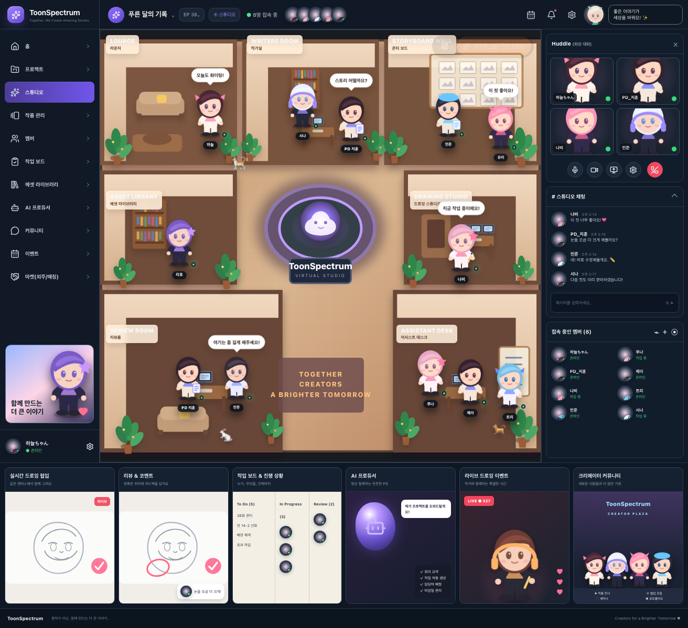
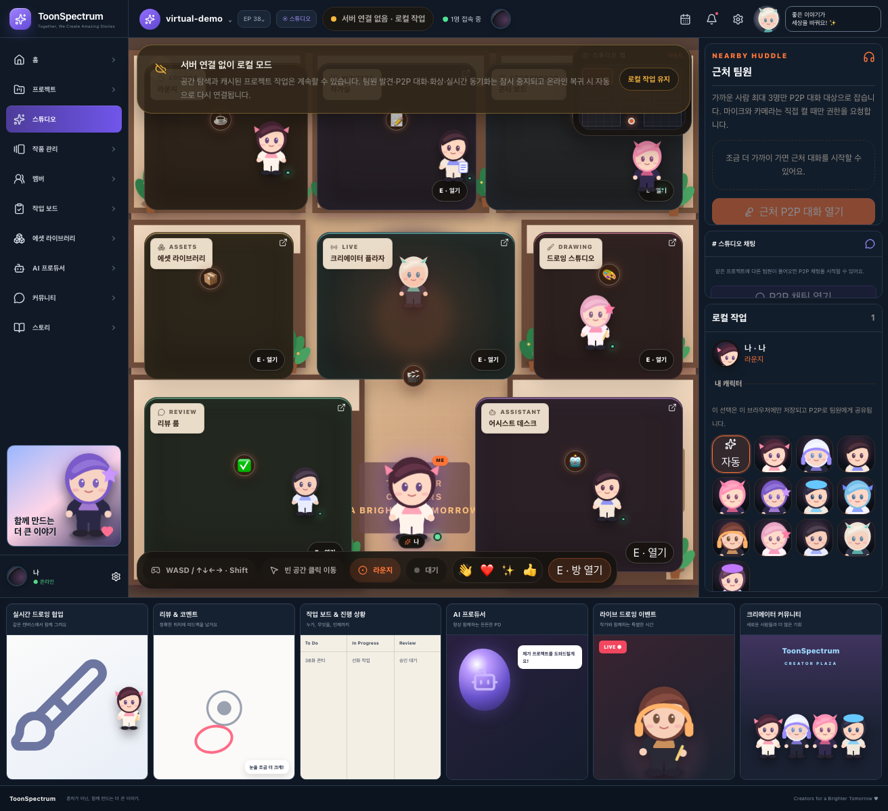

# Virtual Studio visual comparison

**Reference:** the 1312×1199 concept image shared in the ChatGPT conversation.

## 1. Current Virtual Studio home — latest main

## 2. Current playable project space — latest main

## Visual differences to inspect

- central world art/detail and warm lighting
- chibi character quality and scale
- prop/plant density and room depth
- right Huddle / Chat / Members visual fidelity
- bottom feature-card illustration quality
- typography, padding and decorative polish

These screenshots were captured in Chromium from commit `ad27094ac` at **1312×1199**.
