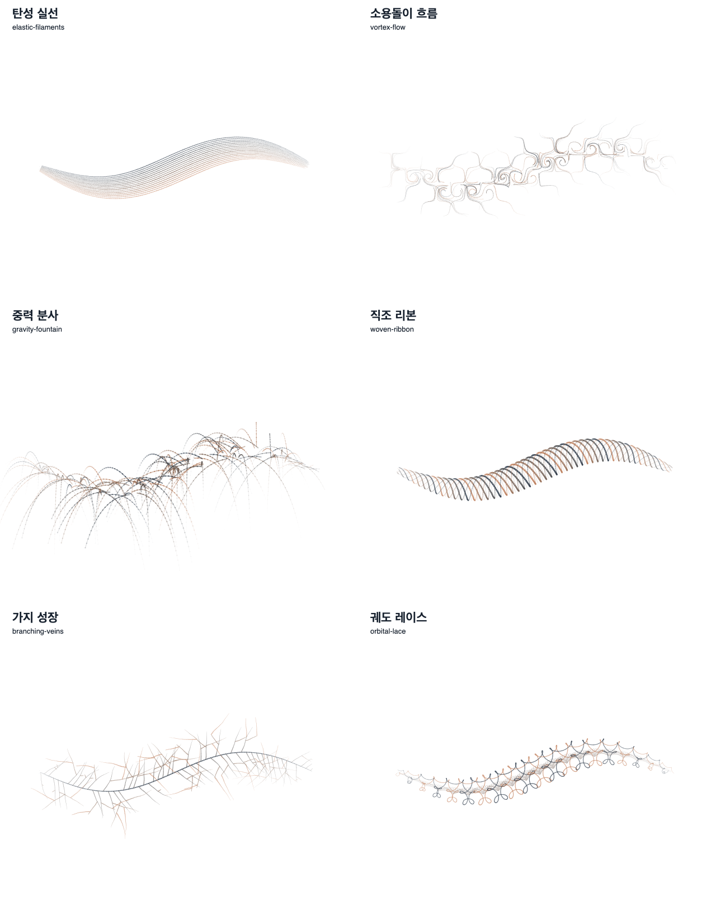

# Hybrid brush topology / 2026-09-13

## Product entry

Brush editor → Recipes → **획 구조·물리**. Six recipes extend V6 recipes from 17 to 23; the separate 80-brush public catalogue is not duplicated.

Select a material brush in the drawing canvas → **커스텀 재료 브러시 설정 → 획 구조 엔진**. Combine the structure with five deposition materials, six papers, pigment colors and neon. Switching to a new topology explicitly removes incompatible graph nodes; imported snapshots are not silently rewritten.

| Recipe | Actual structure | Controls |
|---|---|---|
| 탄성 실선 / elastic-filaments | Damped spring filaments with four Euler substeps | restoring force, damping, strand density |
| 소용돌이 흐름 / vortex-flow | Analytic curl-field advection | flow strength, inertia, scale, density |
| 중력 분사 / gravity-fountain | Finite-life ballistic particles | signed gravity, launch speed/angle, drag, lifetime |
| 직조 리본 / woven-ribbon | Alternating over/under strands and weft | strand count, pitch, twist |
| 가지 성장 / branching-veins | Parent-connected, bounded branching | frequency, angle, lifetime, density |
| 궤도 레이스 / orbital-lace | Harmonic curves and ring knots | lobes, period, eccentricity |



## Execution and bounds

Version-pinned CPU carriers use the common material contact kernel for live drawing, saved replay, Canvas2D, SVG and symmetry. Simulation advances by resampled pen distance, not wall time. Holding or lifting the pen does not run an asynchronous fluid simulation.

The solver retains at most 32 elements in fixed typed arrays: 1,312 bytes of topology arrays, **not total application/stroke memory**. It emits at most 66 topology primitives per contact, with up to three material marks each. The existing per-append mark budget remains enforced. Clipped teleport segments reset state instead of bridging distant particles. Weave/orbit automatically resolve curve harmonics; irrelevant manual spacing is disabled.

The immutable 32-entry LRU reuses exact 33-color pigment palettes. Repeated identical construction avoids 33 mixing calls. SVG hashes captured from unmodified main `21c3f91f9` protect all 17 existing material recipes on the reference path.

## Verification receipt

- Brush regressions: 274 files / 2,768 tests passed; quiet serial/performance suite: 12 files / 295 tests passed. These are brush-focused suites, not all repository tests.
- Application/API typecheck, changed-file ESLint, architecture validation, production bundle/postbuild, atlas boundary and existing structural bundle budget checks passed. Non-blocking pre-existing bundle observations remain; no threshold was relaxed or historic startup measurement presented as fresh.
- Real Chromium: six structures, 30 coating/neon hybrids, 12 vertical/kaleidoscope combinations. Full/live/JSON equality passed; base DPR 1/2/3 pixels match. SVG alpha differences are within the explicit rasterizer tolerance.
- All 15 opacity-normalized shape pairs differ; minimum alpha total-variation distance is 0.55534, above the 0.10 guard.
- Final local 30-trial measurement: planning P95 2.70 ms, Canvas submission P95 4.30 ms. Apple M2 Max / 32 GiB / Chromium 151.0.7922.34. Synthetic 96-point input; readback excluded. These are full-stroke computation measurements, **not physical stylus latency or cross-device performance promises**.

The complete machine-readable result, browser/runtime metadata and per-recipe measurements are in [report.json](report.json). The existing Studio material morphology workflow also runs the hybrid browser audit and uploads its own receipts.

```sh
pnpm exec vitest run apps/web/src/domains/creator/brush --maxWorkers=2
pnpm exec vitest run --config vitest.perf.config.ts apps/web/src/domains/creator/brush apps/web/src/domains/creator/live/studio-live-dynamic-brush-overlay.test.ts
node scripts/verify-studio-hybrid-topology.mjs
pnpm run typecheck
pnpm run validate:architecture
pnpm run build:bundle
node scripts/verify-studio-material-atlas-boundary.mjs
node scripts/check-studio-bundle.mjs
```

## Scope

No new package, paid API, subscription, database migration or server dependency is added. Wet coating is a deposition approximation, **not a fluid-grid solver or canvas-undercolor pickup**. Weave/orbit are geometric algorithms. Real pen-device feel, full fluid dynamics and GPU acceleration remain distinct areas, not completed claims. The new CPU diagnostics do not advertise GPU allocations or timed settling that do not exist.
