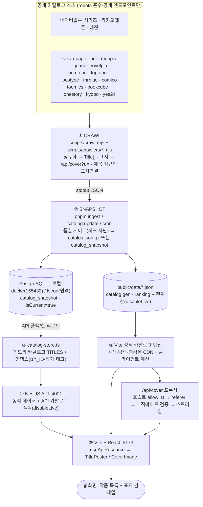

# 데이터 파이프라인 — 크롤 → 스냅샷 → 정적 카탈로그/API → 화면

ToonSpectrum의 작품 데이터는 **하드코딩 seed가 아니라 검증 스냅샷**을 운영 소스로 사용합니다.
공개 카탈로그를 크롤해 정규화한 뒤 `catalog.json.gz`와 `public/data/*.json` 정적 카탈로그를 만들고,
리뷰·인증·커뮤니티 같은 동적 데이터만 API/DB가 담당합니다. `VITE_CATALOG_SOURCE=api` 또는 API 폴백
경로에서는 같은 스냅샷을 Nest 런타임 카탈로그로 로드할 수 있습니다.

## 한눈에 보기 (Mermaid)



## 한눈에 보기 (ASCII)

```
① CRAWL  scripts/crawl.mjs + scripts/crawlers/*.mjs
   공개 카탈로그 fetch → Title[] 정규화 → 표지를 /api/cover?u= 로 치환 → 제목 정규화로 교차연결
        │ stdout JSON
        ▼
② SNAPSHOT  catalog:update │ pnpm ingest │ cron │ POST /api/catalog/ingest/run
   품질 게이트(총건수 급감·주요소스 붕괴 시 승격 거부) → catalog.json.gz 또는 catalog_snapshot
        │  정적: public/data/*.json / 폴백 API: PostgreSQL catalog_snapshot
        ▼
③ LOAD  lib/server/catalog-store.ts  (API 부팅 시 1회)
   isCurrent=1 스냅샷 → 메모리 카탈로그 TITLES + 인덱스(BY_ID·작가·태그)
        ▼
④ STATIC/API
   public/data/*.json               ← 검색·탐색·랭킹 기본 경로(CDN + 클라이언트 계산)
   NestJS apps/api :4001            ← 리뷰·인증·커뮤니티 + API 카탈로그 폴백
   /ranking                         ← 현재 활성 경로는 disableLive=true 스냅샷 산식
   /api/cover?u=…                   ← 표지 프록시(allowlist→referer→매직바이트→스트리밍)
        │  (vite dev: "/api" → 127.0.0.1:4001 프록시)
        ▼
⑤ FRONT  Vite + React  :5173
   페이지(useApiResource) fetch → TitlePoster/CoverImage 가  렌더
        ▼
   🖥️ 화면: 작품 목록 + 표지 썸네일
```

## 단계별 상세

| 단계 | 무엇 | 핵심 파일 | 비고 |
|---|---|---|---|
| ① 수집 | 공개 카탈로그 fetch → `Title[]` 정규화, 표지 URL → `/api/cover?u=` | `scripts/crawl.mjs`, `scripts/crawlers/*.mjs`, `scripts/crawlers/_shared.mjs`, `scripts/crawl-helpers.mjs` | `WEBDEX_SOURCE_IDS`로 소스 제한(`all` 가능). 제목 정규화(`norm`)로 교차연결/신규 분리. 선택된 crawler를 병렬/제한 호출로 실행. |
| ② 스냅샷 | 크롤 JSON → 품질 게이트 → `catalog.json.gz`/`catalog_snapshot` 저장 | `lib/server/catalog-ingest.ts`, `scripts/ingest.mjs`, `scripts/build-static-catalog.ts` | `evaluateRegression`이 총건수 급감/주요 소스 붕괴 시 승격 거부(낡은·부분 데이터로 덮어쓰지 않음). 정적 운영은 `catalog:gen`으로 `public/data/*.json`을 생성. |
| ③ 로드 | 정적 파일 또는 `isCurrent=1` 스냅샷 → 메모리 카탈로그 | `src/catalog-static.ts`, `lib/server/catalog-store.ts`, `lib/db/index.ts` | 기본 프론트는 CDN 정적 파일을 사용. API 폴백은 부팅 시 1회 로드 + 인덱스 구성. 스냅샷 없으면 **빈 카탈로그**로 시작(가짜 데이터 미노출). |
| ④ STATIC/API | 카탈로그 질의 + 표지 프록시 + 동적 API | `src/catalog-static.ts`, `apps/api/src/modules/catalog/catalog.controller.ts`, `catalog.service.ts` | 검색·탐색·랭킹 기본은 정적/클라이언트 계산. `/api/cover`는 호스트 allowlist 통과분만 referer 붙여 업스트림서 받아 바이트 검증 후 스트리밍. |
| ⑤ 화면 | 정적/API fetch → 표지/카드 렌더 | `src/pages/*`, `components/title-poster.tsx`, `components/cover-image.tsx`, `vite.config.ts` | `coverImage`(=`/api/cover`)를 ``로 렌더, 실패 시 타이포그래픽 폴백. |

## 수집 소스 (현재)

- **실크롤(crawler) — 19개 슬롯**: 네이버웹툰, 네이버시리즈, 카카오웹툰, 카카오페이지, 레진, 리디, 문피아, 조아라, 노벨피아, 봄툰, 탑툰, 포스타입, 미스터블루, 코미코, 투믹스, 북큐브, 원스토리, 교보문고, 예스24.
- **조건부 소스**: 코미코는 한국 외 IP 지오펜스가 있어 KR egress에서만 수집되고, 그 외 환경에서는 빈 결과로 빠르게 종료한다.
- 레지스트리·구현 상태: `lib/server/catalog-sources.ts` (`implementation: "crawler" | "partner-required"`)

## 설계 원칙

- **단일 연결**: `lib/db`는 `DATABASE_URL`(Neon 원격 또는 로컬 docker `:55432`)로 연결 →
  크롤/ingest/API/drizzle-kit이 동일 DB를 사용. (libSQL 시절 cwd 상대 파일경로로 갈리던 split-brain은 연결 문자열 방식이라 해당 없음.)
- **정직성**: seed 없음. 스냅샷이 없으면 빈 카탈로그로 시작하고, 품질 게이트가 급감·붕괴 시 승격을 거부.
  제목·작가·장르·표지는 실수집, 비공개 보조 지표(일부 평점/조회/완독률 등)는 추정값으로 화면에 명시.
- **표지 프록시**: 핫링크/CORS 회피. 허용 호스트(`pstatic.net`·`kakaocdn.net`·`ccdn.lezhin.com` +
  신규 `ridicdn.net`·`dn-img-page.kakao.com`·`cdn1.munpia.com`·`cf-image.joara.com`·`cloudfront`(postype)·
  `img.mrblue.com`·`bookimg.bookcube.com`·`img-books.onestore.co.kr`·`image.yes24.com`)만 통과.

## 로컬에서 돌려보기

```bash
pnpm crawl                       # 크롤러 JSON을 stdout으로 출력(적재 안 함)
pnpm ingest                      # 크롤 후 catalog_snapshot 적재(기본 WEBDEX_SOURCE_IDS=all)
pnpm ingest --from out.json      # 미리 크롤해 둔 JSON 적재(재크롤 없음)
pnpm catalog:gen                 # apps/api/data/catalog.json.gz → public/data/*.json 생성
pnpm dev:all                     # 웹앱(:5173) + API(:4001) 동시 실행 → 화면에서 확인
```

> 원격(Neon) 적재: `.env.local`의 `DATABASE_URL`(Neon, `sslmode=require`)을 설정하면 크롤/ingest/API가 모두 원격 Postgres를 사용합니다. (`apps/api`는 `load-env`가 다른 import보다 먼저 `.env.local`을 로드.)

## 데이터 갱신 (정적 운영 + API 폴백)

정적 운영에서는 `catalog.json.gz`를 갱신한 뒤 `pnpm catalog:gen`이 `public/data/*.json`을 다시 만들고, 배포/CDN 전파로 사용자 경로가 갱신됩니다. API 폴백 모드에서는 부팅 시 current DB 스냅샷을 메모리로 1회 로드하며, 외부 프로세스(`pnpm ingest`·cron·다른 인스턴스)가 새 스냅샷을 적재해도 **재시작 없이** 수렴합니다.

- **폴링 핫 리로드**: API가 `CATALOG_REFRESH_POLL_SECONDS`(기본 60초, 0=off)마다 DB의 current 스냅샷 id를 확인하고, 메모리에 로드된 것과 다르면 재로드(`refreshCatalogIfChanged`). Neon 풀러는 LISTEN/NOTIFY 미지원이라 폴링이 견고합니다.
- **강제 리로드 엔드포인트**: `POST /api/catalog/refresh`(토큰 설정 시 `x-catalog-ingest-token`) → `{ reloaded, snapshotId, titleCount }`. 적재 직후 즉시 반영하고 싶을 때.
- **스냅샷 보존/프루닝**: 적재 시 최신 `CATALOG_SNAPSHOT_RETENTION`개(기본 5)만 남기고 오래된 스냅샷 삭제 — 스냅샷 1행이 수십 MB라 무한 증가 방지.
- **주기 ingest**: `CATALOG_INGEST_MODE=fixed` + `CATALOG_INGEST_INTERVAL_SECONDS`로 API 내부 스케줄러가 크롤+적재(실패 시 지수 백오프). 이 경로는 in-process라 즉시 갱신됩니다.
