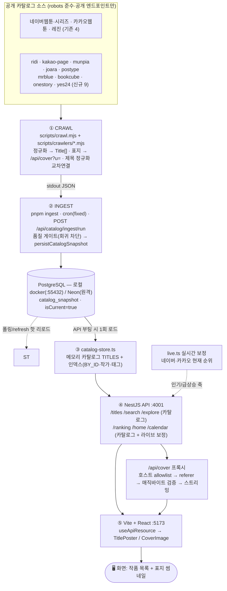

# 데이터 파이프라인 — 크롤 → DB 적재 → API → 화면

ToonSpectrum의 작품 데이터는 **파일 seed가 아니라 서버 DB 스냅샷**을 운영 소스로 사용합니다.
공개 카탈로그를 크롤해 정규화한 스냅샷을 DB에 적재하고, API가 부팅 시 이를 메모리로 로드해
프론트에 응답합니다. 아래는 수집부터 화면 노출까지의 전 과정입니다.

## 한눈에 보기 (Mermaid)



## 한눈에 보기 (ASCII)

```
① CRAWL  scripts/crawl.mjs + scripts/crawlers/*.mjs
   공개 카탈로그 fetch → Title[] 정규화 → 표지를 /api/cover?u= 로 치환 → 제목 정규화로 교차연결
        │ stdout JSON
        ▼
② INGEST  pnpm ingest │ cron(CATALOG_INGEST_MODE=fixed) │ POST /api/catalog/ingest/run
   품질 게이트(총건수 급감·주요소스 붕괴 시 승격 거부) → catalog_snapshot INSERT(isCurrent=1)
        │  PostgreSQL: 로컬 docker(:55432) / Neon(원격) — DATABASE_URL
        ▼
③ LOAD  lib/server/catalog-store.ts  (API 부팅 시 1회)
   isCurrent=1 스냅샷 → 메모리 카탈로그 TITLES + 인덱스(BY_ID·작가·태그)
        ▼
④ API  NestJS  apps/api  :4001
   /titles /search /explore         ← 메모리 카탈로그 질의
   /ranking /home /calendar         ← 카탈로그 + live.ts 실시간 보정(네이버·카카오)
   /api/cover?u=…                   ← 표지 프록시(allowlist→referer→매직바이트→스트리밍)
        │  (vite dev: "/api" → 127.0.0.1:4001 프록시)
        ▼
⑤ FRONT  Vite + React  :5173
   페이지(useApiResource) fetch → TitlePoster/CoverImage 가  렌더
        ▼
   🖥️ 화면: 작품 목록 + 표지 썸네일
```

## 단계별 상세

| 단계 | 무엇 | 핵심 파일 | 비고 |
|---|---|---|---|
| ① 수집 | 공개 카탈로그 fetch → `Title[]` 정규화, 표지 URL → `/api/cover?u=` | `scripts/crawl.mjs`, `scripts/crawlers/*.mjs`, `scripts/crawlers/_shared.mjs`, `scripts/crawl-helpers.mjs` | `WEBDEX_SOURCE_IDS`로 소스 제한(`all` 가능). 제목 정규화(`norm`)로 교차연결/신규 분리. 신규 9개는 `Promise.all` 병렬 크롤. |
| ② 적재 | 크롤 JSON → 품질 게이트 → `catalog_snapshot` 적재 | `lib/server/catalog-ingest.ts`, `scripts/ingest.mjs` | `evaluateRegression`이 총건수 급감/주요 소스 붕괴 시 승격 거부(낡은·부분 데이터로 덮어쓰지 않음). 직전 `isCurrent`는 0으로 내리고 신규를 `isCurrent=1`로 INSERT(원자적). |
| ③ 로드 | `isCurrent=1` 스냅샷 → 메모리 카탈로그 | `lib/server/catalog-store.ts`, `lib/db/index.ts` | API 부팅 시 1회 로드 + 인덱스 구성. 스냅샷 없으면 **빈 카탈로그**로 시작(가짜 데이터 미노출). |
| ④ API | 카탈로그 질의 + 라이브 보정 + 표지 프록시 | `apps/api/src/modules/catalog/catalog.controller.ts`, `catalog.service.ts`, `lib/server/live.ts` | `/api/cover`는 호스트 allowlist 통과분만 referer 붙여 업스트림서 받아 바이트 검증 후 스트리밍. |
| ⑤ 화면 | API fetch → 표지/카드 렌더 | `src/pages/*`, `components/title-poster.tsx`, `components/cover-image.tsx`, `vite.config.ts` | vite dev가 `/api`를 Nest(:4001)로 프록시. `coverImage`(=`/api/cover`)를 ``로 렌더, 실패 시 타이포그래픽 폴백. |

## 수집 소스 (현재)

- **실크롤(crawler) — 13**: 네이버웹툰, 네이버시리즈, 카카오웹툰, 레진 + **ridi, 카카오페이지, 문피아, 조아라, 포스타입, 미스터블루, 북큐브, 원스토리, 예스24**
  (신규 9개는 공개 카탈로그가 접근 가능하고 robots/ToS를 우회하지 않는 범위에서만 구현)
- **pending(partner-required) — 미구현**: 노벨피아·코미코·버프툰·교보 등 — 로그인/성인 인증/서비스 종료/Cloudflare로 공개 수집이 불가하여 우회하지 않고 보류
- 레지스트리·구현 상태: `lib/server/catalog-sources.ts` (`implementation: "crawler" | "partner-required"`)

## 설계 원칙

- **단일 연결**: `lib/db`는 `DATABASE_URL`(Neon 원격 또는 로컬 docker `:55432`)로 연결 →
  크롤/ingest/API/drizzle-kit이 동일 DB를 사용. (libSQL 시절 cwd 상대 파일경로로 갈리던 split-brain은 연결 문자열 방식이라 해당 없음.)
- **정직성**: seed 없음. 스냅샷이 없으면 빈 카탈로그로 시작하고, 품질 게이트가 급감·붕괴 시 승격을 거부.
  제목·작가·장르·표지는 실수집, 비공개 보조 지표(일부 평점/조회/완독률 등)는 추정값으로 화면에 명시.
- **표지 프록시**: 핫링크/CORS 회피. 허용 호스트(`pstatic.net`·`kakaocdn.net`·`ccdn.lezhin.com` +
  신규 `ridicdn.net`·`dn-img-page.kakao.com`·`cdn1.munpia.com`·`cf-image.joara.com`·`cloudfront`(postype)·
  `img.mrblue.com`·`bookimg.bookcube.com`·`img-books.onestore.co.kr`·`image.yes24.com`)만 통과.

## 로컬에서 돌려보기

```bash
pnpm crawl                       # 크롤러 JSON을 stdout으로 출력(적재 안 함)
pnpm ingest                      # 크롤 후 catalog_snapshot 적재(기본 WEBDEX_SOURCE_IDS=all)
pnpm ingest --from out.json      # 미리 크롤해 둔 JSON 적재(재크롤 없음)
pnpm dev:all                     # 웹앱(:5173) + API(:4001) 동시 실행 → 화면에서 확인
```

> 원격(Neon) 적재: `.env.local`의 `DATABASE_URL`(Neon, `sslmode=require`)을 설정하면 크롤/ingest/API가 모두 원격 Postgres를 사용합니다. (`apps/api`는 `load-env`가 다른 import보다 먼저 `.env.local`을 로드.)

## 데이터 갱신 (무중단 핫 리로드)

API는 부팅 시 current 스냅샷을 메모리로 1회 로드하지만, 외부 프로세스(`pnpm ingest`·cron·다른 인스턴스)가 새 스냅샷을 적재해도 **재시작 없이** 수렴합니다 — 공유 원격 DB(Neon)에서 특히 중요.

- **폴링 핫 리로드**: API가 `CATALOG_REFRESH_POLL_SECONDS`(기본 60초, 0=off)마다 DB의 current 스냅샷 id를 확인하고, 메모리에 로드된 것과 다르면 재로드(`refreshCatalogIfChanged`). Neon 풀러는 LISTEN/NOTIFY 미지원이라 폴링이 견고합니다.
- **강제 리로드 엔드포인트**: `POST /api/catalog/refresh`(토큰 설정 시 `x-catalog-ingest-token`) → `{ reloaded, snapshotId, titleCount }`. 적재 직후 즉시 반영하고 싶을 때.
- **스냅샷 보존/프루닝**: 적재 시 최신 `CATALOG_SNAPSHOT_RETENTION`개(기본 5)만 남기고 오래된 스냅샷 삭제 — 스냅샷 1행이 수십 MB라 무한 증가 방지.
- **주기 ingest**: `CATALOG_INGEST_MODE=fixed` + `CATALOG_INGEST_INTERVAL_SECONDS`로 API 내부 스케줄러가 크롤+적재(실패 시 지수 백오프). 이 경로는 in-process라 즉시 갱신됩니다.
