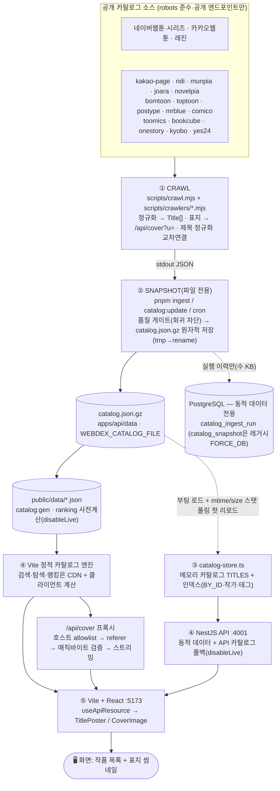

# 데이터 파이프라인 — 크롤 → 스냅샷 → 정적 카탈로그/API → 화면

ToonSpectrum의 작품 데이터는 **하드코딩 seed가 아니라 검증 스냅샷**을 운영 소스로 사용합니다.
공개 카탈로그를 크롤해 정규화한 뒤 `catalog.json.gz`(카탈로그의 **단일 운영 저장소 — 파일 전용**)와
`public/data/*.json` 정적 카탈로그를 만들고, 리뷰·인증·커뮤니티 같은 동적 데이터만 API/DB가
담당합니다. Nest API도 같은 gz 파일을 부팅 시 로드하고 파일 스탯 폴링으로 핫 리로드합니다 —
카탈로그 경로에 DB 전송이 없습니다(DB `catalog_snapshot`은 `WEBDEX_CATALOG_FORCE_DB=1` 레거시 전용).

## 한눈에 보기 (Mermaid)



## 한눈에 보기 (ASCII)

```
① CRAWL  scripts/crawl.mjs + scripts/crawlers/*.mjs
   공개 카탈로그 fetch → Title[] 정규화 → 표지를 /api/cover?u= 로 치환 → 제목 정규화로 교차연결
        │ stdout JSON
        ▼
② SNAPSHOT(파일 전용)  catalog:update │ pnpm ingest │ cron │ POST /api/catalog/ingest/run
   품질 게이트(총건수 급감·주요소스 붕괴 시 승격 거부) → catalog.json.gz 원자적 저장(tmp→rename)
   동일 runHash 면 다시 쓰지 않음 · 실행 이력만 DB catalog_ingest_run(수 KB) 기록
        │  정적: public/data/*.json  /  API: 같은 gz 파일 (DB 스냅샷은 WEBDEX_CATALOG_FORCE_DB=1 레거시)
        ▼
③ LOAD  lib/server/catalog-store.ts  (API 부팅 시 1회 + 파일 스탯 폴링 핫 리로드)
   catalog.json.gz → 메모리 카탈로그 TITLES + 인덱스(BY_ID·작가·태그) · 없으면 빈 카탈로그
        ▼
④ STATIC/API
   public/data/*.json               ← 검색·탐색·랭킹 기본 경로(CDN + 클라이언트 계산)
   NestJS apps/api :4001            ← 리뷰·인증·커뮤니티 + API 카탈로그 폴백
   /ranking                         ← 현재 활성 경로는 disableLive=true 스냅샷 산식
   /api/cover?u=…                   ← 표지 프록시(allowlist→referer→매직바이트→스트리밍)
        │  (vite dev: "/api" → 127.0.0.1:4001 프록시)
        ▼
⑤ FRONT  Vite + React  :5173
   페이지(useApiResource) fetch → TitlePoster/CoverImage 가  렌더
        ▼
   🖥️ 화면: 작품 목록 + 표지 썸네일
```

## 단계별 상세

| 단계 | 무엇 | 핵심 파일 | 비고 |
|---|---|---|---|
| ① 수집 | 공개 카탈로그 fetch → `Title[]` 정규화, 표지 URL → `/api/cover?u=` | `scripts/crawl.mjs`, `scripts/crawlers/*.mjs`, `scripts/crawlers/_shared.mjs`, `scripts/crawl-helpers.mjs` | `WEBDEX_SOURCE_IDS`로 소스 제한(`all` 가능). 제목 정규화(`norm`)로 교차연결/신규 분리. 선택된 crawler를 병렬/제한 호출로 실행. |
| ② 스냅샷 | 크롤 JSON → 품질 게이트 → `catalog.json.gz` **원자적 저장**(tmp→rename, 동일 runHash 스킵) | `lib/server/catalog-ingest.ts`, `lib/server/catalog-file.ts`, `scripts/ingest.mjs`, `scripts/build-static-catalog.ts` | `evaluateRegression`이 총건수 급감/주요 소스 붕괴 시 승격 거부(낡은·부분 데이터로 덮어쓰지 않음). 실행 이력만 DB `catalog_ingest_run`(수 KB). DB 스냅샷 적재는 `WEBDEX_CATALOG_FORCE_DB=1`/`ingest --db` 레거시. 정적 운영은 `catalog:gen`으로 `public/data/*.json`을 생성. |
| ③ 로드 | gz 파일 → 메모리 카탈로그 (부팅 1회 + 파일 스탯 폴링 핫 리로드) | `src/catalog-static.ts`, `lib/server/catalog-store.ts`, `lib/server/catalog-file.ts` | 기본 프론트는 CDN 정적 파일을 사용. API는 부팅 시 gz 로드 + 인덱스 구성, `CATALOG_REFRESH_POLL_SECONDS`마다 mtime/size 비교(무비용). 파일 없으면 **빈 카탈로그**로 시작(가짜 데이터 미노출). |
| ④ STATIC/API | 카탈로그 질의 + 표지 프록시 + 동적 API | `src/catalog-static.ts`, `apps/api/src/modules/catalog/catalog.controller.ts`, `catalog.service.ts` | 검색·탐색·랭킹 기본은 정적/클라이언트 계산. `/api/cover`는 호스트 allowlist 통과분만 referer 붙여 업스트림서 받아 바이트 검증 후 스트리밍. |
| ⑤ 화면 | 정적/API fetch → 표지/카드 렌더 | `src/pages/*`, `components/title-poster.tsx`, `components/cover-image.tsx`, `vite.config.ts` | `coverImage`(=`/api/cover`)를 ``로 렌더, 실패 시 타이포그래픽 폴백. |

## 정적 산출물 구조 — 경량 카드 + 상세 샤드 (`lib/catalog-slim.ts`)

`pnpm catalog:gen`이 만드는 `public/data/*`는 **목록 경로(카드·검색·랭킹·추천)가 읽는 필드만 담은
경량 카드**와 **상세 전용 샤드**로 분리되어 있다. `apps/api/data/catalog.json.gz`(정규화 Title[] 교환
포맷 — `{titles,…}` 래퍼) 계약은 그대로다 — 슬리밍은 정적 산출 단계에서만 일어난다.

| 산출물 | 내용 | 비고 |
|---|---|---|
| `catalog.json` | 전체 작품의 경량 카드(`TitleCard`) — 시놉시스는 카드 노출 한도(160자)로 축약, `availability[].url`·`stats.ratingDist` 제거 | 클라이언트 엔진(`src/catalog-static-engine.ts`) 입력. 24.6k 기준 원시 22.0→19.2MB |
| `detail/<00–7f>.json` | 상세 전용 필드 샤드 — `{ [id]: { s: 시놉시스 원문, u: availability url 배열(순서 정렬), d: ratingDist } }`. id의 djb2 해시 % 128 버킷 | 상세/비교 화면에서 버킷 1개만 추가 fetch(원시 ~28KB, 압축 ~9KB) 후 `mergeDetailExtra`로 병합 |
| `calendar.json` | `days[].items`가 경량 카드(시놉시스 제외) | 원시 2.08→1.62MB. API 폴백 모드의 풀 Title 응답과 동일 필드만 소비(CalendarPage) |
| `ranking/*.json` | `items[].title`이 경량 카드(축약 시놉시스 포함) | rank-row·ranking-board·`explainScore`가 읽는 스칼라 stats는 전부 유지 |
| `home.json`·`insights.json`·`tags.json`·`authors.json` | 변경 없음(이미 소형·사전계산) | insights는 ratingDist가 필요해 빌드 시 풀 데이터로 계산 |

소비 규칙: 엔진의 `/api/titles/:slug`(상세)는 샤드를 병합한 풀 Title을 돌려주고, 비교 화면은 선택
확정 시 상세 엔드포인트로 보강한다(`components/compare-view.tsx`). 샤드 fetch가 실패해도 경량 카드만으로
우아하게 동작한다(보러가기 링크만 "준비 중" 표시). 캐싱은 `vercel.json`의 `/data/(.*)` 헤더와
서비스워커 SWR 전략이 샤드까지 동일하게 커버한다.

## 수집 소스 (현재)

- **실크롤(crawler) — 19개 슬롯**: 네이버웹툰, 네이버시리즈, 카카오웹툰, 카카오페이지, 레진, 리디, 문피아, 조아라, 노벨피아, 봄툰, 탑툰, 포스타입, 미스터블루, 코미코, 투믹스, 북큐브, 원스토리, 교보문고, 예스24.
- **조건부 소스**: 코미코는 한국 외 IP 지오펜스가 있어 KR egress에서만 수집되고, 그 외 환경에서는 빈 결과로 빠르게 종료한다.
- 레지스트리·구현 상태: `lib/server/catalog-sources.ts` (`implementation: "crawler" | "partner-required"`)

## 설계 원칙

- **역할 분리(비용)**: 카탈로그는 **파일 전용**(`catalog.json.gz`), DB는 **동적 데이터 전용**(리뷰·
  커뮤니티·계정·창작 + ingest 실행 이력 수 KB). 24k편 ~22MB 스냅샷을 DB로 읽고 쓰다 Neon 전송
  쿼터를 소진한 사고의 재발 방지(`docs/ARCH-DECISION-catalog-storage.md` v2).
- **단일 연결**: `lib/db`는 `DATABASE_URL`(Neon 원격 또는 로컬 docker `:55432`)로 연결 →
  ingest 이력/동적 API/drizzle-kit이 동일 DB를 사용. 풀은 슬림(`max 3`·유휴 10s 종료·
  `allowExitOnIdle`)하게 잡아 Neon 컴퓨트가 유휴 시 잠들 수 있게 한다.
- **정직성**: seed 없음. 스냅샷이 없으면 빈 카탈로그로 시작하고, 품질 게이트가 급감·붕괴 시 승격을 거부.
  제목·작가·장르·표지는 실수집, 비공개 보조 지표(일부 평점/조회/완독률 등)는 추정값으로 화면에 명시.
- **표지 프록시**: 핫링크/CORS 회피. 허용 호스트(`pstatic.net`·`kakaocdn.net`·`ccdn.lezhin.com` +
  신규 `ridicdn.net`·`dn-img-page.kakao.com`·`cdn1.munpia.com`·`cf-image.joara.com`·`cloudfront`(postype)·
  `img.mrblue.com`·`bookimg.bookcube.com`·`img-books.onestore.co.kr`·`image.yes24.com`)만 통과.

## 로컬에서 돌려보기

```bash
pnpm crawl                       # 크롤러 JSON을 stdout으로 출력(적재 안 함)
pnpm ingest                      # 크롤 후 catalog.json.gz 원자적 저장(기본 WEBDEX_SOURCE_IDS=all, DB 불필요)
pnpm ingest --from out.json      # 미리 크롤해 둔 JSON 저장(재크롤 없음)
pnpm ingest --db                 # (레거시) DB catalog_snapshot 적재 — FORCE_DB 운영 전용
pnpm catalog:gen                 # apps/api/data/catalog.json.gz → public/data/*.json 생성
pnpm dev:all                     # 웹앱(:5173) + API(:4001) 동시 실행 → 화면에서 확인
```

> 카탈로그 ingest 에는 DB가 필요 없습니다. `.env.local`의 `DATABASE_URL`(Neon, `sslmode=require`)은 리뷰·커뮤니티 등 동적 API와 ingest 실행 이력에만 쓰입니다. (`apps/api`는 `load-env`가 다른 import보다 먼저 `.env.local`을 로드.)

## 데이터 갱신 (정적 운영 + API 동기화)

정적 운영에서는 `catalog.json.gz`를 갱신한 뒤 `pnpm catalog:gen`이 `public/data/*.json`을 다시 만들고, 배포/CDN 전파로 사용자 경로가 갱신됩니다. API는 부팅 시 같은 gz 파일을 메모리로 1회 로드하며, 외부 프로세스(`pnpm ingest`·cron·다른 인스턴스)가 파일을 갱신해도 **재시작 없이** 수렴합니다.

- **파일 스탯 폴링 핫 리로드**: API가 `CATALOG_REFRESH_POLL_SECONDS`(기본 60초, 0=off)마다 gz 파일의 mtime/size 를 확인하고(`refreshCatalogIfChanged` — syscall 1번, DB/네트워크 0), 바뀌었을 때만 gz 를 재로드합니다. 레거시 `WEBDEX_CATALOG_FORCE_DB=1` 모드에서만 기존 DB current 스냅샷 id 폴링이 동작합니다.
- **강제 리로드 엔드포인트**: `POST /api/catalog/refresh`(토큰 설정 시 `x-catalog-ingest-token`) → `{ reloaded, snapshotId, titleCount }`. 적재 직후 즉시 반영하고 싶을 때.
- **동일-hash 스킵**: ingest 가 직전과 같은 runHash 를 만들면 파일을 다시 쓰지 않습니다(mtime 보존 → 다른 인스턴스도 불필요한 재로드를 하지 않음). 레거시 모드의 스냅샷 보존/프루닝(`CATALOG_SNAPSHOT_RETENTION`)은 FORCE_DB에서만 의미가 있습니다.
- **주기 ingest**: `CATALOG_INGEST_MODE=fixed` + `CATALOG_INGEST_INTERVAL_SECONDS`로 API 내부 스케줄러가 크롤+파일 저장(실패 시 지수 백오프). 이 경로는 in-process라 즉시 갱신됩니다.
- **잔존 DB 스냅샷 정리**: 파일 전용 전환 후 남은 `catalog_snapshot` 대형 행은 `node scripts/db-prune-snapshots.mjs`(전부 삭제, `--keep-current`로 1행 보존)로 정리합니다 — DELETE는 행 본문을 전송하지 않아 Neon 쿼터에 안전.
