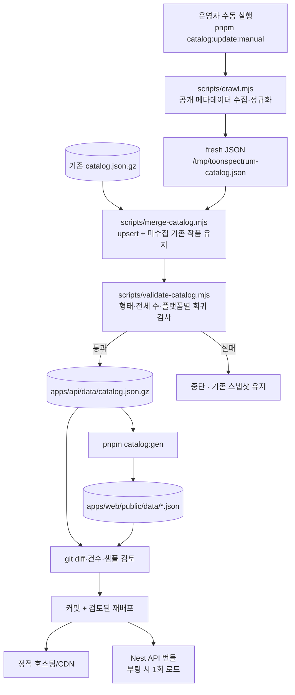

# 데이터 파이프라인 — 수동 수집 → 검토된 스냅샷 → 배포

ToonSpectrum의 작품 데이터는 검토 후 커밋된 `apps/api/data/catalog.json.gz`를 단일 운영
스냅샷으로 사용합니다. 크롤링은 로컬 운영자가 필요할 때만 실행하며, 배포된 웹·API·GitHub
Actions에는 크롤러 실행이나 주기 갱신 기능이 없습니다.

## 핵심 불변식

- 배포 런타임은 카탈로그를 **읽기만** 합니다.
- 카탈로그 갱신은 `pnpm catalog:update:manual`을 직접 실행한 경우에만 시작됩니다.
- 수집 결과는 기존 스냅샷과 병합하고 최종 결과를 검증한 뒤에만 원본 파일을 교체합니다.
- 변경 사항은 사람이 검토하고 커밋·재배포해야 사용자에게 반영됩니다.
- 카탈로그 본문과 수집 이력은 PostgreSQL에 저장하지 않습니다. DB는 계정·리뷰·커뮤니티·창작 등
  동적 데이터 전용입니다.

## 전체 흐름


```mermaid
flowchart TD
  O["운영자 수동 실행<br/>pnpm catalog:update:manual"] --> C["scripts/crawl.mjs<br/>공개 메타데이터 수집·정규화"]
  C --> F["fresh JSON<br/>/tmp/toonspectrum-catalog.json"]
  B[("기존 catalog.json.gz")] --> M["scripts/merge-catalog.mjs<br/>upsert + 미수집 기존 작품 유지"]
  F --> M
  M --> V["scripts/validate-catalog.mjs<br/>형태·전체 수·플랫폼별 회귀 검사"]
  V -->|통과| GZ[("apps/api/data/catalog.json.gz")]
  V -->|실패| STOP["중단 · 기존 스냅샷 유지"]
  GZ --> GEN["pnpm catalog:gen"]
  GEN --> STATIC[("apps/web/public/data/*.json")]
  GZ --> REVIEW["git diff·건수·샘플 검토"]
  STATIC --> REVIEW
  REVIEW --> COMMIT["커밋 + 검토된 재배포"]
  COMMIT --> CDN["정적 호스팅/CDN"]
  COMMIT --> API["Nest API 번들<br/>부팅 시 1회 로드"]
```

런타임에는 위 흐름의 `크롤`, `병합`, `검증`, `파일 교체` 단계가 포함되지 않습니다. 실행 중인 API는
파일 변경을 폴링하지 않으며, 새 스냅샷은 다음 배포·프로세스 시작 때 로드됩니다.

## 수동 명령

```bash
# 원시 JSON만 확인. 저장소 파일은 수정하지 않음.
pnpm --silent catalog:crawl:manual > /tmp/toonspectrum-catalog.json

# 수집 → 임시 병합 → 최종 스냅샷 검증 → catalog.json.gz 교체 → 정적 파일 생성
pnpm catalog:update:manual

# 작품별 외부 관련 정보가 필요할 때만 별도 실행
pnpm related:update:manual

# 이미 존재하는 catalog.json.gz로 정적 파일만 재생성
pnpm catalog:gen
```

`catalog:update:manual`은 새 수집 결과를 바로 운영 파일에 쓰지 않습니다. 먼저 임시 gz 파일을 만들고
`validate-catalog.mjs`를 통과한 경우에만 `apps/api/data/catalog.json.gz`를 교체합니다. 명령이
실패하면 기존 스냅샷은 유지되고 임시 파일을 조사할 수 있습니다.

## 단계별 파일 경계

| 단계 | 파일 | 역할 |
|---|---|---|
| 수집 | `scripts/crawl.mjs`, `scripts/crawlers/*.mjs` | 공개 카탈로그 메타데이터를 `Title[]`로 정규화 |
| 병합 | `scripts/merge-catalog.mjs` | 동일 id upsert, availability 합집합, 이번 실행에서 빠진 기존 작품 유지 |
| 검증 | `scripts/validate-catalog.mjs` | 불완전 레코드, 전체 건수, 플랫폼 단위 급락을 검사 |
| 운영 스냅샷 | `apps/api/data/catalog.json.gz` | 검토·버전 관리되는 단일 카탈로그 원본 |
| 정적 생성 | `scripts/build-static-catalog.ts` | 검색·홈·랭킹·캘린더·상세 샤드를 생성 |
| 브라우저 | `apps/web/src/shared/catalog/catalog-static.ts` | CDN 정적 파일을 읽는 기본 카탈로그 경계 |
| API 로드 | `apps/api/src/server/catalog-loader.ts`, `catalog-file.ts` | 번들 gz 파일을 부팅 시 한 번 메모리에 로드 |

## 병합과 검증 원칙

부분 차단이나 지역 제한 때문에 한 플랫폼이 이번 실행에서 비어도 기존 작품을 즉시 삭제하지 않습니다.
`merge-catalog.mjs`는 새 값이 있는 필드만 갱신하고, 누락된 기존 작품과 기존 availability를 보존합니다.
이 방식은 일시적인 수집 실패가 대규모 데이터 삭제로 이어지는 것을 막습니다.

최종 병합 결과에는 다음 검증이 적용됩니다.

- 전체 작품 수 절대 바닥
- 직전 스냅샷 대비 전체 건수 회귀
- 기존 대형 플랫폼의 비정상적 붕괴
- id·제목·availability가 없는 불완전 레코드 비율

검증 통과는 자동 배포 승인이 아닙니다. 운영자는 로그의 `fresh`, `updated`, `added`, `retained`,
플랫폼별 건수와 `git diff --stat`을 확인하고, 샘플 작품의 제목·작가·링크·연령등급·표지 정책을
검토한 뒤 커밋해야 합니다.

## 로컬 수집 설정

`WEBDEX_SOURCE_IDS`, `WEBDEX_CRAWL_DELAY_MS`, `WEBDEX_WEBTOON_CAP` 등 `WEBDEX_*` 수집 설정은
로컬 수동 명령에서만 읽습니다. 배포 API의 환경 스키마나 운영 설정에는 ingest 모드·주기·트리거
토큰이 없습니다.

새 소스를 추가할 때는 `scripts/crawlers/*.mjs` 어댑터와 `scripts/crawl.mjs`의 명시적 목록을 함께
수정합니다. robots.txt, 이용약관, 공식 API·제휴 가능성, 호출량 제한, 로그인·성인인증·유료 콘텐츠
경계를 검토하기 전에는 기본 수집 목록에 포함하지 않습니다.

## 관련 정보 스냅샷

`scripts/crawl-related-info.mjs`도 자동 실행되지 않습니다. `pnpm related:update:manual`을 실행하면
`data/related-info.json`을 갱신하고 `catalog:gen`이 상세 샤드에 반영합니다. 네이버 검색 API나 YouTube
Data API 키가 있으면 공식 API를 우선하며, 결과를 검토한 뒤 카탈로그와 같은 방식으로 커밋합니다.

## 배포 런타임 동작

- 정적 웹은 `apps/web/public/data/*.json`을 CDN에서 읽습니다.
- Nest API는 `catalog-loader.ts`를 통해 번들 gz 파일을 부팅 시 한 번 읽습니다.
- 파일이 없거나 파싱에 실패하면 가짜 seed로 대체하지 않고 빈 카탈로그로 시작합니다.
- `/api/catalog/ingest/*`, `/api/catalog/refresh`, 관리자 크롤 UI, 수집 스케줄러는 존재하지 않습니다.
- 새 데이터 반영에는 검토된 커밋과 재배포가 필요합니다.

법적·운영 체크리스트는 [`COMPLIANCE.md`](COMPLIANCE.md), 랭킹 계산과 데이터 경계는
[`ranking-architecture.md`](ranking-architecture.md)를 참고하세요.
