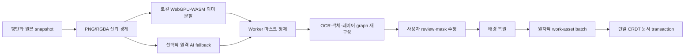

# ToonSpectrum Semantic Layer Lift

## 제품 결정

평면 이미지에서 편집 가능한 의미 레이어를 복원하는 기능은 ToonSpectrum에 추가할
가치가 높다. Canva의 Magic Layers는 PNG/JPEG의 텍스트, 객체, 배경과 레이아웃 관계를
복원해 개별 이동·크기 변경·색상 변경·애니메이션·텍스트 수정을 가능하게 한다.

ToonSpectrum은 타사 상표를 제품 기능명으로 사용하거나 Canva의 비공개 Design Model에
의존하지 않는다. 기존 `컷 레이어 분리(Scene Layer Lift)`를 다음과 같이 웹툰 제작에
특화된 `의미 레이어 분리(Semantic Layer Lift)`로 확장한다.

- 원본 백업
- 컷 테두리
- 배경
- 캐릭터 인스턴스
- 전경 소품
- 선화
- 밑색
- 명암·하이라이트
- 효과·스크린톤
- 말풍선 본체와 꼬리
- 편집 가능한 대사
- 효과음

Canva 공식 설명에서 확인한 기준 기능:

- 평면 이미지를 선택·이동 가능한 다중 레이어 디자인으로 재구성
- 텍스트를 실제 편집 가능한 텍스트 상자로 복원
- 객체와 배경을 분리하면서 원래 레이아웃 관계 보존
- 객체 이동·크기 변경·색상 변경·애니메이션
- 객체를 옮긴 뒤 드러나는 배경의 생성형 복원

참고:

- [Canva Magic Layers 발표](https://www.canva.com/newsroom/news/magic-layers/)
- [Canva Magic Layers 제품 설명](https://www.canva.com/en_in/magic-layers/)

## 현재 기반과의 연결

현재 Scene Layer Lift 기반은 다음의 1단계 신뢰 경계를 코드 수준에서 제공한다.

1. 정규화된 straight-alpha sRGB RGBA 원본 계약을 강제한다.
2. 요청 ID, 원본 ID, 크기, SHA-256으로 비동기 결과의 출처를 고정한다.
3. 신뢰할 수 없는 마스크 연산을 예산이 제한된 Worker에서 실행한다.
4. 배경·전경 PNG를 실제 디코드하고 크기·무결성을 검증한다.
5. provider plane, compositor 버전, 배경·전경 PNG 해시를 composition receipt 하나로
   결합한다.
6. provider RGBA·mask의 실제 바이트를 최종 재해시하고, 같은 ticket의 동시 승인을
   차단한 뒤 현재 문서·페이지·선택·원본 세대가 유지된 경우에만 승인을 한 번 소비한다.
7. 원본을 숨김·잠금 백업으로 남기고 결과를 연속된 그룹으로 계획한다.
8. 저장 작품에서는 두 결과를 하나의 work-asset batch로 DB에 원자 저장하며, 실제
   PostgreSQL에서 두 번째 행 실패 시 첫 번째 행까지 rollback되는 통합 테스트를 둔다.

이 경계가 완성되기 전에는 더 많은 의미 레이어를 UI에 노출하지 않는다. 검증되지 않은
PNG 한 장이나 오래된 비동기 결과가 문서에 일부만 들어가면 레이어 수가 늘수록 복구가
더 어려워지기 때문이다.

### 구현 상태

| 영역 | 상태 | 남은 제품 연결 |
| --- | --- | --- |
| strict source/provider 계약과 실제 plane SHA 검증 | 구현 | 현재 선택의 시각적 외형을 RGBA로 만드는 snapshot adapter |
| mask morphology/island Worker | 구현 | 검수 화면의 포함·제외 브러시 |
| PNG Worker 검증·native decode·수신 realm 재해시 | 구현 | 실제 compositor Worker에서 두 PNG 생성 |
| provider → compositor → PNG composition receipt | 구현 | compositor가 receipt를 직접 발급하도록 연결 |
| 문서/page/selection/source stale 방어, provider plane 재해시와 동시 one-shot admission | 구현 | Studio 최신 refs와 commit callback 연결 |
| local data URL 치환 planner | 구현 | UI 단일 undo/redo 오케스트레이션 |
| saved work-asset background/foreground batch transaction과 실 PostgreSQL rollback 검증 | 구현 | 업로드 후 stale 재검사, 미참조 자산 보상 정리 |
| 단일 CRDT scene transaction | 미구현 | 여러 동료에게 중간 topology가 노출되지 않는 batch mutation |
| 사용자 실행 버튼·review dialog | 미구현 | 데스크톱 modal, 모바일 fullscreen |

즉, 이 문서 작성 시점의 결과는 안전한 foundation이며 사용자가 Studio에서 실행할 수
있는 완성 기능이라고 표시하지 않는다. 첫 제품 베타는 source snapshot, local provider,
compositor Worker, review dialog, Studio commit 연결과 실제 브라우저 codec QA까지 끝난
뒤 활성화한다.

## 단계별 구현

### 1단계 — 신뢰 가능한 전경·배경 분리

- 배경·전경 pair 결과
- 마스크 threshold, feather, morphology, 작은 섬 제거
- 취소·timeout·stale 작업 격리
- 로컬 초안 data URL과 저장 작품 work-asset 경계 분리
- 원본 백업과 단일 undo

### 2단계 — 웹툰 의미 객체 분해

- 인물·소품 instance segmentation
- 말풍선 본체, 꼬리, 대사 영역 분리
- OCR 결과를 실제 `text` 요소로 변환
- 효과음과 장식 문자를 별도 이미지/벡터 후보로 분리
- 컷 경계와 배경을 분리해 세로 스크롤 재배치 지원
- 각 후보에 confidence, 역할, 읽기 순서, z-order, 원본 mask를 보존
- 사용자가 체크한 후보만 한 번에 적용하는 review 화면

이 단계는 2분할 v1 배열을 무리하게 늘리지 않고 별도
`StudioSemanticLayerLiftGraphV1`으로 정의한다. 후보별 source-space bounding box,
cropped RGBA, source-aligned mask, z-order, reading-order, confidence, parent/anchor,
`editableProjection(image | text | bubble | frame)`을 저장한다. 전체 원고 크기의 RGBA
plane을 후보마다 복제하지 않아 대형 원고 메모리와 저장 비용을 제어할 수 있다.

### 3단계 — 이동 가능한 객체와 배경 복원

- 객체를 옮기기 전 occlusion mask 계산
- 드러난 영역만 타일 단위로 inpaint
- 이동 중에는 기존 배경 preview를 즉시 표시하고 pointer-up 뒤에만 고품질 복원
- 동일한 원본·mask·설정은 content-addressed cache로 재사용
- 배경 복원 실패 시 원본 배경을 유지하고 문서 변경을 취소

### 4단계 — 고급 재편집

- OCR 글꼴 후보, 자간, 행간, 곡선 텍스트, 세로쓰기 복원
- 말풍선과 꼬리의 편집 가능한 벡터 재구성
- 같은 캐릭터 후보를 작품 내 character identity와 연결
- 선화·밑색·명암·효과 분리와 alpha-lock 편집
- 팀원이 후보를 승인·수정할 수 있는 리뷰 상태와 댓글 anchor

## 런타임 구조

분할 provider는 문서를 직접 변경하지 않는다. provider 출력은 제안일 뿐이며, 제품이
소유한 검증기와 현재 editor mutation ticket을 모두 통과해야만 적용한다.

## 비용과 개인정보 원칙

- 기본은 로컬 실행이다. 포인터 이동, 레이어 이동, 확대·축소에는 서버 AI를 호출하지
  않는다.
- 원격 AI는 최초 자동 분해, 사용자가 명시한 영역 재분석, 선택적 고품질 배경 복원에만
  사용한다.
- 동일 입력 SHA-256, 모델 버전, 옵션 조합은 결과를 캐시한다.
- 취소되거나 오래된 작업은 즉시 Worker/네트워크를 중단하고 결과를 폐기한다.
- 원격 provider에 전송하기 전 작품별 동의, 민감 콘텐츠 경고, 전송 크기와 예상 비용을
  표시한다.
- API 키는 브라우저 bundle/localStorage/문서에 넣지 않고 서버 측 provider adapter에서만
  사용한다.
- provider 잔액·rate limit·장애 시에는 로컬 provider 또는 다음 허용 provider로
  failover하되, 모델이 달라졌다는 provenance를 receipt에 남긴다.

## 품질 기준

- live preview와 최종 commit의 픽셀 결과가 같아야 한다.
- 원본과 결과의 크기, 좌표, 회전, flip, skew가 정확히 일치해야 한다.
- 결과 레이어의 합성은 허용 오차 안에서 평탄화 원본을 재현해야 한다.
- 저신뢰 경계는 자동 확정하지 않고 review 대상으로 표시한다.
- 모든 성공은 한 번의 undo로 되돌릴 수 있어야 한다.
- 저장·협업 작품에서는 레이어 자산 일부만 들어가는 상태를 허용하지 않는다.
- 소스, 페이지, 선택, 권한, 문서 세대 중 하나라도 달라지면 결과를 적용하지 않는다.

## 초기 비목표

- 임의 이미지에서 원래 사용된 정확한 상용 글꼴을 항상 알아내는 것
- 가려진 객체의 보이지 않는 전체 형태를 사실로 간주해 복원하는 것
- 모든 레이어를 완전한 벡터로 재구성하는 것
- Canva의 비공개 모델이나 결과 형식을 역공학해 호환하는 것

이 항목은 품질을 과장하지 않기 위한 경계다. 대신 원본 백업, confidence, mask review,
부분 재시도와 배경 복원으로 실무에서 안전하게 수정 가능한 결과를 우선한다.
