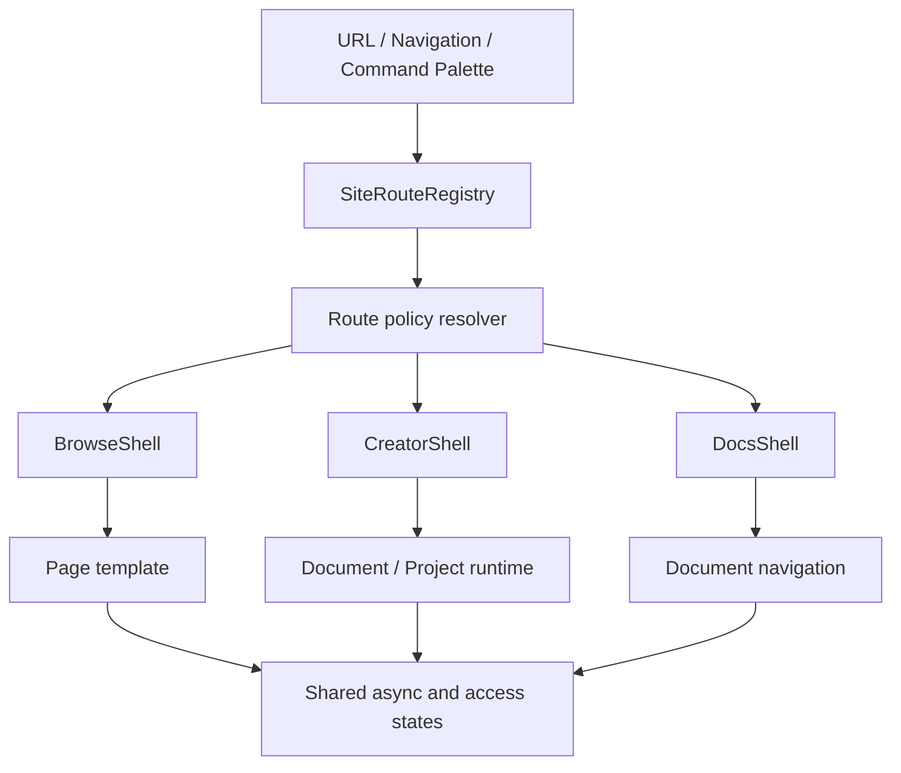

# ToonStudio 전면 사이트 경험 — 개발 전 설계 패키지

상태: **Implementation-ready design · main revalidated**
최초 기준일: 2026-09-16
최초 기준 커밋: `e23362011`
최신 main 재검토: 2026-09-17 · `ecae7445966a`
대상: 공개 사이트, 탐색·커뮤니티·학습·마켓, 개인 공간, Studio 프로젝트 운영·편집 표면

## 0. 최신 main 재검토 안내

현재 구현 판단과 다음 개발 우선순위는 [`main-revalidation-20260917.md`](./main-revalidation-20260917.md)를 따른다.

- 현재 사이트맵 canonical 목적지: 108개
- 사이트맵 자기 자신과 누락된 Studio 1차 목적지를 포함한 정적 재검토: 112개
- 추가 Production route pattern: 14개(정적·동적 포함)
- 최초 빈 화면 P0 일부는 main에서 복구됐고, 새 P0는 route authority·main landmark·readiness 계약으로 이동했다.
- 기존 `route-inventory.csv`와 `implementation-backlog.csv`는 2026-09-16 시점의 역사적 기준으로 유지한다.
- 현재 상태는 `main-route-revalidation-20260917.csv`와 `main-backlog-revalidation-20260917.csv`에서 확인한다.

## 1. 목적

이 문서는 `/sitemap`에서 확인되는 사용자 목적지 108개를 기능 목록이 아니라 하나의 제품 체계로 재구성하기 위한 개발 전 설계다.

구현팀이 추가 UX 판단 없이 다음을 시작할 수 있는 수준을 목표로 한다.

- 단일 라우트 계약과 canonical URL 정리
- Browse·Creator·Docs 세 셸의 책임과 전환 규칙
- 페이지 템플릿, 공통 컴포넌트, 상태 모델
- 인증·프로젝트·디바이스·성숙도 계약
- 108개 라우트별 목표 구조와 구현 우선순위
- 단계별 PR, 테스트, 출시·롤백 기준

이 패키지는 실제 화면 구현 전의 기준 문서다. 기능 완료를 주장하거나 운영 배포를 승인하지 않는다.
## 2. 근거와 점검 범위

운영 화면을 비로그인·콜드 로드 조건으로 데스크톱 `1440×1000`, 모바일 `390×844`에서 순회했다.

- 점검 목적지: 108개
- 초기 HTTP 200: 108개
- 초기 화면 가로 넘침: 발견되지 않음
- 초기 화면 깨진 이미지: 발견되지 않음
- 빈 화면 또는 실질 콘텐츠 부재: `/market/browse`, `/publishing`
- 로딩·렌더 불안정: `/studio/bg3d`, `/studio/3d/dcc/sculpt`, `/music`, `/studio/poser`
- 모바일 오류 후보: `/reviews`
- 의미 있는 H1 누락: 다수의 Studio companion·DCC·프로젝트 페이지
- 높은 인터랙션 밀도: `/tags`, `/ranking`, `/explore`, `/market/fit`, `/recommend`

이 점검은 진입·초기 렌더·정보 구조 감사다. 결제, 게시, 파일 변환, 공동 편집 같은 인증·데이터 의존 작업의 완전한 거래성 E2E를 대신하지 않는다.

## 3. 설계 결정 요약

1. **라우트 계약을 단일 레지스트리로 통합한다.**
2. **페이지를 Browse, Creator, Docs 세 셸 중 하나에 배치한다.**
3. **모든 페이지는 하나의 주 과업과 하나의 주 CTA를 가진다.**
4. **로딩·빈 상태·오류·권한 부족·프로젝트 미선택을 공통 상태 모델로 처리한다.**
5. **모바일은 데스크톱 축소판이 아니라 목적에 맞는 전용 모드를 제공한다.**
6. **리디렉션 별칭은 사용자 내비게이션과 검색에서 제거하고 canonical 주소만 노출한다.**
7. **기능 존재보다 시작→저장→재개→공유가 이어지는 완결된 여정을 성공 기준으로 삼는다.**
8. **P0 안정성 수정과 셸 전환을 분리해 작은 수직 슬라이스로 배포한다.**

## 4. 목표와 비목표

### 목표

- 처음 온 사용자가 10초 안에 목적과 다음 행동을 이해한다.
- 재방문 사용자가 히어로를 반복해서 통과하지 않고 최근 작업·목록으로 진입한다.
- 108개 목적지의 제품, 목적, 접근 조건, 디바이스, 성숙도, 프로젝트 문맥이 코드로 판정된다.
- 200 응답이지만 비어 있는 화면을 자동으로 실패 처리한다.
- 로그인·프로젝트가 없는 상태에서도 기능의 가치와 다음 행동이 보인다.
- Studio 작업공간 이동 중 동일 문서 런타임과 저장 상태를 보존한다.
- 모바일에서 편집이 부적절한 기능은 검토·댓글·프리뷰 모드로 명확히 전환한다.

### 비목표

- Studio 렌더링 엔진의 전면 교체
- 모든 페이지의 콘텐츠·백엔드 기능을 한 번에 완성
- URL을 일괄 변경하는 대규모 빅뱅 마이그레이션
- 근거 없는 사용자 수치, 추천 정확도, 기능 완성도 주장
- 운영 배포 또는 배포 인프라 변경
## 5. 산출물

| 파일 | 역할 |
| --- | --- |
| `README.md` | 범위, 핵심 결정, 개발 착수 조건 |
| `information-architecture.md` | 사용자 목적 구조, 라우트 계약, canonical 정책 |
| `technical-architecture.md` | 실제 코드 배치, 타입·상태·경계·마이그레이션 설계 |
| `shell-component-contracts.md` | 셸·페이지 템플릿·공통 상태·컴포넌트 API |
| `wireframes-and-flows.md` | 핵심 화면 와이어프레임과 사용자 흐름 |
| `route-inventory.csv` | 108개 라우트의 구현 가능한 분류·우선순위 |
| `implementation-backlog.csv` | 최초 Epic·작업·의존성·완료 조건 |
| `main-revalidation-20260917.md` | 최신 main 기준 재판정과 수정 설계 |
| `main-route-revalidation-20260917.csv` | 112개 정적 경로 현재 상태와 조치 |
| `main-route-authorities-20260917.csv` | Studio·Production의 57개 domain route authority record |
| `main-backlog-revalidation-20260917.csv` | 기존 77개 작업 상태와 main 신규 10개 작업 |
| `delivery-plan.md` | 단계별 PR·플래그·마이그레이션·롤백 전략 |
| `qa-acceptance.md` | 자동·수동 검증 매트릭스와 출시 게이트 |

## 6. 목표 아키텍처

### 책임 분리

- `SiteRouteRegistry`: 경로, 제목, 검색 키워드, 셸, 접근 조건, 성숙도, 디바이스, canonical을 소유한다.
- `RoutePolicyResolver`: 현재 URL과 세션·프로젝트·기기 능력으로 표시 정책을 계산한다.
- `RouteFrame`: H1, 문서 제목, 로딩 정체, 오류 경계, 분석 이벤트를 보장한다.
- 각 셸: 내비게이션과 레이아웃만 소유하며 도메인 데이터는 소유하지 않는다.
- 도메인 페이지: 사용자 과업과 데이터 orchestration을 소유한다.
- Studio 문서 런타임: 기존 ADR-0016의 문서 수명과 표면 수명 규칙을 유지한다.

## 7. UX 원칙

### 결과에서 시작

기능명보다 사용자가 만들거나 얻을 결과를 먼저 제시한다. 예: `Lift3D`보다 `2D 원화를 입체 장면으로`, `Asset fit`보다 `현재 프로젝트에 맞는지 확인`을 우선한다.

### 한 화면, 한 주 과업

첫 화면에는 하나의 Primary CTA만 둔다. Secondary CTA는 최대 두 개이며, 관련 없는 다음 행동은 본문 아래로 이동한다.

### 전문성은 숨기지 않고 단계적으로 공개

초보자에게는 기본값·추천을 제공하고 고급 제어는 `고급 설정` 안에서 드러낸다. 전문 용어에는 설명·예시·결과 미리보기를 함께 제공한다.

### 상태는 기능의 일부

로딩, 빈 상태, 오류, 오프라인, 권한 부족, 프로젝트 없음은 예외가 아니라 정식 화면 상태다. 모든 상태는 이유, 보존된 데이터, 다음 행동을 설명한다.
### 모바일은 역할을 다시 정의

읽기·탐색·검토는 모바일에서 완전 지원한다. 정밀 드로잉·3D·애니메이션은 기기 능력에 따라 전체 편집 또는 검토 모드로 전환한다. 지원하지 않는 조작을 작게 축소해 그대로 노출하지 않는다.

### 증거 기반 신뢰

데이터 출처, 갱신 시점, 라이선스, 모델·엔진 요구 조건, 예상 비용·시간, 베타 상태를 사용자에게 숨기지 않는다.

## 8. 성공 지표

| 지표 | 목표 |
| --- | --- |
| 공개 페이지 핵심 과업 발견 시간 | 중앙값 10초 이하 |
| 새 작업 또는 샘플 시작 시간 | 중앙값 15초 이하 |
| 핵심 과업 성공률 | 90% 이상 |
| 오류 후 복구 성공률 | 80% 이상 |
| 빈 화면 라우트 | 0개 |
| H1 계약 위반 | 0개 |
| 이름 없는 핵심 인터랙션 | 0개 |
| 모바일 핵심 터치 대상 | 44 CSS px 이상 |
| canonical이 아닌 링크 노출 | 0개 |
| route smoke 실패 | 0개 |

성공 지표는 출시 전 합성 테스트와 출시 후 실제 사용 데이터를 분리해 기록한다. 사용자 조사 없이 수치 달성을 마케팅 문구로 사용하지 않는다.

## 9. 개발 착수 조건

- 제품·디자인·프론트엔드가 `route-inventory.csv`의 셸·접근 조건·canonical을 검토한다.
- P0 라우트의 현재 원인과 담당 도메인을 확인한다.
- Route Registry의 최종 위치와 소유 팀을 확정한다.
- 세 셸의 모바일 정책과 Studio 몰입형 예외를 승인한다.
- 공통 상태 컴포넌트가 보존 데이터·재시도·대체 경로를 표현할 수 있는지 확인한다.
- 추적 이벤트에서 작품 내용, API 키, 민감한 쿼리·식별자를 수집하지 않는 계약을 승인한다.
- 단계별 feature flag와 롤백 소유자를 지정한다.

## 10. 개발 완료의 정의

페이지가 존재하거나 메뉴에서 열리는 것만으로 완료하지 않는다. 각 수직 슬라이스는 다음을 함께 만족해야 한다.

1. 정식 URL과 canonical 정책
2. 초기·로딩·성공·빈 상태·오류·오프라인 상태
3. 키보드·스크린리더·터치 조작
4. 저장·재개 또는 해당 도메인의 내구성 계약
5. 모바일 정책
6. 분석 이벤트와 개인정보 경계
7. 단위·통합·브라우저·시각 회귀 테스트
8. 기능 플래그 해제와 롤백 절차

## 11. 권위 문서와의 관계

- 제품 범위와 과장 금지 원칙: `PRODUCT.md`
- 시각 토큰과 브랜드 언어: `DESIGN.md`
- 프론트엔드 의존 방향: `docs/architecture/frontend-layered-architecture.md`
- Studio 라우트·문서 런타임: `docs/adr/0016-studio-route-document-runtime-boundaries.md`
- 수용·부분 구현 중인 사이트 전면 경계 결정: `docs/adr/0023-sitewide-route-registry-and-shell-boundaries.md`
- 기존 공개 사이트 방향: `docs/design/site-experience-v3.md`

충돌 시 제품·아키텍처 ADR을 우선하며, 이 패키지는 그 경계 안에서 사이트 경험을 구체화한다.