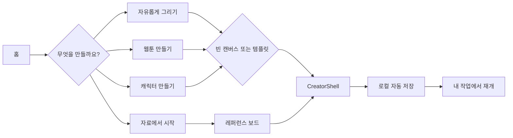
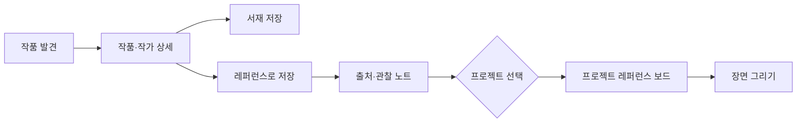
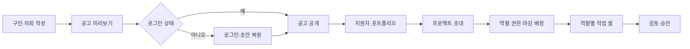
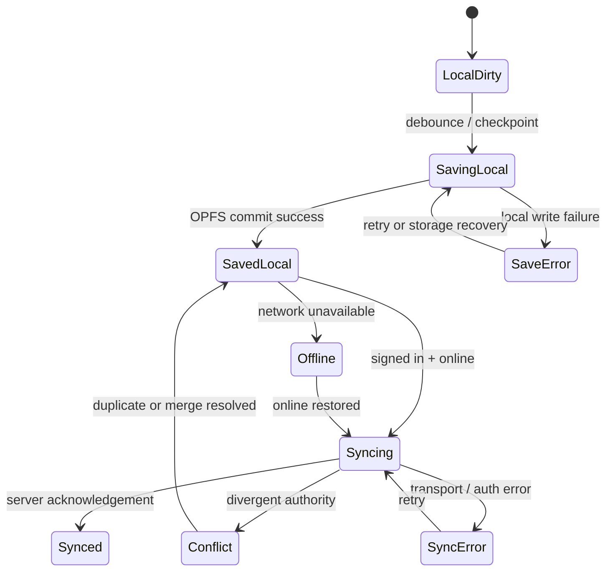
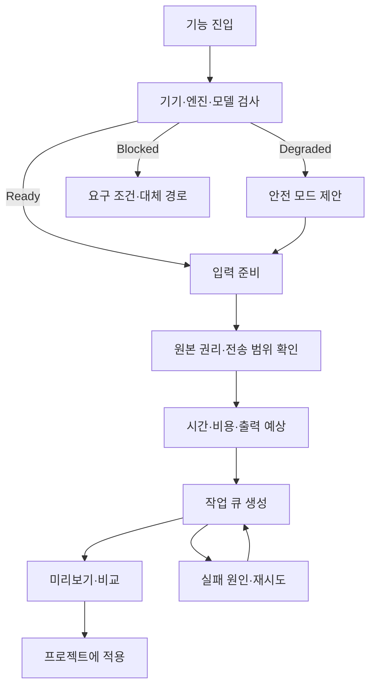
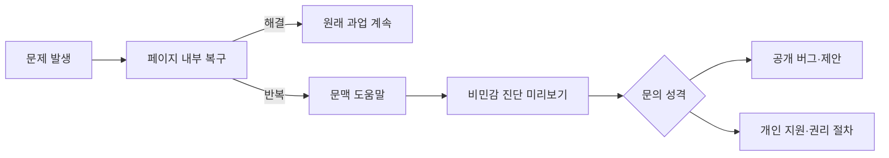

# 핵심 화면 와이어프레임과 사용자 흐름

이 문서의 와이어프레임은 시각 스타일이 아니라 정보 위계, 책임, 상태 전환을 고정한다.

## 1. 사이트맵 — 데스크톱

```text
┌────────────────────────────────────────────────────────────────────┐
│ Global header                                      Search  Account │
├────────────────────────────────────────────────────────────────────┤
│ 전체 작업 지도                                                   │
│ 무엇을 하려는지 알려주세요.                                      │
│ [ 메뉴·도구·페이지 검색...................................... ] │
│ [만들기] [영감 찾기] [함께하기] [관리하기]                       │
├────────────────────────────────────────────────────────────────────┤
│ 최근 방문                즐겨찾기                진행 중 작업      │
│ 프로젝트 A · 12분 전     브러시 연구실           검토 3건          │
│ 레퍼런스 아틀라스        태그 탐색                복구 1건          │
├────────────────────────────────────────────────────────────────────┤
│ Filters: Product | Purpose | Status | Access | Device | Technology │
│ 108 results · Stable 72 · Beta 25 · Experimental 11               │
├───────────────────────────────┬────────────────────────────────────┤
│ Create                        │ Discover                           │
│ Studio home      Stable       │ Search             Stable         │
│ 3D sculpt       Experimental │ Spatial reader     Experimental   │
│ ...                           │ ...                                │
└───────────────────────────────┴────────────────────────────────────┘
```
### 모바일

```text
┌ ToonStudio              Search  Menu ┐
│ 전체 작업 지도                         │
│ [ 메뉴·도구 검색.................... ] │
│ [만들기] [찾기] [함께] [관리]          │
├ 최근 방문 ─────────────────────────────┤
│ 프로젝트 A                        →    │
│ 브러시 연구실                     →    │
├ Filter & sort                          │
│ [Studio] [Stable] [Responsive]  42개  │
├ 결과 카드                              │
│ 프로젝트 목록        Project required │
│ 기존 프로젝트를 찾아 이어서 작업      │
│                                  열기 │
└ Home  Find  Ranking  Community  Library┘
```

- 검색 결과는 이름, 설명, 키워드, route metadata를 함께 검색한다.
- 숨겨진 alias는 결과에 나오지 않는다.
- 현재 점검 중인 P0 라우트는 열기 버튼 대신 상태와 대체 경로를 제공할 수 있다.

## 2. 검색·탐색 Collection

```text
┌ Breadcrumb: 작품 찾기 / 통합 검색                              ┐
│ 작품을 바로 찾는 작업공간                    [저장 검색]       │
│ [ 검색어.................................................. ]   │
├ Tabs: 작품 1,248 | 작가 82 | 태그 214 | 자료 36                │
├ Filter summary: 판타지 ×  완결 ×  무료 ×       [필터 3] [정렬] │
├────────────────────────────────────────────────────────────────┤
│ Result card / row                                               │
│ Cover │ Title / creator / genre / status                        │
│       │ 제공처·가격·갱신 시각 │ 저장  비교  상세               │
│ ... virtualized or paginated                                   │
└────────────────────────────────────────────────────────────────┘
```
### 모바일 필터 시트

```text
┌ 필터                                         닫기 ┐
│ 작품 유형   (● 전체) ( ) 웹툰 ( ) 웹소설         │
│ 장르        [판타지] [로맨스] [액션] [더 보기]   │
│ 상태        [연재중] [완결] [휴재]               │
│ 가격        [무료] [기다무] [유료]               │
│ 플랫폼      [선택 2개]                           │
│                                                  │
│ [초기화]                     [1,248개 결과 보기] │
└──────────────────────────────────────────────────┘
```

- 열기 전 현재 선택과 결과 수를 유지한다.
- 적용 후 스크롤 위치를 불필요하게 초기화하지 않는다.
- `/tags`는 전체 수천 개 태그를 DOM에 동시에 만들지 않고 검색·클러스터·페이지 단위로 탐색한다.

## 3. DocsShell

```text
┌ ToonStudio  도움말  접근성  정책                       Search ┐
├ 서비스 / 개인정보처리방침                                      ┤
│ 개인정보처리방침                                               │
│ 쉬운 말 요약: 무엇을, 왜, 얼마나 보관하는지                    │
│ 시행 2026-09-16 · 최종 변경 2026-09-16 · [변경 이력] [인쇄]    │
├───────────────┬────────────────────────────────┬────────────────┤
│ 문서 목차     │ 1. 수집하는 항목              │ 관련 행동      │
│ 1 수집 항목   │ ...                            │ 데이터 받기    │
│ 2 이용 목적   │ 2. 이용 목적                  │ 삭제 요청      │
│ 3 저장 정보   │ ...                            │ 문의하기       │
│ ...           │                                │                │
└───────────────┴────────────────────────────────┴────────────────┘
```

문서 페이지에서 일반 마케팅 히어로, 동일 작품 이미지, 반복 전환 배너는 제거한다.

## 4. 내 공간 Dashboard

```text
┌ 내 공간                                      [대시보드 편집] ┐
│ 오늘 이어갈 일                                                  │
├────────────────┬────────────────┬──────────────────────────────┤
│ 최근 프로젝트 │ 검토 요청 3건 │ 동기화·복구 주의 1건         │
│ 썸네일 / 제목 │ 담당·마감     │ 마지막 안전 저장 / 해결      │
├────────────────┴────────────────┴──────────────────────────────┤
│ 내 작업 | 공유받음 | 서재 | 에셋 | 학습                       │
│ 검색 / 필터 / 최근 수정                                        │
│ Project cards with thumbnail, role, sync, next action          │
└────────────────────────────────────────────────────────────────┘
```
## 5. Studio 프로젝트 운영 화면

```text
┌ ← Studio │ Project A / Episode 12 │ Saved locally · Syncing │ Share ┐
├ Overview  Projects  Review  Versions  Present  Publish             ┤
│ 프로젝트                                                          │
│ [검색...] [상태] [역할] [최근 수정]                 [+ 새 프로젝트] │
├─────────────────────────────────────────────────────────────────────┤
│ Thumbnail │ Episode 12                                             │
│           │ 내 역할: 작화 · 수정 8분 전 · 서버 동기화됨            │
│           │ 다음 할 일: 편집자 검토 3건 반영             [이어하기] │
├─────────────────────────────────────────────────────────────────────┤
│ Thumbnail │ Episode 11 · 복구 필요 · 로컬 버전이 더 새로움          │
│           │ [비교] [복제하여 열기] [복구 도움말]                   │
└─────────────────────────────────────────────────────────────────────┘
```

- `/studio/projects`, `/studio/review`, `/studio/share`, `/studio/versions`, `/studio/present`는 독립 전역 페이지처럼 보이지 않고 동일 프로젝트 ContextBar를 공유한다.
- 프로젝트가 없으면 샘플·가져오기·새 프로젝트·최근 로컬 초안을 제공한다.

## 6. Immersive editor — 데스크톱

```text
┌ Back │ Project A / Episode 12 │ Saved locally · Synced │ Share Export ┐
├ File  Edit  View  Canvas  Layer  3D     Mode: Drawing      Comments 2 ┤
│ Tools │                                                             │
│       │                    CANVAS / 3D SURFACE                       │ Inspector
│       │                                                             │ Layers
│       │                                                             │ Properties
├ Pages / Timeline / Frames                                           ┤
└ Zoom 100% │ Brush engine ready │ Online │ GPU normal │ Shortcut help ┘
```

- 상단 floating 패널은 드래그·리사이즈 가능하되 기본 배치 복원과 키보드 이동을 지원한다.
- 도구 패널이 캔버스 핵심 영역을 가리키면 자동 도킹 또는 투명 프리뷰를 제공한다.
- 서브 뷰는 외부 창·내부 도킹·오버레이 세 모드를 지원하고 같은 기능을 중복 구현하지 않는다.
### 모바일 review 모드

```text
┌ ← │ Episode 12 │ Synced │ ⋯ ┐
│ [보기] [댓글] [승인] [재생] │
├──────────────────────────────┤
│                              │
│       CANVAS PREVIEW         │
│       pinch / pan            │
│                              │
├──────────────────────────────┤
│ 댓글 2건 · 현재 컷 4         │
│ [댓글 추가] [수정 요청]      │
└ 데스크톱에서 편집 이어하기 ──┘
```

정밀 도구를 24px 아이콘으로 축소해 노출하지 않는다. 사용 가능한 조작과 제한 이유를 명확히 설명한다.

## 7. 마켓 탐색과 적합성

```text
┌ 소재 마켓                           Search assets  My assets ┐
│ 현재 프로젝트: Episode 12 · 2D/WebGL · 상업 연재            │
├ Category | License | Format | Compatibility | Price | Sort ┤
│ Asset card                                                   │
│ Preview │ Name · Author · Version                            │
│         │ License: commercial · Attribution: no              │
│         │ Studio compatible · 42MB · updated 3d ago          │
│         │ [Preview] [Fit check] [Save] [Install]             │
└──────────────────────────────────────────────────────────────┘
```

### Fit 결과

```text
Overall: 조건부 적합
✓ 파일 형식과 Studio 버전 호환
✓ 상업적 이용 가능
! 텍스처 4K, 현재 모바일 검토 모드에서 느릴 수 있음
! 프로젝트 색공간과 다름 — 자동 변환 가능
[자동 수정 후 추가] [다른 에셋 보기] [상세 근거]
```

`/market/browse` 데이터 실패 시에도 카테고리·검색 셸·캐시된 인기 에셋·재시도는 표시한다.
## 8. 흐름 A — 처음 방문한 창작자



### 완료 조건

- 계정이 없어도 샘플 또는 로컬 초안을 시작한다.
- 로그인 요구 시 현재 초안과 복귀 URL을 보존한다.
- 생성한 결과가 `/studio` 프로젝트 목록에 썸네일과 함께 나타난다.

## 9. 흐름 B — 작품 발견에서 창작으로



원작 이미지·유료 본문을 복제하지 않는다. 공개 메타데이터와 사용자가 작성한 관찰 노트의 경계를 유지한다.
## 10. 흐름 C — 협업 요청과 역할 배정



공고, 커뮤니티 대화, 프로젝트 편집 권한을 같은 권한으로 취급하지 않는다. 프로젝트 초대 전에 역할·범위·만료·권리를 다시 확인한다.

## 11. 흐름 D — 저장·동기화·복구



UI는 `SavedLocal`과 `Synced`를 같은 “저장 완료”로 뭉개지 않는다. 브라우저 종료 위험이 있는 상태에서는 보존 범위와 복구 경로를 설명한다.
## 12. 흐름 E — 3D·AI 기능 준비와 실행



- 실행 중 route를 떠나도 작업 큐에서 추적한다.
- 개인 서버, 외부 API, 무료 모델, 로컬 실행을 동일한 상태 모델로 표현하되 데이터 전송 범위를 구분한다.
- 결과 적용 전에 원본 보존과 실행 취소 가능 여부를 표시한다.

## 13. 흐름 F — 지원과 오류 진단



진단은 자동 전송하지 않는다. 작품 내용, 파일명, query의 식별자, API 키를 포함하지 않으며 사용자가 복사 내용을 먼저 확인한다.

## 14. 화면 상태 우선순위

한 화면에 여러 문제가 동시에 있을 때 다음 우선순위로 표현한다.

1. 데이터 손실 위험
2. 권한·인증·프로젝트 불일치
3. 기능 실행 차단
4. 데이터 제공자·네트워크 오류
5. 부분 기능 제한
6. 일반 빈 상태
7. 교육·프로모션 메시지

오류 배너와 일반 empty state를 동시에 표시해 사용자가 실제 원인을 추측하게 하지 않는다.
## 10. main 재검토 추가 — Production과 Studio 연결

### Production project — 데스크톱

```text
┌ Creator header: 제작 관리 / 프로젝트명 / 역할 / 저장 상태 / 원고 열기 ┐
├ Project nav: 홈 | 기획 | 회차 | 작업 보드 | 일정 | 넘기기 | 검수 | 권리 ┤
│ 오늘 할 일                         │ 막힌 작업·승인 대기              │
│ 1. 12화 콘티 검수                 │ 배경 작업 입력 revision 없음     │
│ 2. 13화 선화 담당 배정            │ 계약 milestone 승인 대기         │
├────────────────────────────────────┴─────────────────────────────────┤
│ 역할별 workcell                                                       │
│ Story → Thumbnail → Line/Background → Color → Lettering → Final       │
│ 각 카드: 담당자 · 입력 revision · 마감 · 상태 · 다음 결정자           │
└───────────────────────────────────────────────────────────────────────┘
```

### Studio project library

```text
┌ 프로젝트                                                [새 작품] [가져오기] ┐
│ [검색]  [최근] [로컬 초안] [공유] [복구]                                  │
├─────────────────────────────────────────────────────────────────────────────┤
│ Thumbnail  작품명             이 기기에 저장됨 · 서버 미동기화              │
│            마지막 작업 12분 전                                      [열기] │
│            제작 관리: 2건 검수 대기                          [제작 상태]     │
└─────────────────────────────────────────────────────────────────────────────┘
```

### 연결 규칙

- Production은 업무·일정·역할·승인의 권위다.
- Studio Project Library는 실제 작업 파일·초안·package·복구의 권위다.
- `원고 열기`는 명시적 `ProductionStudioLink`의 work revision을 연다.
- `제작 상태`는 문서를 재저장하지 않고 Production projection만 연다.
- handoff와 review는 지정 revision을 참조하며 최신 파일을 암묵적으로 바꾸지 않는다.
- mobile Production은 목록·검토·배정 중심, 정밀 Studio 편집은 route mobile policy를 따른다.
