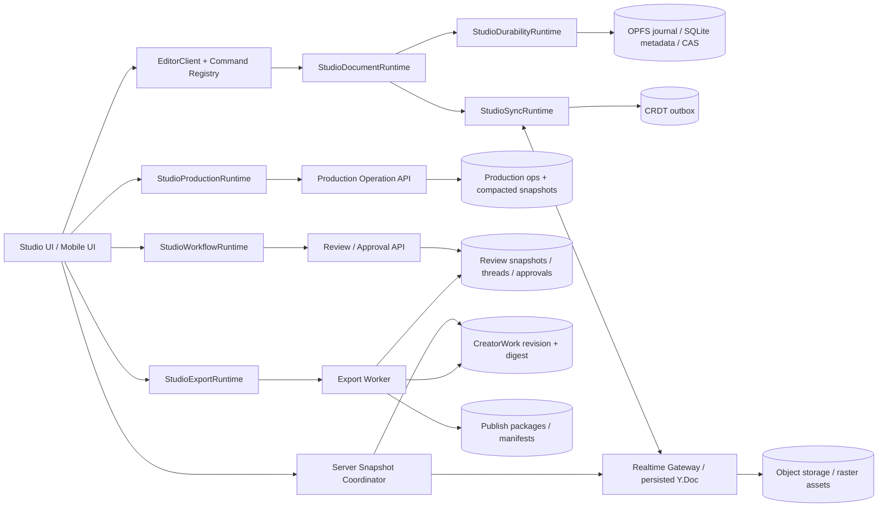
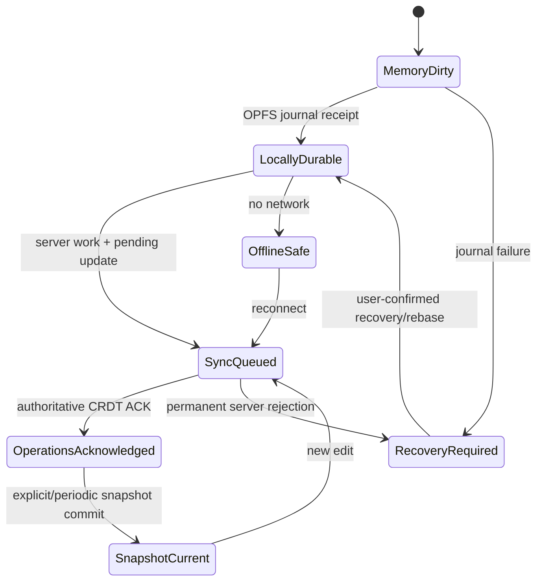

# ToonSpectrum Studio Production OS — 개발 전 상세 설계

- 상태: **Implementation Review Ready**
- 기준일: 2026-09-16
- 기준 브랜치: `main@e23362011433cbfcdc59f0d5fda260ad208074f7`
- 범위: `/studio`, 실시간 공동 편집, 로컬 내구 저장, Production Center, 검수·승인, 게시·내보내기
- 관련 결정: [ADR-0012](../adr/0012-v12-sqlite-opfs-local-authority.md), [ADR-0020](../adr/0020-editor-client-ui-command-boundary.md), [ADR-0022](../adr/0022-studio-authority-identity-production-modes.md), [ADR-0023](../adr/0023-local-first-durability-sync-and-snapshot-fences.md), [ADR-0024](../adr/0024-production-operations-review-approval-publish-contract.md)
- 구현 계획: [Studio Production OS 구현 계획](../rewrite/studio-production-os-implementation-plan-2026-09-16.md)

## 1. 제품 결정

ToonSpectrum Studio의 목표는 Clip Studio Paint, MediBang Paint, ibisPaint의 기능을 화면 단위로 복제하는 것이 아니다.
다음 하나의 제작 흐름을 끊김 없이 연결하는 것이 제품 우위다.

```text
대본 → 장면 → 컷 → 작화 → 말풍선/식자 → 팀 검수 → 승인 → 플랫폼별 연재본
```

제품 문장은 다음으로 고정한다.

> 혼자 그리는 드로잉 앱이 아니라, 웹툰 팀이 함께 기획하고 그리고 검수하고 연재하는 제작 운영체제.

경쟁 기준은 다음과 같다.

| 제품군의 강점 | ToonSpectrum이 흡수할 능력 | ToonSpectrum의 차별화 지점 |
| --- | --- | --- |
| Clip Studio Paint의 만화 편집, 다중 페이지, 웹툰 출력, 3D·소재 | 컷·말풍선·특수 자·효과선·페이지·출력·3D를 하나의 작품 문서에서 유지 | 동일 페이지 공동 작업, 직군별 인계·검수, 자동 저장과 플랫폼 게시 파이프라인 |
| MediBang의 클라우드 프로젝트와 팀 제작 | 역할·담당·작업 단계·검수·공유 | 파일 공유가 아니라 같은 원고의 구조적 실시간 공동 편집 |
| ibisPaint의 모바일 우선 입력과 기기 간 클라우드 연속성 | 펜/터치 분리, 오프라인 편집, 기기 간 이어 작업 | 장편 원고·팀 프로젝트·검수·게시까지 이어지는 모바일 제작 흐름 |

공개 커뮤니티와 대규모 공개 소재 마켓은 이 설계의 선행 조건이 아니다. 먼저 팀 소재함, 검수 링크, 템플릿,
라이선스·버전 추적을 완성하고 공개 생태계는 별도 성장 단계로 둔다.

## 2. 목표와 비목표

### 2.1 목표

1. 사용자의 편집 명령은 네트워크 상태와 무관하게 먼저 기기에 내구 저장된다.
2. 로컬 저장, 클라우드 동기화, 서버 스냅샷, 검수본, 승인본, 게시본을 서로 다른 상태로 표현한다.
3. 같은 페이지에서 선화·배경·식자·검수가 동시에 진행될 수 있다.
4. 에피소드→시퀀스→장면→페이지→컷의 제작 계층과 담당 직군을 원고의 안정 ID에 연결한다.
5. 대본의 화자·대사를 컷과 말풍선에 연결해 번역·일괄 스타일·읽기 순서를 자동화한다.
6. 검수와 승인은 특정 서버 리비전·콘텐츠 digest에 고정되며 이후 편집으로 조용히 바뀌지 않는다.
7. 게시 패키지는 승인된 리비전과 플랫폼 규격 버전을 재현 가능하게 기록한다.
8. 데스크톱·태블릿·모바일에서 같은 문서 권위와 저장 계약을 사용한다.

### 2.2 비목표

- Clip Studio Paint의 모든 브러시·소재 수를 단기간에 추월한다고 주장하지 않는다.
- Blender 전체 DCC 기능을 웹 편집기 안에 재구현하지 않는다.
- presence, 커서, 화면 공유 데이터를 원고 문서에 저장하지 않는다.
- P2P 수신을 서버 승인으로 오인하지 않는다.
- AI 제안을 사용자 확인 없이 원고 권위로 자동 승격하지 않는다.
- 하나의 거대한 JSON 문서를 모든 도메인의 유일한 동시 편집 프로토콜로 사용하지 않는다.

## 3. 현재 기준선과 실제 갭

### 3.1 이미 존재하는 강한 기반

현재 저장소에는 다음 기반이 이미 있다.

- `studio-autosave-opfs-session.ts`, `studio-autosave-document-leader.ts`와 ADR-0012의 OPFS journal·Web Lock 기반 로컬 내구 저장
- Yjs 문서, SQLite CRDT outbox, 서버 ACK, 복구 vault, 상태 벡터 재동기화를 가진 `studio-crdt-room-binding.ts`
- cursor/presence, focused follow, 댓글, 역할, 화면 공유를 가진 `StudioLiveCollaborationProvider`
- 컷·말풍선·톤·효과선을 하나의 그래프로 취급하는 `packages/studio-project-model/src/ir/comic.ts`
- 에피소드·시퀀스·장면·페이지, 직군, 작업, 의존성, 인계, 검수를 가진 Production Workspace v3
- `/creator/works/:id/production` 서버 저장소와 view/edit/manageRoles/approve/publish capability
- 서버 리비전·digest에 고정할 수 있는 `studio-version-coordinates.ts`
- review cycle, snapshot, rich anchor, blocker, immutable approval 코어인 `studio-review-workflow.ts`
- 전체 화면 페이지 오거나이저, 플랫폼 출력 preflight, 다중 포맷·검증 ZIP, 3D multipass 기반

따라서 신규 제품을 옆에 만드는 것이 아니라 기존 권위와 런타임을 연결해야 한다.

### 3.2 가장 큰 구조적 갭

#### A. “저장”이 너무 많은 의미를 가진다

`runStudioPageSavePipeline()`은 현재 마지막 획 확정, publish preflight, 서버 CRDT ACK 대기, 모든 페이지 캡처,
DTO 생성, CreatorWork 저장, 로컬 autosave tombstone까지 한 사용자 동작 안에서 수행한다. 이 흐름은 게시·검수용
서버 스냅샷에는 타당하지만, 일반적인 자동 저장의 의미로는 너무 무겁고 로컬/P2P 모드를 실패로 보이게 한다.

#### B. Production Center는 전체 문서 PUT 충돌 모델이다

Production Workspace v3 자체는 역할·계층·의존성·인계까지 충분히 풍부하다. 그러나 서버 변경은
`baseRevision + 전체 document PUT`이므로 서로 다른 팀원이 독립 작업을 수정해도 409 후 전체 재로드가 필요하다.

#### C. 검수 코어와 외부 검토 API가 분리되어 있다

revision-pinned review/approval 코어는 존재하지만, 현재 서버 API는 주로 검토 링크와 단순 feedback을 저장한다.
검수 회차·스냅샷·thread·approval·publish package가 서버 리비전 좌표로 이어지는 영속 경로가 필요하다.

#### D. 의미 ID가 사용자 흐름에 아직 충분히 노출되지 않는다

ADR-0022의 Semantic Identity 기반은 존재하지만 대본→ComicGraph→PageState→Bubble의 실제 연결과 사용자 확인형
migration 흐름이 제품 전체에 배선되어야 한다.

## 4. 설계 원칙

### 4.1 Local-first, server-authoritative는 서로 모순이 아니다

- **편집 안전성 권위**: 기기의 OPFS journal
- **팀 병합 권위**: 인증된 CRDT 서버 sequence와 persisted Y.Doc frontier
- **공식 원고 스냅샷 권위**: CreatorWork server revision + content digest
- **검수 권위**: review snapshot
- **승인 권위**: immutable approval record
- **게시 권위**: approval을 참조하는 publish package

로컬 저장은 서버 권한을 대신하지 않고, 서버 권한은 로컬 편집 안전성을 막지 않는다.

### 4.2 한 상태를 여러 이름으로 숨기지 않는다

사용자에게 다음을 별도로 보여준다.

| 내부 상태 | 사용자 문구 | 편집 가능 | 검수/게시 가능 |
| --- | --- | ---: | ---: |
| memory only | `기기 저장 준비 중` | 예 | 아니오 |
| OPFS durable, offline | `이 기기에 안전하게 저장됨 · 오프라인` | 예 | 아니오 |
| OPFS durable, remote pending | `기기에 저장됨 · 클라우드 동기화 중` | 예 | 아니오 |
| CRDT ACK complete | `클라우드와 동기화됨` | 예 | 스냅샷 생성 후 가능 |
| CreatorWork snapshot current | `서버 원고 최신` | 예 | 예 |
| recovery required | `복구 확인 필요` | 제한 | 아니오 |
| read-only permission | `보기 전용` | 아니오 | 권한에 따름 |

`저장됨` 하나로 이 상태들을 합치지 않는다.

### 4.3 도메인별 최적 동시 편집 모델을 사용한다

- 원고 구조·벡터·텍스트·말풍선·페이지 metadata: CRDT
- 래스터 stroke: append operation + content-addressed raster asset/tile
- 파괴적 raster transform·대형 filter bake: surface-scoped lease
- Production 작업·역할·인계: idempotent domain operations
- 검수·승인: revision-pinned workflow records
- presence·cursor·viewport·screen signaling: ephemeral session

### 4.4 기존 호스트에 상태를 더 밀어 넣지 않는다

신규 UI는 `EditorClient.dispatch()`와 명명된 runtime service를 통해 동작한다. 거대 호스트의 setter/closure bag을
확장하지 않는다. 저장·동기화 상태는 selector로 구독하고 렌더러 객체를 도메인 계약에 노출하지 않는다.

## 5. 목표 사용자 흐름

### 5.1 혼자 오프라인에서 작업

1. 사용자가 획 또는 문서 명령을 수행한다.
2. 화면은 즉시 갱신된다.
3. 명령/CRDT update가 문서별 Web Lock 아래 OPFS journal에 기록된다.
4. UI는 `이 기기에 안전하게 저장됨`을 표시한다.
5. 네트워크가 없으면 outbox가 유지된다.
6. 앱 재시작 시 snapshot + journal replay로 동일 frontier를 복구한다.
7. 네트워크 복귀 후 서버 state vector와 비교해 누락 update만 전송한다.

서버에 연결되지 않았다는 이유로 로컬 저장 버튼이 실패하지 않는다.

### 5.2 다른 기기에서 이어 작업

1. 새 기기가 서버 snapshot과 CRDT frontier를 받는다.
2. 로컬 OPFS document scope를 새 generation으로 materialize한다.
3. 기존 기기의 미전송 update가 있으면 서버가 받은 순서와 Yjs convergence로 병합한다.
4. immutable asset hash가 없는 경우만 object storage에서 내려받는다.
5. 첫 화면은 현재 페이지와 저해상도 preview를 우선 로드하고 나머지는 지연 hydration한다.

### 5.3 같은 페이지 공동 작업

- 선화 담당: 캐릭터 레이어/벡터 stroke
- 배경 담당: 별도 raster surface 또는 3D-linked background
- 식자 담당: balloon/text graph
- 편집자: semantic anchor comment

각 사용자는 같은 페이지를 본다. 서로 다른 권위 영역은 동시에 편집한다. 같은 raster surface에 destructive operation이
필요할 때만 짧은 lease를 획득한다. lease가 없는 참여자는 해당 surface만 읽기 전용이며 페이지 전체가 잠기지 않는다.

### 5.4 검수와 승인

1. `검수본 만들기`는 일반 저장이 아니라 명시적 서버 snapshot fence다.
2. pending CRDT update를 서버 ACK까지 drain한다.
3. CreatorWork revision과 digest를 생성한다.
4. review snapshot이 해당 revision/digest를 고정한다.
5. 댓글은 element/region/script-range 등 안정 anchor를 사용한다.
6. blocker가 없고 capability가 있는 사용자가 승인한다.
7. 승인 이후 원고가 바뀌면 approval은 삭제되지 않고 `stale`이 된다.

### 5.5 게시

1. 게시 대상 approval을 선택한다.
2. 승인 source revision을 export worker가 materialize한다.
3. 플랫폼 profile의 version을 고정한다.
4. preflight, slice, compression, naming, watermark, package manifest를 생성한다.
5. 파일별 digest와 source approval을 기록한다.
6. 재시도는 같은 job idempotency key를 사용한다.

## 6. 목표 아키텍처



### 6.1 Runtime 책임

| Runtime | 책임 | 금지 |
| --- | --- | --- |
| `StudioDocumentRuntime` | Authoring 문서, 명령 적용, projection | 네트워크·렌더러 객체 소유 |
| `StudioDurabilityRuntime` | OPFS journal, checkpoint, recovery receipt | 서버 ACK를 로컬 내구성으로 위장 |
| `StudioSyncRuntime` | outbox, state vector, server ACK, reconnect | review/approval 상태 저장 |
| `StudioProductionRuntime` | 작업·역할·계층·인계 operation | 원고 pixel/CRDT update 저장 |
| `StudioWorkflowRuntime` | review snapshot, thread, approval | 승인 source revision 변경 |
| `StudioExportRuntime` | preflight, export job, package receipt | 현재 편집 head를 승인본 대신 출력 |
| `StudioCollaborationRuntime` | presence, cursor, follow, media signaling | presence 영속화 |

## 7. 버전 좌표와 저장 의미

기존 `StudioVersionCoordinates`를 제품 상태의 기준으로 유지하되 다음 좌표를 명시적으로 투영한다.

```ts
interface StudioVersionCoordinatesV2 {
  local: {
    sequence: number;
    checkpointId: string | null;
    journalGeneration: number;
    durableState: "memory" | "opfs" | "recovery-required";
    documentDigest: string | null;
    pendingServerMutations: number;
  };
  collaboration: {
    serverSequence: string | null;
    stateVectorDigest: string | null;
    acknowledgedAt: string | null;
  } | null;
  server: {
    revision: number;
    contentDigest: string;
    crdtServerSequence: string;
    snapshotCreatedAt: string;
  } | null;
  review: StudioReviewVersionCoordinate | null;
  approval: StudioApprovalVersionCoordinate | null;
  publish: StudioPublishVersionCoordinate | null;
}
```

`collaboration.serverSequence`와 `server.revision`은 같은 값이 아니다.

- server sequence: CRDT update stream의 내구 ACK 경계
- CreatorWork revision: 검수·게시 가능한 canonical snapshot 경계

둘을 하나의 `saved` boolean으로 합치지 않는다.

## 8. 로컬 우선 저장과 서버 스냅샷

### 8.1 상태 머신



### 8.2 로컬 내구 receipt

```ts
interface StudioLocalDurabilityReceiptV1 {
  schemaVersion: 1;
  documentScope: string;
  localSequence: number;
  journalGeneration: number;
  contentDigest: string;
  persistedAt: string;
  operationCount: number;
}
```

- 명령은 메모리 적용 후 bounded queue로 journal에 기록한다.
- 로컬 저장 표시 전 receipt가 필요하다.
- journal 쓰기 실패 시 메모리 편집을 즉시 버리지 않지만 `저장되지 않음`을 분명히 표시한다.
- 두 탭은 기존 document leader/Web Lock을 유지한다. follower 탭의 편집은 leader로 전달하거나 명시적으로
  독립 세션으로 분기하며 동일 journal에 무경쟁 쓰기를 허용하지 않는다.

### 8.3 클라우드 동기화 receipt

```ts
interface StudioCloudSyncReceiptV1 {
  updateId: string;
  serverSequence: string;
  stateVectorDigest: string;
  acknowledgedAt: string;
}
```

- stable update id로 재시도한다.
- peer 전달은 이 receipt를 만들 수 없다.
- server ACK 후에만 outbox tombstone을 기록한다.
- 영구 거절은 recovery vault로 이동하고 자동 삭제하지 않는다.

### 8.4 서버 스냅샷 fence

일반 편집은 서버 snapshot을 매번 만들지 않는다. 다음 동작만 snapshot fence를 요구한다.

- 이름 있는 서버 버전 만들기
- 검수본 만들기
- 승인 요청
- 게시 패키지 생성
- 명시적 `클라우드 원고 갱신`
- 서버 정책상 정한 background compaction

현재 `runStudioPageSavePipeline()`은 단계적으로 `commitStudioServerSnapshot()` 의미로 축소한다.

#### 전환 단계 A

기존 client DTO·capture 경로를 유지하되 `requiredCrdtServerSequence`를 서버 요청에 포함한다. 일반 autosave에서는
호출하지 않는다.

#### 전환 단계 B

서버 snapshot worker가 persisted Y.Doc frontier와 immutable asset manifest에서 canonical document와 preview를
materialize한다. 클라이언트는 페이지 전체 data URL을 매 저장마다 보내지 않는다.

## 9. 공동 편집 lane과 충돌 정책

| Lane | 데이터 | 병합 | 잠금 |
| --- | --- | --- | --- |
| Structure | page, panel, balloon, text, vector, metadata | Yjs/command transaction | 참조 무결성 transaction만 |
| Raster stroke | stroke op, tile patch, immutable asset ref | append + deterministic replay | 없음 또는 tile ownership |
| Destructive raster | transform, liquify commit, filter bake | 새 surface revision | surface lease |
| Binary asset | GLB, texture, font, image | SHA-256 CAS | manifest commit만 직렬화 |
| Production | task, role, handoff, hierarchy | domain operation | capability + optimistic revision |
| Review | snapshot, thread, approval | immutable/append 중심 | approval command만 capability gate |
| Presence | cursor, viewport, follow | 최신 ephemeral state | 없음 |

### 9.1 Lease 계약

```ts
interface StudioSurfaceLeaseV1 {
  leaseId: string;
  workId: string;
  pageId: string;
  surfaceId: string;
  operationClass: "transform" | "bake" | "replace" | "large-fill";
  holderUserId: string;
  expiresAt: string;
  baseSurfaceRevision: number;
}
```

- page 전체가 아니라 surface 범위만 잠근다.
- TTL과 heartbeat가 필요하다.
- 연결 종료 후 자동 해제하되 완료되지 않은 결과를 commit하지 않는다.
- lease 없이 생성한 preview는 로컬 임시 상태이며 canonical commit이 아니다.

### 9.2 동일 객체 동시 변경

- 텍스트: CRDT text
- 좌표/스타일 scalar: deterministic last accepted operation + history receipt
- 삭제 대 편집: 삭제 tombstone을 우선하고 편집은 orphan recovery 후보로 보존
- panel 삭제: 연결 balloon/tone/effect/reference가 있으면 현재처럼 refuse-based integrity를 유지
- 대형 style 일괄 변경: 하나의 atomic command id로 기록

## 10. Production Workspace operation 모델

현재 Workspace v3 스키마는 유지한다. 변경 전송 방식을 전체 문서 PUT에서 operation 중심으로 확장한다.

```ts
interface StudioProductionOperationV1 {
  schemaVersion: 1;
  operationId: string;       // UUID, idempotency key
  clientId: string;
  workId: string;
  baseRevision: number;
  target: {
    kind: "task" | "review" | "hierarchy" | "role" | "handoff" | "workspace";
    id: string | null;
  };
  kind:
    | "task.create" | "task.patch" | "task.delete"
    | "review.create" | "review.patch" | "review.resolve"
    | "hierarchy.create" | "hierarchy.move" | "hierarchy.delete"
    | "role.assign" | "role.revoke"
    | "handoff.create" | "handoff.patch" | "handoff.accept"
    | "workspace.rename";
  payload: Readonly<Record<string, unknown>>;
  submittedAt: string;
}

interface StudioProductionOperationReceiptV1 {
  operationId: string;
  acceptedRevision: number;
  appliedAt: string;
  changedEntityIds: readonly string[];
  snapshotRevision: number;
}
```

### 10.1 서버 규칙

- actor identity와 capability는 header가 아니라 인증 context에서 결정한다.
- operation id는 work 범위에서 unique하다.
- 같은 operation 재전송은 같은 receipt를 반환한다.
- 서로 다른 entity의 operation은 최신 snapshot에 재적용할 수 있다.
- 같은 field 충돌은 409와 현재 field revision을 반환하며 전체 workspace를 버리지 않는다.
- dependency cycle, hierarchy cycle, missing assignment 등 기존 Zod 무결성 검사를 operation 후 snapshot에도 적용한다.
- operation log는 append-only이며 bounded snapshot compaction을 수행한다.

### 10.2 호환 전환

- `GET /creator/works/:id/production`: 계속 hydrated Workspace v3 반환
- `PUT /creator/works/:id/production`: 구형 클라이언트 호환용으로 유지하되 operation client 활성화 후 deprecated telemetry 기록
- 신규 `POST .../production/operations`: canonical mutation path
- compacted snapshot은 기존 `creatorWorkProductionWorkspaces`를 계속 사용할 수 있다.

## 11. 검수·승인·게시 계약

### 11.1 Review Snapshot

```ts
interface StudioReviewSnapshotRecordV1 {
  id: string;
  cycleId: string;
  workId: string;
  sourceServerRevision: number;
  sourceContentDigest: string;
  sourceCrdtServerSequence: string;
  sourceArchiveSchemaVersion: number;
  previewManifestId: string;
  createdBy: string;
  createdAt: string;
}
```

- snapshot 생성 전에 CRDT ACK fence와 CreatorWork snapshot commit이 완료되어야 한다.
- preview는 snapshot source에서 생성한다. 현재 편집 head에서 다시 캡처하지 않는다.
- 기존 rich anchor 타입을 그대로 사용한다.

### 11.2 Approval

- blocker thread가 열려 있으면 승인할 수 없다.
- approval은 immutable이다.
- 수정이 필요한 경우 기존 approval을 `superseded`로 표시하고 새 review cycle을 만든다.
- 승인 문구와 source digest를 함께 digest해 감사 영수증을 남긴다.

### 11.3 Publish Package

```ts
interface StudioPublishPackageRecordV1 {
  id: string;
  workId: string;
  approvalId: string;
  sourceServerRevision: number;
  profileId: string;
  profileVersion: number;
  manifestDigest: string;
  artifactIds: readonly string[];
  status: "queued" | "rendering" | "validating" | "ready" | "failed" | "cancelled";
  createdAt: string;
  completedAt: string | null;
}
```

게시 worker는 승인된 source revision만 읽는다. 현재 head가 더 최신이어도 승인본을 조용히 바꾸지 않는다.

## 12. 대본→컷→말풍선 의미 그래프

### 12.1 안정 ID

```text
StoryBlock / DialogueLine
  ↕ semantic link
SemanticScene / SemanticPanel / SemanticDialogue
  ↕ domain references
WriterRoomPanel → ComicPanel → PageFrameElement → BubbleElement/TextNode
```

### 12.2 신규 문서

- scene/panel/dialogue 생성 시 semantic ID를 함께 발급한다.
- 대사 삽입은 화자, 원문, locale variant, balloon reference를 연결한다.
- 컷 분할·복제 시 semantic lineage를 기록한다.
- 번역은 원문을 덮지 않고 locale variant로 저장한다.

### 12.3 기존 문서

- read-only scanner가 위치·대사·기존 ID를 기반으로 후보를 만든다.
- confidence와 충돌 이유를 보여준다.
- 사용자가 승인한 link만 저장한다.
- 불확실한 후보를 자동으로 canonical ID로 승격하지 않는다.

### 12.4 가능한 자동화

- 화자별 balloon style 일괄 변경
- 대사 변경 시 번역 재검수 표시
- 읽기 순서와 시선 흐름 검사
- balloon tail의 화자 anchor 추적
- 대본 누락/중복 배치 검사
- page organizer와 Production task의 semantic 범위 연결

## 13. API 설계

아래 경로는 구현 시 OpenAPI와 공유 contract package로 고정한다. `기존`은 현재 경로를 유지하고, `신규`는 제안이다.

| 구분 | Method / path | 목적 |
| --- | --- | --- |
| 기존 | `GET /creator/works/:id/production` | hydrated Production Workspace 조회 |
| 기존 | `PUT /creator/works/:id/production` | 전체 문서 호환 저장 |
| 신규 | `POST /creator/works/:id/production/operations` | idempotent operation batch 적용 |
| 신규 | `GET /creator/works/:id/production/operations?after=` | reconnect/catch-up |
| 신규 | `POST /creator/works/:id/authoring-snapshots` | CRDT frontier를 CreatorWork revision으로 고정 |
| 신규 | `GET /creator/works/:id/version-coordinates` | local 제외 서버/review/approval/publish 좌표 조회 |
| 신규 | `POST /creator/works/:id/review-cycles` | review cycle과 첫 snapshot 생성 |
| 신규 | `POST /creator/works/:id/review-cycles/:cycleId/snapshots` | 수정본 snapshot 추가 |
| 신규 | `POST /creator/works/:id/review-threads` | semantic/element/region thread 생성 |
| 신규 | `PATCH /creator/works/:id/review-threads/:threadId` | 담당·상태·기한 변경 |
| 신규 | `POST /creator/works/:id/approvals` | pinned snapshot 승인 |
| 신규 | `POST /creator/works/:id/publish-packages` | 승인본 export job 생성 |
| 신규 | `GET /creator/works/:id/publish-packages/:packageId` | job·artifact 상태 조회 |

### 13.1 Snapshot 요청 예

```json
{
  "baseWorkRevision": 18,
  "requiredCrdtServerSequence": "4821",
  "expectedStateVectorDigest": "sha256:...",
  "intent": "review",
  "previewPolicy": "review-medium"
}
```

서버는 sequence가 영속 frontier에 포함되지 않으면 409/425 계열의 retryable 오류를 반환한다. 클라이언트가
서버보다 오래된 snapshot을 성공으로 오인해서는 안 된다.

### 13.2 공통 오류 계약

```ts
interface StudioOperationErrorV1 {
  code: string;
  message: string;
  retryable: boolean;
  currentRevision?: number;
  rejectedOperationId?: string;
  recoveryToken?: string;
  fieldConflicts?: readonly {
    entityId: string;
    field: string;
    currentValue: unknown;
    currentRevision: number;
  }[];
}
```

## 14. 서버 데이터 모델

### 14.1 신규 또는 확장 테이블

| 테이블 | 핵심 필드 | 목적 |
| --- | --- | --- |
| `creator_work_authoring_snapshots` | work_id, revision, crdt_sequence, state_vector_digest, content_digest, document, preview_manifest_id | 검수 가능한 원고 snapshot |
| `creator_work_production_operations` | work_id, operation_id, base_revision, accepted_revision, actor_id, kind, target, payload | idempotent Production 변경 log |
| `creator_work_production_entity_revisions` | work_id, entity_kind, entity_id, field_revision_map | field-scoped conflict 판단 |
| `creator_work_review_cycles` | id, work_id, status, current_snapshot_id | 검수 회차 |
| `creator_work_review_snapshots` | source_revision, source_digest, preview_manifest_id | immutable 검수본 |
| `creator_work_review_threads` | snapshot_id, anchor, severity, status, assignee_id, due_at | 구조적 댓글 |
| `creator_work_approvals` | snapshot_id, source_revision, source_digest, statement_digest, superseded_at | immutable 승인 |
| `creator_work_publish_packages` | approval_id, profile_id/version, manifest_digest, status | 게시 package/job |
| `creator_work_surface_leases` | surface_id, holder_id, base_revision, expires_at | 파괴 작업 범위 lease |

기존 `creatorWorkProductionWorkspaces`는 compacted snapshot으로 유지할 수 있다. operation log와 snapshot은 하나의
transaction으로 revision을 전진시킨다.

### 14.2 삭제와 보존

- operation receipt, review snapshot, approval, publish manifest는 감사 기간 동안 hard delete하지 않는다.
- 사용자 삭제 정책에 따라 암호화 key 파기 또는 tombstone 후 비동기 삭제를 수행한다.
- presence와 WebRTC signaling은 영속 테이블에 넣지 않는다.
- export artifact는 retention 정책과 사용자 명시 보존을 분리한다.

## 15. 보안과 권한

### 15.1 Capability

- `view`: 원고/Production 조회
- `edit`: Authoring·일반 Production operation
- `manageRoles`: 역할·멤버 범위
- `approve`: review 승인
- `publish`: publish package 생성
- `manageLinks`: 외부 검토 링크 관리

서버가 operation 종류별 capability를 검사한다. UI disabled 상태는 보안 경계가 아니다.

### 15.2 입력 안전

- operation batch 수, payload bytes, entity 수 상한
- schema version과 strict parser
- client timestamp는 표시 참고값일 뿐 server applied time을 권위로 사용
- asset URL 직접 신뢰 금지; hash·MIME·byte length 검증
- review anchor는 존재하는 snapshot entity에만 연결
- idempotency key의 사용자/작품 scope 격리
- external review token은 난수 원문을 한 번만 반환하고 digest만 저장

### 15.3 남용 방지

- cursor/presence와 durable update rate limit을 분리한다.
- 장식 패킷 drop은 허용하지만 durable CRDT ACK는 drop하지 않는다.
- export job 동시 실행·총 byte·페이지 수 quota
- review link와 feedback quota 유지
- lease 획득 반복 실패·heartbeat 폭주 계측

## 16. 모바일·저사양 설계

### 16.1 입력 정책

기존 정책을 기본으로 유지한다.

- stylus: draw/erase
- 한 손가락: pan 또는 UI 조작
- 두 손가락: pinch/pan, 두 손가락 tap undo
- 세 손가락 tap redo
- long press eyedropper

### 16.2 UI 모드

- **집중 그리기**: 캔버스, 핵심 도구, 로컬/클라우드 상태만 표시
- **편집**: 레이어·컷·말풍선·참조 바텀 시트
- **제작 관리**: 작업·검수·담당을 카드/리스트 중심으로 제공

데스크톱 패널을 단순 축소하지 않는다. 현재 도구와 저장 상태는 항상 확인 가능해야 한다.

### 16.3 메모리 정책

- 현재 페이지와 인접 preview만 decode
- 원본 raster tile은 viewport 기반 demand load
- 숨은 탭은 presence frequency와 preview rendering을 낮춤
- WebGPU device loss 시 active stroke 취소·복구 후 문서 frontier 재확인
- 저사양 모드는 결과 품질을 조용히 낮추지 않고 preview 품질과 background concurrency만 조절

## 17. 출력·플랫폼 프로필

플랫폼 프로필은 코드 상수가 아니라 versioned registry다.

```ts
interface StudioPublishProfileV1 {
  id: string;
  version: number;
  destination: string;
  widthPx: number;
  maxSliceHeightPx: number;
  allowedFormats: readonly ("png" | "jpg" | "webp")[];
  maxArtifactBytes: number | null;
  colorSpace: string;
  transparency: "allowed" | "flatten" | "forbidden";
  namingPattern: string;
  validationRules: readonly string[];
}
```

프로필 변경은 기존 package를 바꾸지 않는다. package manifest에는 profile id/version, source approval, file digest,
인코딩 설정, AI·소재 provenance, 생성 시각을 기록한다.

## 18. 신뢰성·성능 게이트

아래는 구현 완료 판정 기준이며 현재 성능 주장 값이 아니다.

| 항목 | 출시 게이트 |
| --- | --- |
| 로컬 내구성 | command commit 후 durability indicator p95 250ms 이하, 정상 종료 없이 재시작해도 마지막 receipt까지 복구 |
| 데이터 손실 | ACK 전 브라우저 강제 종료, 네트워크 단절, 서버 5xx에서 durable operation 유실 0 |
| 두 탭 | 동일 문서 2개 탭에서 writer 중복 0, follower handoff 후 journal sequence 역행 0 |
| CRDT 수렴 | reorder/duplicate/drop/reconnect property test에서 최종 digest 동일 |
| presence | reference network에서 cursor event-to-render p95 150ms 이하, durable lane 지연과 별도 계측 |
| Production operation | 서로 다른 entity 동시 변경 자동 수렴, 같은 field 충돌은 field 단위로만 표시 |
| Review | snapshot revision/digest 불일치 승인 0 |
| Publish | approval source가 아닌 head revision artifact 생성 0 |
| 장편 문서 | 300페이지 fixture 진입 시 전체 page bitmap eager decode 0 |
| 접근성 | 키보드로 저장 상태·검수·승인·오류 복구 가능, 상태 변화 `aria-live` 제공 |

## 19. 실패·복구 매트릭스

| 실패 | 편집 | 사용자 상태 | 자동 처리 | 수동 복구 |
| --- | --- | --- | --- | --- |
| OPFS 일시 실패 | 메모리에서 제한적으로 계속 | `기기 저장 실패` | bounded retry | 복구 package 다운로드 |
| 오프라인 | 계속 | `기기에 저장됨 · 오프라인` | reconnect 후 outbox drain | 없음 |
| server 5xx | 계속 | `클라우드 동기화 지연` | backoff retry | 재시도/상태 보기 |
| 영구 ACL 거절 | collaborative edit 차단 | `권한 변경 · 복구본 보존` | recovery vault | 내보내기 또는 권한 요청 |
| 같은 field Production 충돌 | 다른 작업 계속 | 해당 field conflict | 최신 entity refetch | 값 선택/병합 |
| raster lease 만료 | preview만 유지 | `편집권 만료` | 재획득 시도 | preview 폐기/새 revision |
| review source stale | 편집 계속 | `승인본 이후 변경 있음` | approval stale 계산 | 새 검수본 만들기 |
| export worker 실패 | 편집 영향 없음 | 단계·원인 표시 | idempotent retry | 설정 수정 후 재실행 |

## 20. 단계적 전환

### Wave 0 — 계약과 계측

- 저장 용어와 version coordinates projection 고정
- 기존 save pipeline의 단계별 latency·실패 계측
- local/P2P save 차단을 재현하는 browser test
- Production full PUT conflict fixture

### Wave 1 — 저장 UX 분리

- OPFS receipt를 상단 상태의 기본 `저장됨`으로 사용
- server ACK는 `동기화됨`으로 이름 변경
- 일반 자동 저장에서 authoritative save barrier 제거
- `검수본/서버 버전/게시`에서만 snapshot fence 실행

### Wave 2 — Production operations

- 공유 contract와 operation API
- 기존 GET snapshot + 신규 POST operations
- field conflict 및 idempotency receipt
- UI optimistic update + operation outbox

### Wave 3 — 동일 페이지 공동 편집 강화

- surface lease API
- raster operation/asset frontier 계측
- shared selection/viewport presence
- two-tab·multi-browser·offline convergence gate

### Wave 4 — 서버 검수·승인

- review cycle/snapshot/thread/approval repository
- 기존 external feedback를 thread로 projection
- approval stale/superseded UI

### Wave 5 — 의미 그래프

- 신규 문서 semantic ID
- 기존 문서 scanner와 사용자 승인 UI
- 대본→컷→말풍선, 번역 variant, 화자 anchor

### Wave 6 — 게시·모바일·팀 소재

- approval-pinned export worker
- platform profile registry
- 모바일 집중 그리기/제작 관리 모드
- 팀 asset manifest·라이선스·버전 추적

상세 작업과 완료 증거는 별도 구현 계획에서 관리한다.

## 21. 구현 파일 지도

### 21.1 공유 계약

신규 `packages/studio-workflow-contract`를 권장한다.

```text
packages/studio-workflow-contract/
  src/version-coordinates.ts
  src/production-operation.ts
  src/review.ts
  src/publish.ts
  src/errors.ts
```

현재 web runtime과 API DTO에 중복된 Production 스키마를 한 번에 강제 이동하지 않는다. 먼저 공유 parser를 shadow로
도입해 양쪽 결과 동등성을 검증한 뒤 import source를 전환한다.

### 21.2 Web

```text
apps/web/src/domains/creator/
  durability/studio-local-durability-runtime.ts
  durability/studio-local-save-status.ts
  live/studio-cloud-sync-coordinator.ts
  live/studio-surface-lease-client.ts
  production/studio-production-operation-client.ts
  production/studio-production-operation-outbox.ts
  studio-workflow/studio-review-server-client.ts
  studio-workflow/studio-server-snapshot-client.ts
  export/studio-publish-job-client.ts
```

기존 `studio-page-save-pipeline.ts`는 바로 삭제하지 않고 server snapshot adapter로 줄인다.

### 21.3 API

```text
apps/api/src/modules/creator/
  studio-authoring-snapshot.controller/service/repository.ts
  studio-production-operation.controller/service/repository.ts
  studio-review.controller/service/repository.ts
  studio-publish.controller/service/repository.ts
  studio-surface-lease.gateway/repository.ts
```

기존 `studio-production.*`와 동일 모듈 안에서 시작해도 되지만 operation·review·publish repository의 transaction
경계는 분리한다.

## 22. 테스트 전략

### 22.1 순수 계약

- parser round-trip과 unknown field fail-closed
- operation idempotency
- Production hierarchy/dependency cycle
- version coordinate invariant
- approval/publish source pinning
- semantic reference uniqueness

### 22.2 통합

- OPFS receipt → outbox → server ACK → snapshot revision
- 두 브라우저가 서로 다른 Production task를 동시에 수정
- 같은 field conflict 후 다른 field 변경 보존
- CRDT ACK sequence보다 오래된 snapshot 요청 거절
- approval 이후 head 변경 시 stale projection

### 22.3 실제 브라우저

- offline draw → tab close → cold reload → reconnect
- 같은 문서 2개 탭과 2개 브라우저 context
- mobile coarse pointer + stylus simulation
- 300페이지/대형 raster/다중 3D asset fixture
- device lost·quota 부족·Worker terminate

### 22.4 배포 smoke

- 기존 `/studio`, `/studio/work/:id/*`, `/studio/projects` route 유지
- 구형 Production PUT client 유지
- 기존 문서 open/save/export hash 회귀
- feature flag off 시 기존 서버 snapshot 경로 동작

## 23. 출시와 롤백

Feature flag는 기능 표시가 아니라 권위 전환 단위를 제어한다.

- `studio.local-first-save-status.v1`
- `studio.authoring-snapshot-fence.v1`
- `studio.production-operations.v1`
- `studio.review-workflow-server.v1`
- `studio.semantic-links.v1`
- `studio.approval-pinned-publish.v1`

전환 순서는 shadow read/compare → dual receipt(단일 권위) → 새 권위 read → 구 경로 제거다. 서로 다른 두 저장소를
동시에 권위로 쓰는 무기한 dual-write는 허용하지 않는다.

Rollback은 schema를 되돌리는 것이 아니라 새 mutation 입구를 닫고 기존 snapshot reader를 유지하는 방식으로 한다.
이미 생성된 operation, review snapshot, approval은 삭제하지 않는다.

## 24. 승인 조건

이 설계는 다음 조건이 충족되면 구현 착수 상태다.

- [ ] ADR-0023과 ADR-0024의 권위·호환 결정 승인
- [ ] 일반 저장과 server snapshot UX 용어 승인
- [ ] 공유 contract package 위치 승인
- [ ] 신규 서버 테이블·retention·quota 검토
- [ ] Production operation 충돌 정책 검토
- [ ] Review/Approval capability와 감사 보존 검토
- [ ] reference fixture와 성능 게이트 CI 예산 확정
- [ ] 각 Wave의 feature flag와 rollback owner 지정

## 25. 공식 벤치마크 참고

- Clip Studio Paint Teamwork: https://help.clip-studio.com/en-us/manual_en/090_cloud/Teamwork.htm
- Clip Studio Paint Page Manager: https://help.clip-studio.com/en-us/manual_en/570_pages/Managing_pages.htm
- Clip Studio Paint multi-page export: https://help.clip-studio.com/en-us/manual_en/570_pages/Exporting_multi-page_projects.htm
- MediBang Group Project: https://medibangpaint.com/en/team/
- ibisPaint Cloud Storage: https://ibispaint.com/lecture/index.jsp?no=77&lang=en

타사의 화면, 명칭, 소스, 소재를 복제하지 않는다. 공개된 작업 개념을 ToonSpectrum의 기존 문서·권한·저장 구조에
맞게 독자 구현한다.
