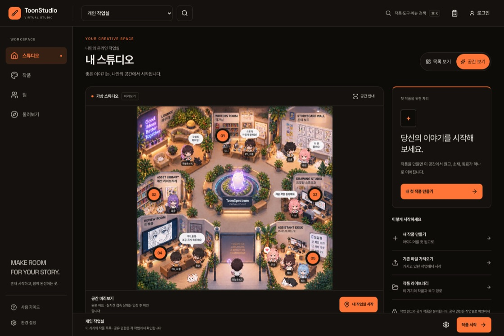
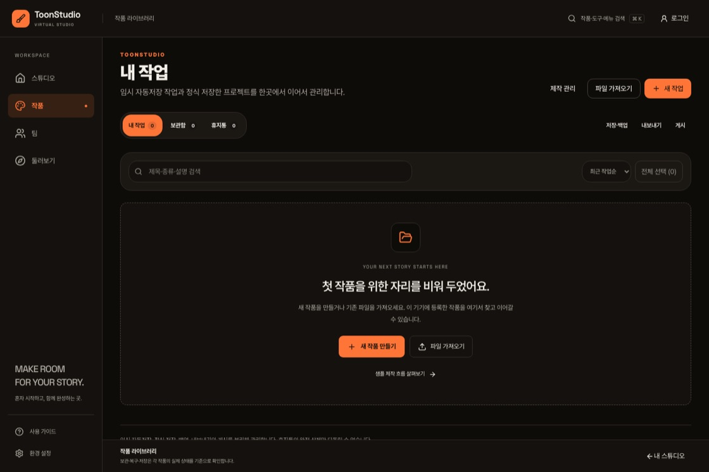
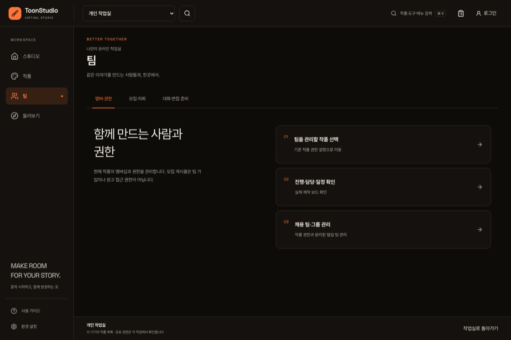
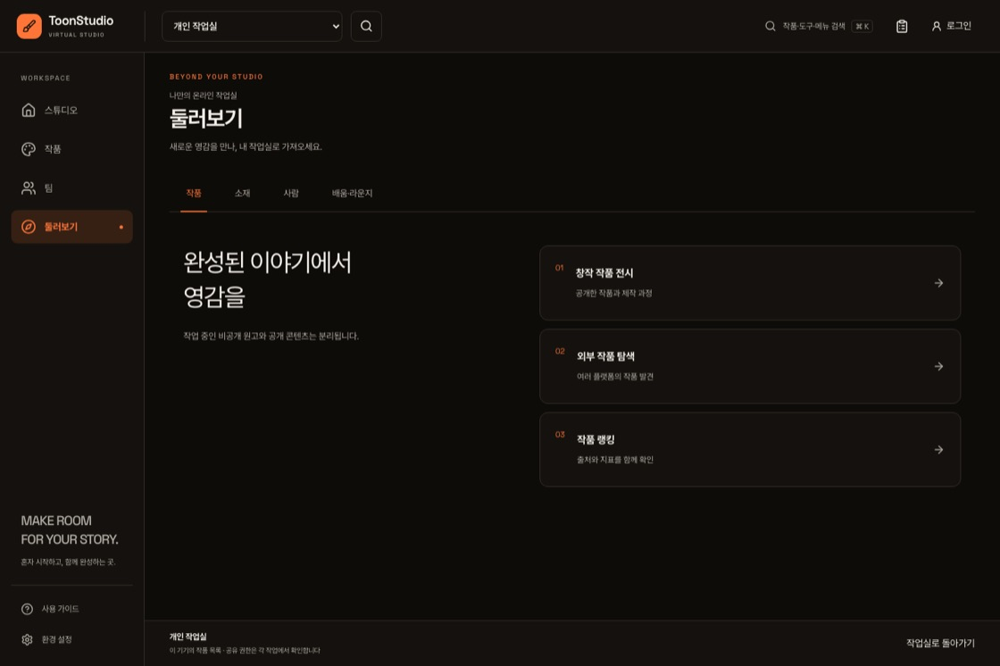

# ToonStudio — 가상 스튜디오 중심 사이트 개편

> 2026-09-21 설계 우선 재개: 현재 구현 기준은 [DESIGN-v2.md](DESIGN-v2.md)다. 아래 화면과 결과는 초기 cb2913ecf 스냅샷이며, 상시 우측 카드/넓은 사이드바는 v2에서 수정한다. 과거 light 캡처는 테마 전환을 충분히 검증하지 못했으므로 그 결과를 현재 합격 증거로 사용하지 않는다. 실제 theme store와 계산 색상의 전환 완료를 확인하는 QA로 교체했다.

작성: 2026-09-21 · 브랜치: `feat/virtual-studio-site-redesign-20260920`

## 구현 범위

소개와 기능 나열을 앞세운 입구 대신, 가상 스튜디오와 실제 작품을 중심으로 주요 화면을 구성했다. 데스크톱의 사이드바, 모바일의 하단 탐색, 상단 작품 전환과 계정 진입을 같은 구조로 연결한다.

| 메뉴 | 진입점 | 개편 내용 |
| --- | --- | --- |
| 스튜디오 | `/`, `/home` | 원본 공간 미리보기, 현재 작품 이어하기, 작업 바로가기, 최근 작품 |
| 작품 | `/studio` | 실제 작품 목록 우선, 검색·보관함·휴지통 유지, 간결한 빈 상태, 전문 도구 접기 |
| 팀 | `/team` | 멤버·권한 / 모집·의뢰 / 대화·면접 준비의 세 묶음 |
| 둘러보기 | `/hub` | 작품 / 소재 / 사람 / 배움·라운지의 네 묶음 |

서비스 소개와 기존 전문 편집기·제작 도구는 삭제하지 않았다. 실제 프로젝트 공간은 기존 `/studio/p/:projectId/space`를 사용한다. 이번 변경은 주요 진입 화면과 공통 탐색 구조이며, 모든 전문 도구의 내부 편집 UI를 다시 작성한 것은 아니다.

## 화면

### 스튜디오


### 작품


### 팀


### 둘러보기


## 유지한 계약

- 원본 공간 아트 파일은 수정하지 않았다. 홈은 미리보기이며 실제 접속 상태는 공간 입장 후 확인한다.
- 모바일 신규 기본값은 목록 보기, 데스크톱은 공간 보기다. 이미 저장한 보기 선택을 존중한다.
- 작품 전환, 뒤로 가기, 원고 이어하기 재검증, 삭제·누락된 원고의 복구 경로를 유지한다.
- 보관·휴지통·저장·내보내기·게시의 기존 데이터 처리와 확인 절차를 바꾸지 않았다.
- 계정 UI는 앱 조합 계층에서 기존 인증 컴포넌트를 제공한다. 공유 UI가 인증 도메인을 직접 참조하지 않는다.
- 그림을 가리는 안내는 데스크톱에서 펼칠 수 있고, 모바일에서는 텍스트 바로가기를 항상 제공한다.

## 검증 결과

| 검증 | 결과 |
| --- | --- |
| 관련 Vitest 테스트 | 17개 파일, 140개 테스트 통과 |
| 변경한 코드 ESLint | 오류·경고 없음 |
| 프런트엔드 TypeScript 검사 | 통과 |
| Vite 프로덕션 빌드 | 종료 코드 0 |
| 아키텍처·앱 경계 | 통과, 경계 예외 상한 확대 없음 |
| 도구 체인 커버리지 | 통과 |
| 브라우저 기본 진입 | 4페이지 × 1440·1024·390·320px, 가로 넘침·런타임 예외 없음 |
| 접근성 자동 검사 | 주요 4페이지 × 다크·라이트, axe WCAG 2 A/AA 규칙 위반 없음 |
| 실제 브라우저 작업 흐름 | 작품 문맥 유지, 작품 검색·전환, Escape 닫기, 누락 작품, 이미지 실패 대체, 로그인 창 진입 통과 |

브라우저 검사는 폐기 가능한 별도 컨텍스트에서 수행했다. 로그인 세션 조회는 비로그인 응답으로 대체했고, 검증용 작품은 그 컨텍스트의 로컬 저장소에만 생성했다. 실제 계정 로그인·클라우드 동기화·결제·운영 백엔드를 검증한 결과는 아니다. 자동 접근성 검사는 전체 WCAG 인증을 의미하지 않는다.

프로덕션 빌드에는 이번 변경 범위 밖인 Three.js·리뷰 캡처 모듈의 기존 번들 경고와 플러그인 소요 시간 안내가 남아 있다. 해당 엔진이나 빌드 경고를 숨기거나 CI 검사를 해제하지 않았다.

## 재현

의존성은 고정된 잠금 파일 기준으로 준비한다. 실행 중인 개발 서버는 `127.0.0.1:5317`이다.

```sh
pnpm exec vite --host 127.0.0.1 --port 5317 --strictPort
# 다른 터미널
node scripts/qa-studio-workspace-redesign.mjs
NODE_OPTIONS=--max-old-space-size=12288 pnpm exec tsc -p tsconfig.json
NODE_OPTIONS=--max-old-space-size=12288 pnpm exec vite build
pnpm run validate:architecture
pnpm run verify:toolchain-coverage
```

브라우저 검사 결과와 원본 캡처는 기본적으로 `/tmp/toonstudio-site-redesign-20260920/`에 저장된다. `QA_OUT`으로 출력 폴더를 바꿀 수 있다. QA 스크립트는 로컬 호스트만 허용하고, 운영 주소에서는 테스트 작품을 생성하지 않는다.

## 배포 상태와 범위 제한

이 변경에는 운영 배포, 데이터베이스 마이그레이션, 환경 변수, 도메인, 인증 권한 변경이 없다. PR 검토·필수 검사와 별도의 운영 배포 승인을 거쳐 적용해야 한다. 원고 편집 엔진과 실시간 공간 서버, 기존 콘텐츠 데이터는 변경하지 않았다.
