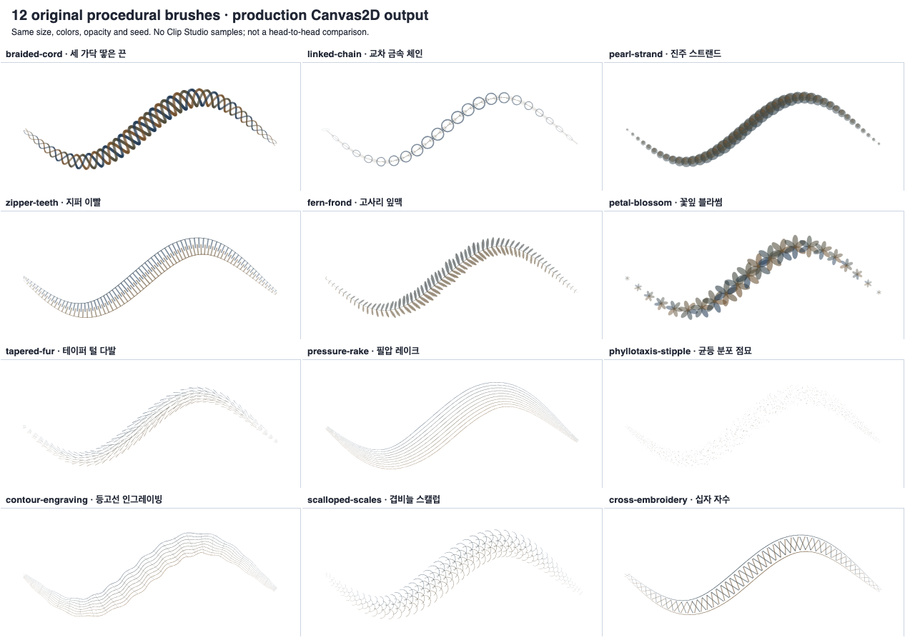

# 브러시 표현 확장 검증 · 2026-09-14

## 반영 범위

V6 제작기의 실행 가능한 레시피를 **23개에서 35개로 확장**했다. 전체 사이트·마켓의 브러시 개수라는 뜻은 아니다.
외부 브러시 팁을 복제하거나 이름·색상만 바꾼 변형이 아니라, 버전 고정 ID를 갖는 12개 원본 절차적 형상이다.

| 용도 | 신규 브러시 |
| --- | --- |
| 의상·장식 | 세 가닥 땋은 끈, 교차 금속 체인, 진주 스트랜드, 지퍼 이빨, 겹비늘 스캘럽, 십자 자수 |
| 배경·자연 | 고사리 잎맥, 꽃잎 블라썸, 테이퍼 털 다발 |
| 선화·질감 | 필압 레이크, 균등 분포 점묘, 등고선 인그레이빙 |

반복 위상은 입력 이벤트 수가 아닌 공통 재샘플러의 이동 거리에 고정된다. 연결 선분은 원형 각도 보간으로 방향 경계의 급회전을 줄인다.
필압에 따른 폭·불투명도, 2색 안료, 종이·습식·건식·유화 설정은 기존 공통 재료 출력 경로를 사용한다.
신규 형상은 CPU Canvas2D/SVG 경로이며 WebGPU 계산·유체 시뮬레이션을 추가한 것이 아니다.
기존 6개 형상 솔버와 기존 17개 재료 레시피의 버전 ID·재생 동작은 유지했다.

제작기 **레시피 → 이름·영문 ID 검색/용도 필터 → 조절 → 스튜디오에 브러시 저장 → 원고에서 사용하기**로 적용한다.
선택 표시, 검색 결과 수, 빈 결과 복구, Escape 검색어 초기화를 제공한다. 검색은 현재 브러시 설정을 변경하지 않는다.

## 실제 출력 샘플

같은 크기·색·불투명도·시드로 그린 **제품 Canvas2D 확정 출력**이다. CSP 출력이나 비교 우위 증거가 아니다.



## 실행 결과

- 단위·통합 회귀: **46개 파일 / 1,094개 테스트 통과**, 실패·보류 0. 저장, 협업 CRDT, 내보내기, UI와 기존 V5/V6를 포함한다.
- Chromium **151.0.7922.34**: **35개 레시피 / 실패 0**, 실제 pen 이벤트, 라이브→확정, 원고 출력, JSON 왕복, PNG 디코드, 전체 SVG 문서 출력을 검사했다.
- 동일 조건의 **595개 레시피 쌍**을 비교했다. 최소 이미지 거리 0.030974845로 기존 기준 0.025를 유지하며 통과했다. 이 수치는 해당 시험 이미지의 구별 가능성이지 예술적 우수성 점수가 아니다.
- 새 12종의 최대 설정 도형 수, 일반 입력 무손실 처리, 1만 샘플 겹비늘 스트리밍을 검사했다. 지퍼의 과도한 작업량 추정으로 정상 입력까지 생략되던 문제는 형상별 최대 도형 수를 사용해 수정했다.
- 기존 1만 샘플·128가닥 강모 시험은 1,279,872개 접촉을 스트리밍했다. 입력당 최대 128개 출력, 확정 출력 픽셀 오차 0. 과대 SVG 문자열은 제품의 기존 용량 한도로 거절한다.
- 웹·API 타입 검사, 변경 소스 ESLint 경고 0, architecture validation, `git diff --check` 통과.

수치는 [summary.json](summary.json)에 기록했다. 원본 보고서 SHA-256도 포함한다.
로컬 Node 24.16.0 / 기존 pnpm 11.4.0 설치 의존성을 연결해 검사했다. 공유 의존성 재설치는 하지 않았고, 기존 `patchedDependencies`와 설치본의 불일치 경고는 남아 있다.
`pnpm_config_verify_deps_before_run=warn`은 자동 재설치만 막았으며 타입·lint·테스트 및 Git hooks는 생략하지 않는다. 잠금 파일 기준의 깨끗한 CI 검증은 유지해야 한다.

## 재실행

잠금 파일에 맞게 의존성이 준비된 작업 트리에서 실행한다. 브라우저 검증에는 로컬 Playwright Chromium이 필요하다.

```sh
node scripts/verify-studio-brush-artistry.mjs
node scripts/verify-studio-brush-v6-quality.mjs
pnpm run typecheck
pnpm run validate:architecture
```

## Clip Studio 대비 판정의 한계

비교 기준은 공식 [브러시 커스터마이징](https://help.clip-studio.com/en-us/manual_en/240_brushes/Customizing_brush_tools.htm)과
[혼색 도구](https://help.clip-studio.com/en-us/manual_en/240_brushes/Blending_tools.htm)의 질감, 듀얼 브러시, 획 간격, 보정, 혼색 항목이다.
**이 PR은 CSP보다 전체적으로 우월하다고 판정하지 않는다.** 외부 ASSETS 라이브러리의 총량과 V6의 35개 레시피를 같은 지표로 비교하지 않는다.
CSP와 같은 원고·브러시 크기·기기를 사용하는 실제 펜 지연, 저필압 시작/끝, 큰 캔버스의 지속 프레임 성능, 화가의 블라인드 평가를 별도로 수행해야 한다.
현재 자료는 Chromium의 공통 CPU 재료 출력 검증이다. WebGPU 성능, Safari/Firefox, 실물 펜부터 화면 표시까지의 지연, 전체 편집기 페이지 자동화, 캔버스 아래색 픽업/완전한 젖은 안료 시뮬레이션은 이번 검증의 증거 범위가 아니다.

PR만 생성한다. 병합, 운영 배포, 호스팅 자동 빌드/Preview 활성화, 의존성/잠금 파일 변경, 유료 서비스 추가는 포함하지 않는다.
