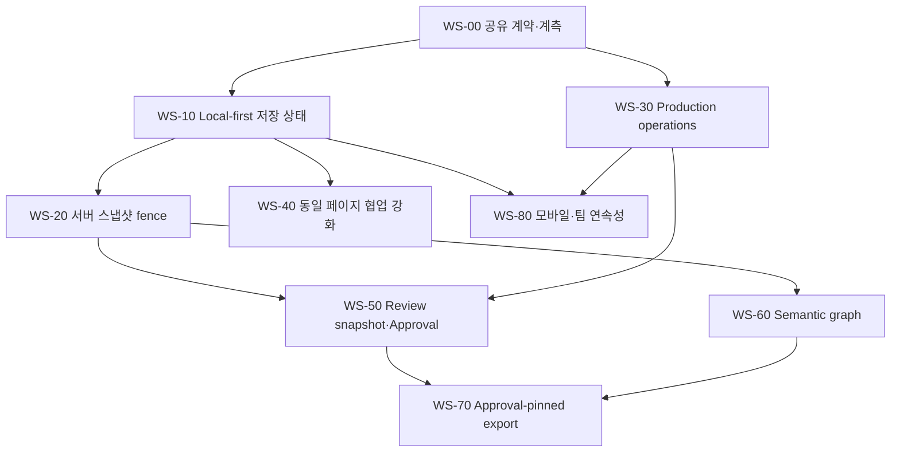

# Studio Production OS 구현 계획

- 상태: **Ready for issue decomposition**
- 기준일: 2026-09-16
- 설계: [개발 전 상세 설계](../design/studio-production-os-predevelopment-design-2026-09-16.md)
- 결정: [ADR-0023](../adr/0023-local-first-durability-sync-and-snapshot-fences.md), [ADR-0024](../adr/0024-production-operations-review-approval-publish-contract.md)
- 기준 브랜치: `main@e23362011433cbfcdc59f0d5fda260ad208074f7`

## 1. 실행 원칙

1. 기존 `/studio`와 `/studio/work/:id/*` 경로에서 in-place로 개선한다.
2. 새 기능보다 원고 유실 방지와 권위 경계를 먼저 고정한다.
3. 한 PR에서 저장 권위와 렌더러 권위를 동시에 바꾸지 않는다.
4. 기존 CRDT·OPFS·Production Workspace v3·Review Workflow 코어를 재사용한다.
5. 거대 editor host에 신규 setter/closure bag을 추가하지 않는다.
6. 모든 신규 mutation은 idempotency, capability, recovery, observability를 함께 구현한다.
7. 기능 표시만 있는 placeholder를 완료로 세지 않는다.
8. feature flag가 꺼져도 새 schema record를 삭제하거나 구형 값으로 덮지 않는다.

## 2. 완료 정의

각 작업은 다음을 모두 만족해야 완료다.

- 실제 제품 UI에서 발견하고 실행할 수 있다.
- 저장·복원 또는 비영속 경계가 명확하다.
- Undo/Redo 또는 해당 도메인의 operation receipt에 포함된다.
- 실패·취소·권한 변경·오프라인 복구가 있다.
- strict parser와 size/count bound가 있다.
- 단위·통합·실브라우저 증거가 있다.
- metric/log가 민감 원문을 기록하지 않는다.
- 기존 문서 fixture와 route smoke를 통과한다.
- rollback 시 생성된 durable record를 유실하지 않는다.
- 사용자 문구가 `기기 저장`, `클라우드 동기화`, `서버 원고`, `검수본`, `승인본`, `게시본`을 구분한다.

## 3. 선행 의존성 지도



`WS-10`과 `WS-30`은 계약 완료 후 병렬 진행할 수 있다. Review와 Publish는 server snapshot receipt 없이 시작하지 않는다.

## 4. 권장 PR 규칙

- 한 PR은 하나의 권위 전환 또는 하나의 vertical slice만 포함한다.
- DB migration과 제품 write path를 같은 PR에 넣을 수 있으나 read/rollback 증거가 필요하다.
- protocol version 증가 PR은 browser/API fixture parity를 같이 수정한다.
- 1,000줄 이상의 generated schema diff는 수동 로직 diff와 분리한다.
- feature flag 기본값 변경은 구현 PR과 분리한다.
- benchmark 결과 파일은 실행 command, environment, raw 측정값을 함께 기록한다.
- 문서의 완료 체크박스는 보호 브랜치 `core` 통과 전에 미리 체크하지 않는다.

# 5. Workstream 00 — 공유 계약과 기준 계측

## WS-00-01 현재 저장 단계 telemetry

**목적**

현재 `runStudioPageSavePipeline()`의 병목과 실패를 단계별로 확인한다.

**대상**

- `apps/web/src/domains/creator/studio-page-save-pipeline.ts`
- `apps/web/src/domains/creator/live/studio-crdt-room-binding.ts`
- API CreatorWork save 경로

**계측 단계**

- pending stroke flush
- authoritative ACK barrier
- page capture
- cover resize
- DTO build
- linked 3D artifact ensure
- API create/update
- autosave clear/tombstone

**완료 증거**

- 원고 내용·대사·prompt·이미지 URL을 metric label에 포함하지 않는다.
- 일반 autosave와 명시적 server save 호출 횟수를 구분한다.
- local/P2P 오류 code를 분리 집계한다.

## WS-00-02 공유 workflow contract package 생성

**신규 패키지**

```text
packages/studio-workflow-contract/
  package.json
  src/index.ts
  src/version-coordinates.ts
  src/production-operation.ts
  src/review.ts
  src/publish.ts
  src/errors.ts
  src/limits.ts
```

**규칙**

- DOM, Node DB, React 의존성 없음
- browser/API에서 동일 fixture corpus 실행
- Zod runtime parser는 cold path에서 사용
- hot drawing path에서 import 금지
- schema version은 각 record에 명시

**전환 방식**

1. 현재 web/API parser와 새 parser를 같은 fixture로 shadow 비교
2. 동등성 test 통과
3. API DTO 내부 parser source 전환
4. web runtime parser source 전환
5. 중복 상수 제거

**완료 증거**

- Production Workspace v3 fixture 양쪽 canonical bytes 동일
- unknown field, duplicate ID, cycle, size overflow가 동일하게 실패
- package browser bundle에 Node built-in 0

## WS-00-03 저장 상태 projection v2

**추가 타입**

- local durability
- collaboration frontier
- CreatorWork snapshot
- review
- approval
- publish

**대상**

- `studio-version-coordinates.ts`
- `studio-workflow-integrity.ts`
- 상단 저장 상태 selector

**완료 증거**

- `local-only`, `queued`, `synced`, `snapshot-current`, `conflict`, `recovery-required` fixture
- approval current/stale/invalid 구분
- UI가 직접 여러 ref를 조합하지 않고 selector를 사용

## WS-00-04 기준 browser fixture

필수 fixture:

- 빈 신규 작품
- 50페이지 일반 작품
- 300페이지 장편 작품
- 다중 raster surface 작품
- linked 3D asset 포함 작품
- 대본·말풍선·번역 포함 작품
- Production task 1,000개 상한 fixture
- review thread 1,000개 상한 fixture

fixture는 개인 데이터와 상용 소재를 포함하지 않는다.

# 6. Workstream 10 — Local-first 저장 UX

## WS-10-01 LocalDurabilityReceipt 발급

**구현**

- 기존 OPFS autosave journal append/checkpoint 결과에 receipt를 추가한다.
- document scope, local sequence, generation, digest, persistedAt을 포함한다.
- receipt를 저장 상태 selector에 전달한다.

**대상 후보**

```text
apps/web/src/domains/creator/
  studio-autosave-opfs-session.ts
  useStudioAutosaveDocumentRuntime.ts
  durability/studio-local-durability-runtime.ts (new)
  durability/studio-local-durability-receipt.ts (new)
```

**완료 증거**

- 강제 Worker terminate 후 마지막 receipt digest 복구
- stale generation receipt 거절
- clear tombstone 이후 이전 receipt가 현재 상태로 복원되지 않음

## WS-10-02 저장 상태 UI 교체

**제품 문구**

- `기기 저장 준비 중`
- `이 기기에 저장됨`
- `기기에 저장됨 · 클라우드 동기화 중`
- `클라우드와 동기화됨`
- `서버 원고 최신`
- `기기 저장 실패`
- `복구 확인 필요`

**UI 규칙**

- 정상 상태는 작은 비차단 indicator
- 오류·복구만 상세 행동 제공
- hover/focus 또는 상세 popover에서 좌표와 마지막 시각 표시
- 색상만으로 상태 구분 금지
- 모바일 44px 조작 영역

**완료 증거**

- 키보드와 screen reader 상태 변화
- 320px 폭에서 잘림 없음
- offline에서 저장 실패 문구가 나오지 않음

## WS-10-03 일반 저장에서 server barrier 분리

**변경**

- 일반 autosave 경로는 `flushAndWaitForAuthoritativeAck()`를 호출하지 않는다.
- local/P2P에서 OPFS receipt 성공 시 정상 저장 상태다.
- server 기능 CTA만 연결 요구를 표시한다.

**회귀 방지 test**

- local room에서 자동 저장 성공
- P2P room에서 자동 저장 성공
- 일반 autosave 중 page capture 0
- 일반 autosave 중 CreatorWork API 0
- publish/review snapshot에서는 authoritative barrier 필수

## WS-10-04 두 탭 writer/follower 정책

**결정 구현**

- document scope별 writer 1개
- follower의 편집 요청은 writer RPC 또는 명시적 독립 사본
- leader 종료 후 generation fencing과 journal 검증
- BroadcastChannel은 command/receipt 또는 invalidation만 전달

**필수 browser scenario**

1. 탭 A writer, 탭 B follower
2. A stroke → B 화면 반영
3. A 강제 종료
4. B leader 승계
5. B stroke → reload
6. sequence와 digest 동일

## WS-10-05 Recovery UX 통합

- OPFS 실패
- quota 부족
- corrupt journal
- permanent server rejection
- server 권한 변경

을 하나의 Recovery Center에서 원인별로 구분한다.

행동:

- 다시 시도
- 서버 원고 다시 불러오기
- 거절 변경 복구본 내보내기
- 기기 저장소 정리 안내
- 독립 사본으로 열기

파괴 동작은 구조화된 확인과 영향 목록이 필요하다.

# 7. Workstream 20 — 서버 원고 스냅샷 fence

## WS-20-01 Snapshot contract와 endpoint

**신규 경로**

```text
POST /creator/works/:id/authoring-snapshots
GET  /creator/works/:id/authoring-snapshots/:revision
```

**요청 필드**

- base CreatorWork revision
- required CRDT server sequence
- expected state-vector digest
- expected document digest
- intent
- preview policy

**서버 검증**

- actor edit/publish capability
- CRDT frontier persisted 여부
- asset manifest 존재·hash
- base revision conflict
- request size/idempotency

## WS-20-02 기존 save pipeline adapter

`runStudioPageSavePipeline()` 호출부를 다음으로 분리한다.

```text
ensureLocalDurability()
ensureAuthoritativeFrontier()
materializeSnapshotPayload()       // 전환기 client path
commitCreatorWorkRevision()
enqueuePreviewJob()
```

신규 `commitStudioServerSnapshot()`이 단계 orchestration을 소유한다.

**금지**

- UI 컴포넌트가 barrier ref를 직접 읽는 것
- 일반 autosave가 snapshot adapter를 호출하는 것
- snapshot 중 새 edit를 조용히 포함시키는 것

## WS-20-03 revision/digest receipt

CreatorWork response에 최소 다음을 추가한다.

- revision
- content digest
- pinned CRDT server sequence
- state-vector digest
- snapshot createdAt
- preview job id

구형 response와의 compatibility parser를 둔다. 새 review/approval 경로는 완전한 receipt 없이는 fail closed한다.

## WS-20-04 preview/thumbnail job 분리

**목표**

- 서버 snapshot 성공과 page preview 생성 분리
- 작업 목록 thumbnail 자동 갱신
- 일반 저장에서 전체 page capture 제거

**단계**

1. 전환기: client capture artifact를 job input으로 등록
2. 다음 단계: server worker가 snapshot revision에서 render
3. thumbnail, review-medium, publish-source profile 분리
4. latest successful receipt만 work thumbnail pointer를 전진

**검증**

- preview 실패가 snapshot revision을 rollback하지 않음
- 오래된 preview job이 최신 thumbnail을 덮지 않음
- 같은 revision/profile retry idempotent

## WS-20-05 이름 있는 서버 버전

- 사용자가 버전 이름과 메모를 입력
- snapshot receipt를 version record에 연결
- 현재 local checkpoint와 server revision을 함께 표시
- restore는 새 server revision을 만들며 기존 revision을 수정하지 않음

# 8. Workstream 30 — Production operation API

## WS-30-01 DB migration

**추가**

- `creator_work_production_operations`
- `creator_work_production_entity_revisions`

**index**

- `(work_id, operation_id)` unique
- `(work_id, accepted_revision)`
- `(work_id, entity_kind, entity_id)`

**제약**

- operation payload byte 상한
- kind/target 정합성
- actor FK 또는 기존 identity 정책
- timestamps server 생성

**rollback**

새 테이블을 읽지 않는 구형 서비스로 rollback 가능해야 하며 기존 Workspace snapshot을 유지한다.

## WS-30-02 task.patch vertical slice

첫 operation은 `task.patch`로 제한한다.

허용 field:

- title
- due
- progress
- status
- priority
- blockedReason
- assigneeIds
- reviewerIds

stage·role·hierarchy·dependency는 첫 slice에서 제외해 충돌 모델을 단순화한다.

**완료 증거**

- 다른 task 동시 수정 성공
- 같은 task progress/title 동시 수정 성공
- 같은 task progress 동시 수정 field conflict
- duplicate request same receipt
- operation append와 snapshot revision 원자 commit

## WS-30-03 web operation outbox

```text
production/studio-production-operation-client.ts
production/studio-production-operation-outbox.ts
production/studio-production-operation-reducer.ts
```

- SQLite/OPFS bounded queue
- work scope Web Lock
- stable operation id
- retry metadata
- ACK tombstone
- capability-sensitive operation은 offline queue 제한

CRDT outbox와 저장소를 공유하지 않는다. protocol과 retry policy가 다른 별도 queue다.

## WS-30-04 Task board 전환

- 기존 전체 Workspace save 호출 대신 task operation dispatch
- optimistic reducer
- pending/failed/conflict 표시
- field conflict resolver
- server snapshot projection 재채택

상단 전체 저장 버튼을 요구하지 않는다.

## WS-30-05 operation 범위 확대

순서:

1. task create/delete
2. review issue create/patch/resolve
3. hierarchy create/move/delete
4. dependency patch
5. role assignment
6. handoff create/patch/accept
7. Production version snapshot

각 단계는 kind별 capability와 invariant test가 필요하다.

## WS-30-06 전체 PUT 호환 축소

- legacy client telemetry
- operation-enabled work marker
- PUT 사용 시 명확한 exact revision conflict 유지
- 충분한 operation coverage 전에는 PUT 제거 금지
- 제거 시 explicit import/replace 경로 별도 설계

# 9. Workstream 40 — 동일 페이지 공동 편집 강화

## WS-40-01 collaboration lane inventory

현재 CRDT root별로 다음을 원장화한다.

- 구조/vector/text
- raster stroke/operation log
- asset registry
- page payload
- 3D shared stage
- filter mask
- layer comps
- presence

각 root에 logical owner, max payload, durability, conflict mode, snapshot inclusion을 기록한다.

## WS-40-02 Surface lease service

**범위**

- transform
- filter bake
- liquify commit
- surface replace
- 대형 fill

**구현**

- gateway request/release/heartbeat
- DB 또는 Redis/transactional ephemeral store
- holder capability
- TTL
- base surface revision
- disconnect cleanup

**UI**

- page 전체가 아니라 해당 layer/surface만 잠김
- holder와 남은 이유 표시
- lease 만료 시 local preview 보존/폐기 선택

## WS-40-03 raster revision contract

- immutable surface revision id
- base asset hash
- operation/tile manifest hash
- resulting asset hash
- authoredBy/appliedAt
- lease receipt

같은 surface의 destructive commit은 base revision compare-and-swap을 사용한다.

## WS-40-04 shared selection/viewport presence

기존 cursor packet에 과적재하지 않고 목적별 presence record를 추가한다.

- selection entity IDs 상한
- viewport rectangle
- presenter follow intent
- expiry/sequence
- local hide/followed/all preference

문서·activity log·recovery package에 저장하지 않는다.

## WS-40-05 대규모 room 성능

- decorative packet과 durable ACK queue delay 별도 metric
- cursor render budget 유지
- active drawer/followed participant 우선
- hidden tab frequency 감소
- stress fixture에서 durable operation starvation 0

# 10. Workstream 50 — 서버 검수와 승인

## WS-50-01 DB와 repository

추가:

- review cycles
- review snapshots
- review threads
- thread messages
- approvals

repository transaction은 source revision/digest, cycle state, blocker를 재검증한다.

## WS-50-02 검수본 만들기

흐름:

```text
ensure local receipt
→ ensure authoritative CRDT frontier
→ commit CreatorWork snapshot
→ enqueue review preview
→ create review cycle/snapshot
→ open review workspace
```

중간 실패별 retry point를 기록한다. 동일 idempotency key로 duplicate cycle을 만들지 않는다.

## WS-50-03 Rich anchor 서버화

기존 `StudioReviewAnchorV2` 사용:

- semantic entity
- element
- point/region
- script range
- time range
- publish issue

서버는 snapshot source에 존재하는 anchor인지 검증한다. element가 삭제된 최신 head가 아니라 해당 snapshot 기준으로 판단한다.

## WS-50-04 External review projection

- 기존 review link/token/feedback 유지
- feedback comment를 thread/message 후보로 수용
- approve/reject는 recommendation으로 표시
- 공식 approval로 자동 변환 금지
- source feedback id로 중복 수용 방지

## WS-50-05 Approval command

검사:

- approve capability
- cycle `in-review`
- current snapshot
- source revision/digest 존재
- open blocker 0
- approval statement digest

결과:

- immutable approval record
- cycle approved transition
- version coordinate update
- current head 차이 시 stale projection

## WS-50-06 수정본과 carry-over

- changes-requested → revised → in-review 상태 전이
- 새 snapshot 생성
- target resolution 계산
- moved/modified/orphaned thread UI
- 사용자 확인 후 carry-over
- 이전 snapshot/thread 유지

# 11. Workstream 60 — 대본·컷·말풍선 의미 그래프

## WS-60-01 신규 문서 semantic ID 발급

대상:

- Writer Room scene/panel/dialogue
- ComicGraph panel/balloon
- Page frame/text element

생성 command receipt에 semantic lineage를 포함한다.

## WS-60-02 기존 문서 read-only scanner

입력:

- 기존 IDs
- page/frame geometry
- dialogue text/화자
- reading order
- balloon tail/anchor

출력:

- link 후보
- confidence
- ambiguity reason
- conflicting existing reference

scanner는 문서를 수정하지 않는다.

## WS-60-03 Link review UI

- 장면·컷·대사별 후보 확인
- 일괄 승인하되 낮은 confidence는 개별 확인
- 잘못된 link 해제
- 저장 전 중복 reference 검증
- 변경 사항 Undo/Redo

## WS-60-04 대본→말풍선 vertical slice

1. 선택 scene의 dialogue lines 표시
2. 미배치 대사 탐지
3. 컷 선택
4. balloon suggestion
5. 화자 anchor와 reading order 포함 삽입
6. 원문 link 저장

AI는 suggestion만 만들고 최종 command는 사용자가 확정한다.

## WS-60-05 번역 variant

- source locale
- target locale
- translation status
- source revision/digest
- balloon fit status
- reviewer

원문 변경 시 target variant를 `needs-review`로 전환한다. 번역 텍스트가 원문을 덮지 않는다.

## WS-60-06 구조 검사

- 미배치 대사
- 중복 배치
- 화자 없는 balloon
- 끊긴 semantic link
- reading order cycle/역전
- 번역 overflow
- tail anchor orphan

Publish preflight와 Production task 생성 후보로 연결한다.

# 12. Workstream 70 — 승인본 게시 파이프라인

## WS-70-01 Publish profile registry

- profile id/version
- width/slice/format/byte/color/transparency/naming rules
- profile migration 금지: 새 version 발급
- fixture와 공식 규격 근거 링크

## WS-70-02 Publish package repository

- package input immutable
- approval/source revision/digest
- profile version
- status
- idempotency key
- attempts
- artifacts
- manifest digest

## WS-70-03 Export worker

단계:

1. source snapshot load
2. asset manifest verify
3. render
4. slice/encode
5. preflight
6. digest
7. package manifest
8. object storage commit

각 단계는 abort와 retry 가능해야 한다. ready manifest는 수정하지 않는다.

## WS-70-04 UI

- 승인본 선택
- 플랫폼 profile
- preflight 결과
- 진행/취소/재시도
- 실패 단계와 복구 행동
- artifact 다운로드
- source approval/revision 표시

현재 head가 승인본보다 최신이면 경고하되 승인본 출력은 허용한다.

## WS-70-05 검증 package 통합

기존 verified ZIP, PDF, CBZ, 웹툰 연합 스크롤, 규격 slice를 publish job backend에 연결한다.
기존 포맷의 의미를 섞지 않는다.

# 13. Workstream 80 — 모바일·기기 연속성·팀 소재

## WS-80-01 모바일 집중 그리기 모드

- 캔버스 우선
- 핵심 도구만 상시
- 저장 상태 compact indicator
- bottom sheet 편집 패널
- stylus/touch 역할 분리
- system gesture와 충돌 test

## WS-80-02 기기 이어 작업

- 서버 snapshot + CRDT frontier hydration
- current page 우선
- asset hash demand load
- 로컬 generation 생성
- offline cache quota 표시
- 다른 기기 pending update 안내

## WS-80-03 저사양 budget controller

조절 가능:

- preview scale
- hidden page decode 수
- background export concurrency
- cursor trail
- 3D viewport quality

조절 금지:

- canonical document precision
- saved raster output 품질의 무통보 저하
- pressure/tilt 기록 누락

## WS-80-04 팀 소재함

공개 마켓 전 단계:

- team asset manifest
- version
- creator/source
- license tier
- allowed works/team
- dependencies
- used-by work/page
- update available
- revoke/replace guidance

asset bytes는 기존 OPFS/Object Storage CAS를 사용한다.

# 14. CI와 테스트 게이트

## 14.1 필수 단위 게이트

- workflow contract fixture parity
- local durability receipt
- version coordinate projection
- Production operation reducer/parser
- field revision conflict
- review state machine
- approval/publish source invariant
- semantic identity uniqueness

## 14.2 필수 API 게이트

- auth/capability matrix
- idempotency
- revision/field conflict
- transaction rollback
- quota/size bounds
- audit persistence
- review source mismatch
- publish retry

## 14.3 필수 browser 게이트

권장 신규 command:

```text
pnpm run verify:studio-local-first-save
pnpm run verify:studio-two-tab-durability
pnpm run verify:studio-production-operations
pnpm run verify:studio-review-approval
pnpm run verify:studio-approval-publish
pnpm run verify:studio-same-page-collaboration
pnpm run verify:studio-mobile-continuity
```

기존 게이트와 함께 실행한다.

- `verify:studio-autosave-opfs`
- `verify:studio-lifecycle`
- collaboration sync regression
- route/launch smoke
- export/preflight tests
- architecture ratchet

## 14.4 Failure injection

- OPFS write reject
- Worker terminate
- quota exceeded
- WebSocket disconnect/reorder/duplicate
- ACK lost after server commit
- API 409/403/5xx
- DB transaction abort
- object storage upload partial
- export worker crash
- WebGPU device loss

# 15. Feature flags와 권위 전환

| Flag | 초기 상태 | 전환 조건 |
| --- | --- | --- |
| `studio.local-first-save-status.v1` | internal on | OPFS receipt browser gate 통과 |
| `studio.authoring-snapshot-fence.v1` | internal on | sequence/digest API 통합 통과 |
| `studio.production-operations.v1` | task.patch cohort | field conflict·idempotency 통과 |
| `studio.surface-lease.v1` | internal | raster CAS/revision gate 통과 |
| `studio.review-workflow-server.v1` | internal | snapshot/anchor/approval gate 통과 |
| `studio.semantic-links.v1` | new docs only | scanner false-positive budget 충족 |
| `studio.approval-pinned-publish.v1` | internal | export source invariant 통과 |
| `studio.mobile-focus-workspace.v1` | opt-in | mobile visual/perf gate 통과 |

## 권위 전환 패턴

```text
shadow read + compare
→ 새 write path opt-in
→ 새 receipt 검증
→ 새 read path
→ cohort 확대
→ 구 write path compatibility-only
→ 제거 ADR
```

동일 데이터를 두 권위에 무기한 dual-write하지 않는다.

# 16. 성공 지표

## 저장

- 로컬 저장 실패율
- durability receipt latency
- 복구 성공률
- 사용자가 수동 저장을 반복 클릭한 비율
- `서버 승인 전 저장 불가` 오류 노출 0

## 협업

- 같은 페이지 동시 활성 편집 세션
- lease 충돌률과 평균 보유 시간
- outbox 최대/중앙 depth
- reconnect convergence 실패 0
- durable ACK starvation 0

## Production

- 전체 PUT 409 감소
- operation field conflict 비율
- conflict 해결 후 unrelated change 보존률 100%
- 작업 인계 수락까지 필요한 클릭/탭 수

## Review/Publish

- review snapshot source mismatch 0
- approval blocker 위반 0
- approval source가 아닌 publish artifact 0
- 검수 의견의 orphan 비율
- package retry 성공률

## 모바일

- 첫 획까지 시간
- canvas를 가리는 UI 비율
- accidental touch/gesture 취소율
- device handoff 성공률

# 17. 위험 원장

| 위험 | 영향 | 완화 | 중단 조건 |
| --- | --- | --- | --- |
| local receipt와 실제 replay frontier 불일치 | 데이터 유실 신뢰 붕괴 | digest·generation·cold reload gate | 단 1건 mismatch |
| server sequence와 CreatorWork revision 혼동 | stale 검수본 | 별도 타입·API·UI | source mismatch |
| operation schema 과도한 범용화 | 권한 우회·merge 불명확 | kind별 strict payload | arbitrary patch 유입 |
| dual write drift | 데이터 분기 | 단일 권위와 shadow compare | unexplained diff |
| surface lease가 page lock으로 확대 | 협업 우위 상실 | surface 범위 강제 | page-level blocking 회귀 |
| review recommendation이 approval로 오인 | 감사·권한 문제 | 별도 command/capability | 자동 승격 발견 |
| export가 current head를 읽음 | 승인본과 결과 불일치 | source revision fixture | artifact mismatch |
| 새 상태 UI 과밀 | 사용성 악화 | 기본 한 줄 + 상세 popover | 모바일 주요 도구 가림 |
| host props 증가 | 구조 악화 | runtime/EditorClient selector | ratchet 초과 |

# 18. 착수 순서와 첫 vertical slice

가장 먼저 구현할 제품 slice는 다음으로 고정한다.

## Slice A — “서버가 끊겨도 저장된다”

1. LocalDurabilityReceipt
2. 저장 상태 projection
3. 일반 autosave의 server barrier 제거
4. local/P2P browser test
5. recovery UI

사용자가 즉시 체감하고 이후 모든 작업의 안전 기반이 된다.

## Slice B — “두 팀원이 다른 작업을 동시에 수정한다”

1. Production operation contract
2. DB operation log/entity field revisions
3. `task.patch`
4. web operation outbox
5. Task Board optimistic/conflict UI
6. two-browser test

## Slice C — “검수본은 정확한 원고를 가리킨다”

1. server snapshot fence
2. revision/digest receipt
3. review cycle/snapshot repository
4. review preview job
5. rich anchor thread
6. approval blocker

## Slice D — “승인된 원고를 그대로 출력한다”

1. approval record
2. publish package repository
3. export worker source pin
4. manifest digest
5. retry/cancel UI

동일 페이지 surface lease와 semantic graph는 Slice A의 내구성, Slice C의 snapshot 좌표를 재사용해 병렬 확장한다.

# 19. 이 설계 PR의 범위

현재 PR은 설계와 구현 분해만 포함한다.

- runtime 코드 변경 없음
- DB migration 없음
- feature flag 변경 없음
- 운영 동작 변경 없음

문서 승인 후 첫 구현 PR은 `WS-00-03 + WS-10-01`의 최소 계약과 테스트만 포함하는 것이 적합하다.
