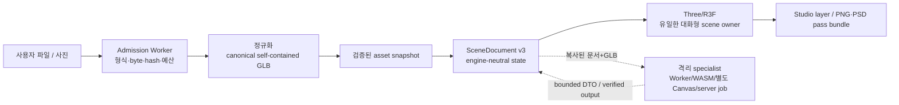

# ToonSpectrum Studio 3D 웹툰 제작 도구 벤치마크 및 적용안

- 기준일: 2026-07-19
- 범위: 캐릭터 생성·포즈, 배경 배치·연출, 표준 3D 파일 반입, 선화·톤·레이어 출력,
  Web Worker/WASM/WebGPU/WebGL, 다중 엔진, SketchUp/SKP 변환과 라이선스
- 비교 대상: NAVER WEBTOON SHAPER, CLIP STUDIO PAINT 3D, Reallusion Character Creator·iClone·AccuRIG·AccuPOSE,
  ABLUR, Snaptoon, SketchUp, Blender
- 엔진 기준: [Studio 3D 엔진·전문 런타임 확장 검토](./studio-3d-engine-specialist-topology-2026-07-18.md)의
  **Three/R3F 단일 대화형 소유자 + 격리 전문 런타임** 결정을 유지한다.
- 연계 문서: [상용 기능 벤치마크](./studio-3d-commercial-benchmark-2026-07-12.md),
  [Babylon.js 도입 평가](./studio-babylonjs-adoption-evaluation-2026-07-11.md),
  [3D 런타임 지연 로딩·WebGPU 벤치마크](./studio-3d-runtime-loading-benchmark-2026-07-13.md),
  [커스텀 모델 업로드](./studio-bg3d-custom-model-upload.md)
- 문서 성격: 제품·기술 검토 및 구현 우선순위 문서다. 여기서 **이번 반영**이라고 표시한 기능은 이
  문서와 함께 반영되는 코드의 production UI/runtime 경로에 구현·연결됐음을 뜻한다. 서버 배포,
  브라우저 smoke와 실기기 release gate 완료 여부는 별도로 판정한다.

## 1. 최종 결론

웹에서도 CLIP STUDIO PAINT의 3D 도구보다 넓은 파일 반입, 배경·캐릭터 동시 배치, 구도 저장,
포즈 편집, 선화·톤 분리, 반복 컷 렌더링을 구현할 수 있다. 다만 성공 기준은 Blender 전체를 브라우저에
복제하는 것이 아니라, **웹툰 한 컷을 만드는 데 자주 반복되는 작업을 더 짧고 안전하게 연결하는 것**이다.

이번 비교에서 바로 가져올 가치가 큰 기능은 다음과 같다.

1. SHAPER의 캐릭터·의상·손 포즈 프리셋, 참조 이미지 기반 프리셋 추천, 모델 표면 드로잉.
2. CLIP STUDIO PAINT의 포즈 소재, 관절 고정, 사진 포즈 스캔, 실시간 한 손 스캔, BVH 포즈 시퀀스,
   선화·톤 변환.
3. Reallusion의 안내형 auto-rig, semantic bone profile, 자연스러운 포즈 제안, end-effector lock,
   모션 레이어·retarget·foot contact·mocap 보정.
4. ABLUR의 SKP 장면 유지, 컷 단위 카메라, 분위기 조명, 선택 항목 렌더, 여러 컷 일괄 렌더,
   composite/material/color/line/shadow 패스와 레이어 PSD.
5. Snaptoon의 실시간 툰 미리보기와 웹툰용 소재 라이브러리 연결.
6. SketchUp의 건축·공간 authoring과 scene/tag/component 메타데이터.
7. Blender의 모델링·스컬프·UV·리깅·툰 셰이딩·Line Art/Freestyle·배치 렌더 품질.

ToonSpectrum의 방향은 다음과 같이 정리한다.

- **프로덕션 대화형 편집기:** Three.js + React Three Fiber + WebGL2.
- **차세대 GPU 실험:** 같은 Three 계열의 격리 WebGPU lab을 먼저 검증한다. WebGPU 도입은
  Babylon.js 전환과 동의어가 아니다.
- **두 번째 엔진:** Babylon.js나 PlayCanvas는 특정 전문 작업에서 수치로 이겼을 때만 별도 Canvas 또는
  headless job으로 사용한다. 하나의 Canvas나 mutable scene graph를 두 엔진이 공유하지 않는다.
- **CPU 고비용 작업:** Worker와 WASM으로 파일 검사·정규화·이미지 전처리·물리·retarget·배치 계산을
  분리한다. 인터랙티브 scene graph와 TransformControls는 main thread가 소유한다.
- **SKP:** 공식 브라우저용 JS/WASM 파서가 확인되지 않았으므로 무허가 역공학 파서를 넣지 않는다.
  우선 SketchUp의 공식 GLB export를 안내하고, 필요하면 SDK·법무 승인을 거친 격리 native/server
  converter를 별도 도입한다.
- **Blender:** 전체 앱의 브라우저 이식 대상이 아니라 외부 DCC bridge, 품질 기준 corpus, 필요 시
  격리된 배치 변환·고급 렌더 specialist로 활용한다.

## 2. 표기와 판정 규칙

이 문서에서는 벤더의 공식 기능과 ToonSpectrum의 판단을 섞지 않는다.

| 표기 | 의미 |
| --- | --- |
| **[공식 사실]** | 제품 공식 사이트·매뉴얼·라이선스 문서에서 직접 확인한 기능 |
| **[현재 기준선]** | 현재 저장소 문서와 기존 구현에 이미 존재하는 기능 |
| **[이번 반영]** | 이 문서와 함께 반영되는 변경에서 production UI/runtime 경로에 구현·연결된 기능. 배포·실기기 release gate는 별도 |
| **[추론/설계]** | 공식 사실을 바탕으로 한 ToonSpectrum의 기술 판단이며 벤더 보장이 아님 |
| **[로드맵]** | 아직 제품 기능으로 확정되지 않은 구현 후보 |

외부 제품의 UI, 모델, 프리셋, pose corpus, 상용 자산을 복제한다는 뜻은 아니다. 기능 아이디어와
workflow를 독립적으로 구현하고, 데이터·모델·에셋은 자체 제작 또는 별도 허가를 받은 것만 사용한다.

## 3. 먼저 바로잡아야 할 오해

### 3.1 SHAPER는 범용 2D 캐릭터 전체를 3D mesh로 복원하는 도구라고 확인되지 않았다

**[공식 사실]** SHAPER는 얼굴·눈·눈동자·코·입·귀·헤어·체형·상의·하의·신발·액세서리·포즈·손 포즈
프리셋, 3D 모델 위 직접 드로잉, 참조 이미지 기반 AI 프리셋 추천, 사진/연결 카메라의 포즈 인식,
투명 배경과 레이어 분리 PSD를 안내한다.

**[정정]** 공식 설명은 이미지에서 비슷한 프리셋을 추천하고 포즈를 인식한다는 범위다. 임의의 2D
전신 캐릭터 그림에서 의상·헤어·숨은 면·정확한 topology까지 복원한 범용 3D mesh를 생성한다고
해석하면 안 된다.

- 공식 자료: [SHAPER](https://shaper.webtoons.com/),
  [SHAPER 사용 가이드](https://shaper.webtoons.com/how-to/)

### 3.2 CLIP STUDIO PAINT의 전신 Pose Scanner는 실시간 카메라 동기화가 아니다

**[공식 사실]** Pose Scanner는 BMP/JPEG/PNG/TIFF/Targa의 사람 사진에서 대략적인 전신 포즈를
추정한다. 여러 사람이 있으면 가장 큰 사람을 사용하고, 손·손가락은 반영하지 않는다. 공식 매뉴얼은
technology preview이며 이미지가 서버로 업로드되고 네트워크가 필요하다고 명시한다.

**[공식 사실]** 실시간 카메라 footage를 쓰는 기능은 별도의 **Hand Scanner**다. 한 번에 한 손에만
적용하고 pause 후 확정한다.

**[정정]** “카메라로 전신을 계속 실시간 동기화한다”와 “한 장의 사진으로 전신 포즈를 대략 추정한다”는
서로 다른 기능이다.

- 공식 자료: [3D figure/character posing](https://help.clip-studio.com/en-us/manual_en/660_3d/Posing_3D_drawing_figures_and_3D_character_materials.htm),
  [Hand Scanner](https://help.clip-studio.com/en-us/manual_en/660_3d/Posing_3D_drawing_figures.htm)

### 3.3 Reallusion은 하나의 “2D 그림 → 임의의 완성형 3D 캐릭터” 버튼으로 설명하면 부정확하다

**[공식 사실]** 최신 Headshot 3는 얼굴 이미지에서 3D head를 재구성하고, 전신 참조 사진을 사용해
Character Creator의 body shape를 맞추는 기능도 안내한다. Character Creator는 morph와 body/head
조절, 의상·헤어·asset 조합, rigging을 제공한다.

**[공식 사실]** Cartoon Animator는 이미지를 2D 캐릭터로 rigging하고 3D motion을 2D 다각도 동작으로
투영하는 제품이다. 이것은 2D 이미지를 일반 3D mesh로 바꾸는 것과 다르다.

**[정정]** Headshot의 image-to-3D head와 파라메트릭 body shape 생성은 강력하지만, 임의의 웹툰
일러스트에서 고유한 의상·헤어·비가시 면·임의 topology를 모두 복원한 완성형 rigged mesh를 자동으로
만든다는 뜻은 아니다. 정확한 스타일 재현에는 CC의 base topology, morph, asset, texture 보정과 수작업이
여전히 개입한다.

- 공식 자료: [Headshot photo-to-3D](https://www.reallusion.com/character-creator/headshot/photo-to-3d-head.html),
  [Cartoon Animator](https://www.reallusion.com/cartoon-animator/default.html),
  [3D motion to 2D animation](https://www.reallusion.com/cartoon-animator/3d-motion-to-2d-animation.html)

### 3.4 ABLUR와 Snaptoon의 확인 범위를 섞지 않는다

**[공식 사실]** ABLUR 공식 기능 페이지는 마지막에 “Not AI”를 명시한다. ABLUR의 강점은 AI가 아니라
SKP 장면, 카메라, 조명·선·재질, 다중 scene와 render pass를 웹툰 workflow로 묶은 데 있다.

**[공식 사실]** Snaptoon 현재 공식 사이트에서는 Unreal Engine 기반 실시간 3D 렌더링, SketchUp 직접
로드, 한·영·일 지원, 14개 카테고리 2,600개 이상의 소재와 Snaptoon/SketchUp 연동을 확인할 수 있다.

**[정정]** Snaptoon의 일반적인 “날씨 효과”를 현재 공식 페이지에서 상세 사양으로 확인하지 못했으므로
이 문서에서는 공식 기능으로 단정하지 않는다. 추후 공식 매뉴얼로 확인한 뒤 비교표를 갱신한다.

## 4. ToonSpectrum 현재 구현 기준선

### 4.1 이미 저장소 기준선에 있는 기능

**[현재 기준선]** 기존 구현과
[전문 런타임 문서](./studio-3d-engine-specialist-topology-2026-07-18.md)를 기준으로 다음 기반이 존재한다.

- `SceneDocument v3`: 카메라, 조명, 배경, 출력, 품질, attachment, transform, material override,
  animation, additive joint pose/morph, aim, analytic two-bone IK를 엔진 중립 데이터로 저장한다.
- GLB/glTF, OBJ/MTL, FBX, DAE, STL, PLY, 3DS 입력을 canonical self-contained GLB로 정규화한 뒤
  동일한 검증 경계를 통과시킨다.
- Worker에서 SHA-256, GLB container/chunk, 외부 URI, accessor/buffer 범위, skin/joint/morph/animation,
  texture decoded memory와 복잡도 예산을 검사하고, Three parse 후 실제 scene graph를 다시 측정한다.
- primitive와 업로드 모델의 계층, 다중 선택, world transform 보존 재부모화, 접지·스냅,
  perspective/orthographic 카메라와 All Sides View를 제공한다.
- 거리 안개, URL 없는 절차적 360° 환경, 컬러·톤·텍스처 선·주선의 raster layer 분리,
  LT preset 저장이 존재한다.
- animation CPU LOD, 적응형 DPR, 안전 조건 기반 static instancing, geometry/edge buffer 공유가 있다.
- Meshopt, KTX2/BasisU 검증·release gate, Rapier WASM Worker 물리 preview/bake가 있다.
- Three WebGPU의 capability probe와 별도 Canvas용 lazy renderer factory 모듈·단위 테스트가 있다.
  아직 lab route, feature flag UI, 동일 corpus runner와 production caller는 연결되지 않았다.
- Three/R3F가 현재 유일한 interactive owner다. engine-neutral specialist snapshot·DTO·registry 계약과
  단위 테스트는 구현돼 있지만, 등록된 두 번째 엔진 adapter와 production 호출 경로는 아직 없다.
- **[이번 반영]** capture adapter는 Three/Babylon/PlayCanvas/Filament/Cesium의 엔진·graphics API 조합을
  표현하는 엔진 중립 identity를 가지며, 현재 Three WebGL adapter도 `engineId`, 실제 Three revision,
  ToonSpectrum adapter 구현 revision, backend, graphics API, capture profile을 함께 보고한다. Shot Batch
  Plan v2는 이 identity와 source viewport·기기 품질·capture budget·LT/PNG/PSD profile을 동결하고, 컷마다
  같은 adapter identity와 viewport인지 다시 확인한다. 이는 두 번째 엔진을 이미 production에 채택했다는
  뜻이 아니라, 나중에 specialist를 추가해도 서로 다른 엔진의 artifact가 같은 계획에 섞이지 않게 하는 계약이다.
- **[이번 기반]** Three/Babylon/PlayCanvas 등 후보를 감으로 채택하지 않도록 외부에서 승인한 동일
  corpus/build/profile/device와 engine/backend/adapter fingerprint뿐 아니라 **순서가 고정된 scene id·등급·
  capture 크기 manifest**를 요구하고, RGBA·linear-depth 허용오차,
  frame/input p95, 30분 soak, device-loss 복구, SceneDocument 보존, dispose와 번들 회귀를 함께 판정하는
  bounded benchmark report·승인 컨텍스트 gate를 추가했다. 모든 scene은 p95 frame 회귀 +5% 이하와
  30 FPS 편집 용량 90% 이상을 지키고, 최소 한 large scene에서 p95 25% 개선 또는 편집 용량 2배를
  추가로 증명해야 한다. capture 비교는 SharedArrayBuffer와 baseline/candidate backing-store 재사용을
  거부하고 입력을 복사한 뒤 계산한다. 결과는 해당 승인 기기 컨텍스트의
  `qualify-approved-context`일 뿐 전역 채택 판정이 아니다. 실기기 corpus runner·기기 매트릭스 집계·
  production route에는 아직 연결하지 않았다.
- **[이번 반영]** VRM 1.0 humanoid 55본을 의미 이름으로 저장하는 포즈 소재 v1과 full/upper/lower/
  left-hand/right-hand/gaze-jaw 부분 적용, locked-bone merge plan, 최대 64개·256 KiB 로컬 라이브러리
  코어를 추가했다. 회전은 `xyzw`·right-handed·VRM normalized·bone-local·rest-relative·
  `delta × rest`로 wire semantics를 고정했다. 손상/미래 버전 저장소는 보존하며 전체 교체는 명시적
  force가 있어야 한다. 별도 poser 패널에서 현재 normalized pose 저장, 범위별 부분 적용, 잠긴 본과
  대상 모델 미지원 본 보존·보고, strict JSON merge/export를 제공한다. runtime 적용은 명시적 before/after
  history transaction으로 즉시 undo/redo되며, eyes·jaw·upperChest·toes를 포함한 55본을 scene bake까지
  동일 allowlist로 처리한다. 기존 Euler/direction·Y-offset·표정 포즈 저장소는 자동 변환하거나 덮어쓰지 않는다.

### 4.2 이번 변경에서 구현·연결된 기능

**[이번 반영]** 아래 항목은 이 문서와 함께 반영되는 코드에서 production UI/runtime 경로에 연결됐다.
배포 승인과 브라우저·실기기 release gate는 10절의 P0 기준으로 별도 검증한다.

| 기능 | 이번 반영 내용 | 벤치마크에서 얻은 가치 |
| --- | --- | --- |
| 컷·샷 보드·배치 | 카메라, 배경, 조명, render, LT, 노드 visibility를 최대 64개 shot으로 저장·적용·복제·순서 변경·삭제하고 undo/redo. 선택 컷과 컷별/공통 **최대 높이**를 받아 animation sample을 고정하고 한 GPU capture에서 beauty·LT composite·color·tone·texture line·main line·depth를 최대 448 PNG로 출력한다. Plan v2가 source SHA-256, scope와 독립적인 render digest, 복구 digest, engine/adapter/profile, 컷별 실제 capture 계약을 분리·동결한다. 완료 컷의 PNG/skip·PSD/fallback과 queue success는 IndexedDB 한 transaction으로 원자 커밋하며, 30초 fencing lease·10초 heartbeat·revision CAS·SHA-256 receipt·quota preflight/GC/TTL로 새로고침 뒤에도 이어 간다. 단, 인증된 사용자가 서버에 저장·ACK된 정확한 작품/페이지/이미지 요소를 열람할 수 있을 때만 durable이고, 게스트·신규/로컬 전용·리믹스·마스터 대상은 탭 메모리로 격리한다. hidden tab에서는 새 capture를 멈춘다 | ABLUR의 SketchUp scene 유지·selected-only·multi-scene·batch workflow |
| 검수·후반작업 bundle | LT 선화·톤 raster 계산은 transferable RGBA/depth를 쓰는 요청별 전용 Worker로 실행한다. Worker 생성 자체가 불가능할 때만 1,048,576픽셀 이하를 동기 fallback하고 protocol/render/timeout/abort/runtime 오류에는 자동 재실행하지 않는다. archive Worker가 민감한 auth/work/page/element/recovery key를 구조적으로 제외한 공개 manifest v3와 PNG/PSD를 bounded ZIP으로 만들고, ready handshake 이전의 module/CSP/startup 실패에만 한 번의 bounded main-thread build를 허용한다. Worker 응답 ZIP은 EOCD·central/local header·offset·경로·entry CRC·manifest digest·요청 inventory를 전체 스트리밍 재검증한다. 컷별 최대 4개 LT layer PSD는 별도 Worker에서 예산 내 생성한다. 컷당 대표 패스로 4×3 콘택트 시트를 OffscreenCanvas Worker에서 만들며, PSD·콘택트가 미지원/초과/실패하면 PNG를 보존하고 manifest에 fallback 사유를 남긴다 | ABLUR의 layered PSD/pass export와 Snaptoon식 빠른 컷 검수 |
| 분위기 rig | 맑은 낮, 골든아워, 푸른 밤, 옅은 안개, 극적 야경의 배경·안개·조명·노출·tone mapping을 원자 적용 | ABLUR/Snaptoon의 빠른 분위기 연출 |
| 사진 포즈 스캔 | JPEG/PNG/WebP admission, EXIF·회전·mirror·resize를 Worker 처리하고 로컬 MediaPipe IMAGE-mode 결과를 VRM pose로 적용 | SHAPER/CSP의 사진 포즈 workflow와 CSP 서버 업로드 대비 privacy 이점 |
| 캐릭터 공용 포즈 소재 | VRM normalized 55본 quaternion을 전신·상하체·양손·시선/턱 scope로 저장하고 다른 VRM에 부분 이식한다. joint lock과 optional-bone skip을 보존·보고하고 한 command로 undo/redo하며, 장면에는 로컬 소재 ID가 아니라 실제 bake 회전을 저장한다 | CSP 포즈 소재의 재사용성과 웹 프로젝트의 이식성·오프라인 로컬 저장 |
| 포즈 편집 보강 | 팔/다리/몸통/전체 mirror, 상체 펴기, 보수적인 VRM joint limit profile과 opt-out, 3D 관절 점 선택·잠금 표시, 화면 평면에서 손목을 끄는 two-bone IK와 drag-end 단일 pose commit | CSP joint limit·시각적 관절 선택, AccuPOSE lock/controlled posing의 기초 |
| 렌더 설정 연결 | SceneDocument의 exposure와 neutral/ACES tone mapping을 실제 Three WebGL 렌더에 반영 | 조명 preset이 문서값에만 머물지 않도록 보장 |
| 원근 브리지 | 분리 LT 삽입 경로에서 회전되지 않은 3D plate의 camera로 2D 원근자용 finite 소실점 가이드를 생성·적용하는 단방향 엔진 중립 경계 | 컷 구도를 2D 후반작업까지 연결 |
| 의미 재질 분석 | 검증된 Three 모델의 공유 재질을 bounded 이름 메타데이터만으로 피부·머리·눈·의상·액세서리·배경·미확정 슬롯에 제안하고 캐릭터/배경 pass 계획과 검토 대상을 UI에 표시 | SHAPER/Reallusion의 character semantic workflow와 ABLUR material pass의 안전한 기초 |
| 깊이·가림 선화 | LT depth pass에서 완만한 경사를 상쇄하고 가까운 가림면 윤곽을 선택하며 선택적으로 2차 형상·접힘 단서를 추가 | ABLUR/Snaptoon/Blender Line Art 계열에서 기대하는 깨끗한 공간 선화에 근접 |

복구 저장소는 Blob의 MIME·크기·헤더만 신뢰하지 않는다. PNG는 동일한 한 번의 Blob snapshot에서
signature, 모든 chunk 경계와 CRC, 렌더 패스의 RGBA8 또는 불투명 콘택트 시트의 RGB8
non-interlaced IHDR, 연속 IDAT, 정확한 IEND와 trailing byte 부재를 검사하고, deflate를 끝까지 풀어
각 profile의 4/3채널 고정 해상도 scanline 수·filter byte를 확인한 뒤
같은 bytes로 SHA-256 receipt를 만든다. PSD도 같은 방식으로 signature/version/reserved bytes,
RGB8 canvas와 section 경계를 확인할 뿐 아니라 실제 `ag-psd` 출력의 1~4개 full-canvas LT layer record,
RGBA channel ID·길이, normal blend, Unicode layer 이름, raw/RLE PackBits row와 3/4채널 composite 전체를
검증한다. 복구 시에는 receipt뿐 아니라 실제 Blob을 다시 읽어 같은 구조와 hash를 재검증하므로,
header-only·0-layer 위조·잘린 파일·CRC 또는 PackBits 손상 artifact는 완료 컷으로 인정하지 않는다.

origin 예산은 Blob payload만 합산하지 않고 Plan·source·queue와 artifact envelope의 보수적 structured
clone reservation, job 수(최대 64개)도 함께 원장에 기록한다. hashing, lease 취득, artifact 복구와
IndexedDB transaction에는 같은 `AbortSignal`을 전달한다. 긴 무결성 검사 뒤 서버 열람 권한과 정확한
대상 revision을 다시 확인해 최대 30초의 typed authorization receipt를 만들고, local authorization epoch를
durable read 뒤·큰 Blob add 뒤·최종 metadata put 직전에 동기 재검증한다. quota 정리 후 재시도할 때도 새
receipt가 필요하다. 서버 ACL과 브라우저 IndexedDB는 서로 다른 시스템이라 분산 원자 commit을 보장한다고
표현하지 않으며, 이 짧은 receipt와 epoch fence로 TOCTOU 창을 제한한다. 권한 철회가 확인된 catch 경로는
queue reset/fail을 쓰지 않는다. 명시적인 quota 오류만 기존 검증 artifact를 현재 탭 메모리로 강등할 수
있고, 그 밖의 IndexedDB/open/transaction 오류는 durable lease를 best-effort로 해제하고 fail closed하여
다른 탭의 durable writer와 메모리 writer가 동시에 권위를 갖지 않게 한다.

사진 포즈 스캐너의 **이미지 decode·EXIF·resize는 Worker**, 현재 MediaPipe IMAGE-mode `detect` 호출은
main-thread inference boundary다. 따라서 “모든 포즈 추론이 Worker에서 실행된다”고 표시하지 않는다.
추론 자체의 Worker/WebGPU 이전은 별도 성능·호환성 검증 항목이다.

## 5. 제품별 상세 분석과 적용안

### 5.1 NAVER WEBTOON SHAPER

#### 공식 기능

**[공식 사실]** SHAPER는 Windows와 macOS용 웹툰 캐릭터 3D 제작 도구다. 얼굴·눈·눈동자·코·입·귀,
헤어, 체형, 상·하의, 신발, 액세서리, 전신 포즈와 손 포즈 프리셋을 조합한다.

**[공식 사실]** 모델 위에 직접 그린 선은 3D mesh 표면에 적용되어 모델이 움직일 때 따라간다.
참조 이미지를 올리면 비슷한 스타일의 프리셋을 추천하고, 사진이나 연결 카메라의 포즈를 인식해
3D 캐릭터에 반영한다. 투명 배경과 요소별 레이어 PSD export도 제공한다.

- [SHAPER 사용 가이드](https://shaper.webtoons.com/how-to/)

#### ToonSpectrum과의 비교

- **[현재 기준선]** VRM 캐릭터, pose/morph, aim/IK, costume·material 관련 모듈은 있으나 SHAPER처럼
  눈·코·체형·헤어·의상을 하나의 검증된 parametric catalog로 조립하는 workflow는 아니다.
- **[이번 반영]** 사진 포즈 스캔, mirror, 상체 정렬, joint limit은 포즈 workflow의 상당 부분을 채운다.
- **[격차]** 캐릭터 프리셋 조합, 유사 프리셋 추천, 표면 직접 드로잉, 캐릭터 전용 PSD pass가 없다.

#### 가져올 기능

1. **[P1] 캐릭터 recipe 문서**: base VRM/GLB hash, head/body morph, hair/clothes/accessory attachment,
   material palette를 참조하는 engine-neutral `CharacterRecipe`를 만든다. vendor asset을 복제하지 않고
   자체 또는 권리 확인된 catalog만 쓴다.
2. **[P1] 프리셋 추천**: 참조 이미지의 색·실루엣·의상 category embedding을 로컬 또는 명시적 동의가
   있는 서버에서 계산하고, 새 mesh 생성이 아니라 권리 확인된 preset 검색 결과를 제시한다.
3. **[P2] 비파괴 surface paint/decal**: UV texture를 즉시 파괴적으로 덮어쓰지 않고 stroke layer,
   projection camera, target mesh/material, blend mode를 저장한다. 이후 KTX2/PNG texture bake를 Worker에서
   수행한다.
4. **[P1] character pass export**: body, hair, face, clothes, accessories, line, shadow, color를 logical pass로
   분리해 Studio layer 또는 PSD package로 내보낸다.
5. **[P1] pose source privacy**: 사진은 기본적으로 서버에 전송하지 않고, 원본을 저장 문서에 넣지 않으며,
   landmark와 확정한 pose rotation만 undo command로 저장한다.

### 5.2 CLIP STUDIO PAINT 3D

#### 공식 기능

**[공식 사실]** CSP는 전용 소재 형식 외에 FBX, OBJ, GLB, glTF, VRM0/VRM1 등의 3D 파일을 가져온다.
VRM character에는 pose material을 적용할 수 있지만 VRM motion과 expression shape-key 변화는 지원하지
않는다고 명시한다. BVH motion은 frame 범위를 정해 pose sequence로 가져온다.

**[공식 사실]** 3D drawing figure와 character material에는 local manipulator, pose controller,
joint lock, joint angle limit, full-body/hand pose material 저장·재사용이 있다. Pose Scanner와 Hand Scanner의
차이는 앞의 정정 절에서 설명한 대로다.

**[공식 사실]** CSP EX의 Convert to lines and tones는 3D 결과를 outline과 tone으로 분리하고 raster/vector,
선 폭·강도, 화면 크기 기반 정밀도, 외곽선·depth·smoothing, texture line, posterization, dot pattern·angle·
frequency를 조정한다.

- [Importing 3D Files](https://help.clip-studio.com/en-us/manual_en/660_3d/Importing_3D_Files.htm)
- [Posing 3D figures and characters](https://help.clip-studio.com/en-us/manual_en/660_3d/Posing_3D_drawing_figures_and_3D_character_materials.htm)
- [Editing a 3D material](https://help.clip-studio.com/en-us/manual_en/660_3d/Editing_a_3D_material.htm)
- [All Sides View](https://help.clip-studio.com/en-us/manual_en/660_3d/All_Sides_View_palette.htm)
- [Convert to lines and tones](https://help.clip-studio.com/en-us/manual_en/390_filters/Convert_to_lines_and_tones_%28EX_only%29.htm)

#### ToonSpectrum과의 비교

- **[현재 기준선]** 표준 형식 반입의 폭은 넓고, 모든 형식을 canonical GLB 검증 경계로 통일한 점은
  웹 보안 측면의 강점이다. hierarchy, multi-select, All Sides View, ortho, pose/morph/IK와 raster LT pass도
  있다.
- **[이번 반영]** local photo pose workflow는 CSP처럼 서버 업로드를 요구하지 않는다. 보수적 joint limit과
  mirror도 추가됐다.
- **[이번 반영]** VRM 1.0 semantic 55본 기반 pose material을 poser의 저장·부분 적용·삭제·JSON
  merge/export UI와 즉시 undo command에 연결했다. 잠긴 본, scope 밖 본, 대상 모델에 없는 optional bone은
  변경하지 않고 결과를 `aria-live`로 보고한다.
- **[격차]** visual joint pin/end-effector lock, 포즈 강도 blend/additive layer, 실시간 hand scanner,
  BVH pose sequence, true vector line, scale/depth-aware line thickness는 남아 있다.

#### 가져올 기능

1. **[P1·이번 반영] 포즈 소재**: full-body, upper/lower body, left/right hand, eye/jaw rotation을
   분리하고 semantic bone name + VRM normalized rest-relative quaternion으로 저장한다. source rig의 bone
   index를 저장하지 않으며 poser adapter와 undo transaction까지 연결했다. 다음 단계는 강도 blend,
   additive/masked layer, thumbnail·folder·cloud share다. blink·감정·viseme 같은 표정은 bone pose로
   과장하지 않고 별도의 bounded VRM expression-weight 계약으로 설계한다.
2. **[P1] visual pin과 end-effector**: 손·발·골반·시선을 화면 controller로 움직이고, 선택한 joint를 pin한다.
   기존 analytic two-bone IK 결과를 같은 undo transaction에 넣는다.
3. **[P1] 실시간 한 손 스캔**: camera permission을 명시적으로 받고 한 손씩 preview한다. 품질이 낮으면
   자동 확정하지 않고 freeze → 사용자 확인 → apply 순서로 처리한다.
4. **[P2] BVH/모션 retarget**: source skeleton mapping을 사용자에게 보여주고, frame range·FPS·root motion·
   foot lock을 설정한 뒤 engine-neutral animation attachment로 변환한다.
5. **[P2] vector line**: 첫 단계는 depth/normal/material-ID 기반 SVG path 또는 vector-like polyline specialist
   corpus를 만든다. silhouette 교차·hair alpha·투명 재질·near clipping을 golden으로 통과하기 전
   “vector LT”로 노출하지 않는다.

### 5.3 Reallusion Character Creator·AccuRIG·AccuPOSE·iClone

#### 공식 기능

**[공식 사실]** Character Creator는 realistic/stylized 3D character를 생성·import·customize하고 morph,
look development, rigging과 asset management를 묶는다. OBJ/FBX 반입·내보내기와 외부 DCC round-trip도
제공한다.

**[공식 사실]** Advanced AccuRIG은 A/T-pose 3D scan·sculpt mesh, single/multi-mesh humanoid에 대해
단계별 joint placement, 재바인딩, skin-weight 보정, bone definition 저장·batch rigging, 기존 skeleton
re-rig, polygon/bone reduction, remesh, material merge, selective/hard-surface rigging, bone masking,
pose offset과 proportion/physics 도구를 제공한다.

**[공식 사실]** AccuPOSE는 AI 학습 human motion data를 이용한 drag-based pose assistance다. Core pose와
1,400개 이상의 Infinity pose, body part focus, transform/rotation constraint, end-effector lock, mirror,
pose library keyframe, in-between, clip-layer editing, mocap correction을 안내한다. 이는 임의의 사진을
읽는 pose scanner라고 공식 설명된 기능이 아니다.

**[공식 사실]** iClone은 motion clip blend/alignment, pose-to-pose, animation layer, timeline, HIK,
end-effector pin/reach, hand/foot contact, foot sliding correction, curve filter/key reduction, motion trail,
face puppet/key, look-at, video/webcam face tracking과 lip-sync를 제공한다.

- [Character Creator](https://www.reallusion.com/character-creator/)
- [Character morphing](https://www.reallusion.com/character-creator/modeling-morph.html)
- [Advanced AccuRIG](https://www.reallusion.com/character-creator/auto-rig.html)
- [AccuPOSE](https://www.reallusion.com/accupose/)
- [iClone character animation](https://www.reallusion.com/iclone/3d-character-animation.html)
- [iClone facial animation](https://www.reallusion.com/iclone/3d-facial-expression.html)

#### ToonSpectrum과의 비교

- **[현재 기준선]** pose/morph, aim, two-bone IK, pose bake, VRM normalized bones, animation sampling이 있다.
- **[이번 반영/기반]** joint limit, mirror, 사진 pose apply가 manual pose workflow를 개선했고 VRM 1.0
  55본 semantic pose 소재 계약이 다른 체형에 ordinal 대신 이름으로 적용할 기반을 만든다.
- **[격차]** generic humanoid auto-rig/skin weight, user-confirmed semantic bone mapping, retarget,
  multi-clip timeline, root motion, foot contact, pose suggestion model, body/head parametric generator는 없다.

#### 가져올 기능

1. **[P1] semantic rig profile**: VRM humanoid와 Mixamo 계열 등 알려진 naming을 자동 제안하되, 사용자
   확인 전에는 mapping을 확정하지 않는다. rest pose, bone axis, handedness, unit, scale을 함께 기록한다.
2. **[P1] pose constraint UX**: joint limit, end-effector lock, mirror, hand/foot contact, pole target와
   selected-body-part focus를 기존 IK 위에 올린다.
3. **[P2] motion stack**: base clip → masked/additive clip → manual pose → IK/contact → corrective layer의
   평가 순서를 고정하고, root motion extract/loop/bake, crossfade와 key reduction을 제공한다.
4. **[P2] 안내형 auto-rig**: “완전 자동”보다 mesh admission → humanoid 후보 판정 → landmark 제안 →
   사용자 joint 보정 → bind → deformation test pose → weight 보정 순서로 만든다. 원본 mesh를 보존하고
   매 단계 취소·rollback이 가능해야 한다.
5. **[P3] 자연 포즈 assistant**: 라이선스가 명확한 자체 pose corpus로만 학습하거나 retrieval한다.
   제안 결과가 bone lock과 joint limit을 무시하지 못하게 solver projection을 거친다.
6. **[P3] parametric head/body**: 범용 2D-to-3D라고 마케팅하지 않고, 지원 topology와 입력 조건을
   명시한 별도 R&D로 둔다. 사진·생체정보 consent, 보관기간, 삭제와 모델 학습 미사용 정책이 선행돼야 한다.

#### 라이선스 경계

**[공식 사실]** Reallusion의 2025-08-01 개정 Content License Policy에서 Standard는 외부 DCC/engine
export와 exportable 2D/3D asset의 완성된 game·app·XR 일반 배포를 허용한다. 반면 재사용 가능한
Reallusion asset을 application/service 자체에 embed하는 항목과 AI training/deep learning은 Enterprise로
표시한다. CC Component의 대량 character 배포에는 Extended license와 개별 SKU 조건이 추가될 수 있다.

**[설계]** Reallusion의 기능 아이디어를 독립 구현하는 것과 Reallusion model/profile/pose/content를
ToonSpectrum 서비스에 포함하는 것은 별개다. 완성된 game/app 결과물에 asset을 배포하는 것과 사용자가
asset을 재사용·추출·조합할 수 있는 editor/service embedding도 구분한다. 후자는 개별 content SKU와 최신
EULA를 법무 검토하고 서면 허가가 없으면 bundle·학습·marketplace 재배포하지 않는다.

- [Reallusion Content License Policy](https://www.reallusion.com/license/content.html)

### 5.4 ABLUR

#### 공식 기능

**[공식 사실]** ABLUR는 `.skp`를 열고 기존 SketchUp scene, layer/tag, component를 유지한다고 안내한다.
큰 scene과 shadow를 빠르게 표시하며 reference image 위에 겹쳐보는 transparent window를 제공한다.

**[공식 사실]** camera pan/orbit/zoom, worm's-eye/bird's-eye/over-the-shoulder angle, near clipping,
screen tilt를 제공한다. overall tone, sun/shadow color와 방향·강도, line color/weight, surface별 material을
조정한다.

**[공식 사실]** layered PSD, multi-scene batch rendering, composite/material/color/line/shadow 개별 pass,
selected-only render를 제공한다.

- [ABLUR Features Overview](https://ablur.io/features-overview)
- [ABLUR 가격·체험](https://ablur.acon3d.com/ko/order)

#### ToonSpectrum과의 비교

- **[현재 기준선]** hierarchy, camera, fog·panorama, line/tone layer, transparent capture와
  engine-neutral scene document가 있다.
- **[이번 반영]** 5개 분위기 rig와 최대 64개 컷·샷 보드에 selected-only, 공통/컷별 최대 높이,
  7종 지원 pass, Plan v2·권한 검증형 IndexedDB 원자 복구, hidden-tab pause, deterministic animation freeze,
  LT raster·bounded layered PSD·콘택트 시트·archive Worker를 연결했다.
- **[격차]** browser-direct SKP, SketchUp scene/tag/component metadata round-trip, camera near clipping·roll의
  작가용 UX, material-ID/shadow/normal pass가 남아 있다.

#### 가져올 기능

1. **[P0] shot board 안정화**: shot apply가 camera뿐 아니라 background, lighting, render,
   node visibility를 원자 변경하고 undo/redo·archive round-trip·320 KiB SceneDocument 예산을 통과하게 한다.
2. **[P1·이번 반영] 선택형·복구 가능한 batch shot queue**: selected-only, animation freeze,
   cancel/progress, hidden-tab pause, Plan v2의 source/render/recovery identity와 컷별 capture 계약,
   권한 검증형 IndexedDB 원자 checkpoint, quota·TTL·fencing lease·heartbeat·revision CAS·SHA-256 receipt를
   구현했다. 마지막 원자 완료 컷부터 재개하며 server ACK 대상과 열람 권한·revision이 달라지면 fail closed한다.
3. **[P1·이번 반영/부분] pass bundle**: beauty/composite, color, tone, texture line, main line, depth를
   공개 manifest v3와 함께 export한다. shadow, material-ID, normal은 capture adapter 계약이 마련되기 전에는
   지원한다고 표시하지 않는다.
4. **[P1·이번 반영] PSD writer**: layer/canvas/aggregate pixel/output byte를 사전 계산하고 별도 Worker에서
   컷별 PSD를 만든다. 예산 초과·Worker 미지원/실패 시 동일 manifest + 개별 PNG ZIP을 유지한다.
5. **[P1] camera direction tools**: near plane, Dutch roll, focal length/FOV, safe frame, panel aspect preset,
   selected focus와 wall clipping을 shot 속성으로 저장한다.
6. **[P2] SketchUp metadata bridge**: SKP 자체를 영속 문서에 넣지 않고 canonical GLB + sidecar scene/tag/
   component mapping으로 변환한다. 구체적인 보안 경계는 8절을 따른다.

### 5.5 Snaptoon

#### 공식 기능

**[공식 사실]** 현재 Snaptoon 회사 사이트는 제품을 Unreal Engine 기반 3D 실시간 rendering solution으로
설명하고 SketchUp 직접 로드와 한·영·일 지원을 명시한다. Warehouse는 14개 category, 2,600개 이상의
3D 소재, Snaptoon/SketchUp 직접 연동을 안내한다.

**[공식 사실]** 공식 gallery의 toon shading 안내와 공식 marketplace의 개별 제품 설명에서는 cartoon
style, lighting/exposure/contrast/saturation 조합, 배경 투명화, object image 추출, material editing,
reflection/lighting, saved scene workflow를 확인할 수 있다. 이것은 제품 전체의 상세 사양서보다 근거가
좁으므로 해당 범위만 인용한다.

- [Snaptoon 공식 사이트](https://snaptoon.co.kr/)
- [Snaptoon Warehouse](https://snaptoon.co.kr/page/?pid=warehouse)
- [Toon shading 안내](https://www.snaptoon.co.kr/bbs/board.php?bo_table=gallery&wr_id=100)
- [공식 marketplace 제품의 배경 투명화·객체 추출·재질·장면 저장 예시](https://snaptoonwarehouse.com/shop/item.php?it_id=1685684950)

#### ToonSpectrum과의 비교

- **[현재 기준선]** 실시간 Three 렌더, 툰/LT 출력, model library와 rights metadata, scene 저장이 있다.
- **[이번 반영]** 분위기 rig와 shot board로 반복 컷 연출이 빨라졌다.
- **[격차]** 큰 웹툰 전용 asset catalog, SketchUp 직접 연동, style preset의 preview gallery와 one-click
  asset-to-scene workflow는 부족하다.

#### 가져올 기능

1. **[P1] 권리 중심 3D 소재 browser**: category, tag, polygon/texture budget, rig/animation, license,
   attribution, source hash를 검색하고 현재 device budget에 맞지 않는 asset은 import 전에 경고한다.
2. **[P1] one-click placement recipe**: asset을 download한 뒤 ground contact, scale, forward axis,
   default material preset과 camera focus를 하나의 undo command로 적용한다.
3. **[P1] style preview contact sheet**: 같은 verified GLB를 mood/LT preset별 작은 thumbnail로 Worker 또는
   저우선순위 render queue에서 만든다.
4. **[P2] marketplace integration**: stand-alone 원본 재배포 권한, 구매 자격, URL 만료, cache 삭제,
   프로젝트 공유 범위를 계약한 공급자만 연결한다.

### 5.6 SketchUp

#### 공식 기능

**[공식 사실]** SketchUp은 건물·인테리어·가구·landscape 모델링, component와 scene, tag, shadow 등
공간 authoring에 강하다. 현재 공식 문서는 GLB import/export와 PBR material/map 처리를 안내하며,
GLB를 web/mobile에 적합한 self-contained format으로 설명한다.

**[공식 사실]** plan·platform에 따라 DAE·3DS 등은 import/export하고, FBX·OBJ 등은 export하며,
IFC·USDZ는 각 공식 workflow가 정한 범위에서 교환한다.

**[공식 사실]** SketchUp C API는 `.skp`를 직접 읽고 쓰는 Windows DLL/macOS framework인 native SDK다.
API 문서는 모든 상호작용이 main thread에서 실행되어야 한다고 명시하고 내부 geometry unit은 inch다.
SDK download 페이지는 현재 공개 즉시 다운로드 대신 access request를 안내한다.

- [SketchUp 개요](https://help.sketchup.com/en/sketchup/sketchup)
- [Working with glTF/GLB](https://help.sketchup.com/en/sketchup/working-gltf-files)
- [다른 모델링 도구와 파일 교환](https://help.sketchup.com/en/sketchup/using-sketchup-data-other-modeling-programs-or-tools)
- [SketchUp C API](https://extensions.sketchup.com/developers/sketchup_c_api/sketchup/index.html)
- [SketchUp SDK access](https://extensions.sketchup.com/sketchup-sdk)
- [Scene flags](https://extensions.sketchup.com/developers/sketchup_c_api/sketchup/scene_8h.html)

#### ToonSpectrum과의 비교 및 결론

- **[현재 기준선]** SketchUp에서 공식 GLB로 export한 결과는 기존 canonical GLB admission과 가장 잘
  맞는다.
- **[추론/설계]** native C API가 존재한다는 사실은 브라우저용 JS/WASM `.skp` parser가 공식 제공된다는
  뜻이 아니다. 이 조사에서는 공식 browser-direct parser를 확인하지 못했다.
- **[격차]** plain GLB에는 SketchUp scene의 camera/render/shadow, tag visibility, component identity를
  동일 의미로 보존할 표준 필드가 충분하지 않다. 별도 sidecar mapping이 필요하다.
- **[결론]** P0/P1은 **SketchUp → official GLB export → ToonSpectrum import**가 기본이다. direct SKP는
  SDK·라이선스·보안 승인을 통과한 native/server specialist로만 검토한다.

### 5.7 Blender

#### 공식 기능

**[공식 사실]** Blender는 mesh/curve modeling, modifier, sculpting, texture/vertex/weight painting, UV,
armature, skinning, constraint, IK, shape key, animation, pose library를 제공하는 오픈소스 DCC다.
Rigify는 human·quadruped 등의 meta-rig에서 control rig를 생성하고 automatic weight binding을 지원한다.

**[공식 사실]** glTF/GLB import/export는 mesh, PBR/unlit material, texture, camera, punctual light,
keyframe/shape-key/skinning animation과 custom property extras를 지원한다. OBJ, FBX, PLY, STL, USD,
Alembic 등도 폭넓게 교환한다.

**[공식 사실]** Grease Pencil Line Art는 scene/collection/object에서 contour, silhouette, crease,
intersection, material border, light contour와 cast shadow line을 만들고 bake할 수 있다. Freestyle은
mesh와 Z-depth를 이용하는 NPR line engine이며 color, alpha, thickness, geometry, texture 기반 line style을
제공한다. EEVEE는 realtime renderer, Cycles는 path tracer이며 render layer/pass를 composite할 수 있다.

**[공식 사실]** command line의 `--background`로 UI 없이 frame/animation을 렌더하고 Python script를
실행할 수 있으며 `--disable-autoexec`, `--offline-mode` 옵션이 있다.

**[공식 사실]** Blender application은 GPL이다. 공식 manual은 GPL이 Blender application에 적용되고
Blender로 만든 artwork 자체에는 적용되지 않는다고 설명한다.

- [Blender 4.5 LTS Manual](https://docs.blender.org/manual/en/4.5/)
- [glTF 2.0 import/export](https://docs.blender.org/manual/en/4.5/addons/import_export/scene_gltf2.html)
- [Armature posing](https://docs.blender.org/manual/en/4.5/animation/armatures/posing/introduction.html)
- [Rigify basics](https://docs.blender.org/manual/en/latest/addons/rigging/rigify/basics.html)
- [Grease Pencil Line Art](https://docs.blender.org/manual/en/5.0/grease_pencil/modifiers/generate/line_art.html)
- [Freestyle](https://docs.blender.org/manual/en/4.5/render/freestyle/introduction.html)
- [Command line arguments](https://docs.blender.org/manual/en/4.5/advanced/command_line/arguments.html)
- [Blender application license](https://developer.blender.org/docs/license)
- [GPL과 생성 artwork의 범위](https://docs.blender.org/manual/en/latest/getting_started/about/license.html)

#### ToonSpectrum과의 비교

- **[현재 기준선]** ToonSpectrum은 배치·구도·간단 material override·pose·capture에 집중해 Blender보다
  빠르게 웹툰 컷에 도달하지만, topology 편집·sculpt·UV·weight paint·복잡한 rig/timeline은 제공하지 않는다.
- **[현재 기준선]** raster LT는 즉시성이 강점이지만 Blender Line Art/Freestyle 수준의 line selection,
  vector/stroke editing과 offline render quality는 아직 없다.
- **[추론/설계]** Blender 전체를 browser WASM으로 가져오는 것은 bundle, memory, threading, filesystem,
  Python/add-on, GPU backend와 UI 통합 비용이 너무 크다. 현재 제품 범위에서는 효율이 낮다.

#### 가져올 기능

1. **[P0] 공식 GLB authoring profile**: Blender export preset, unit/axis, animation bake, material allowlist,
   texture size, Meshopt/KTX2, custom property namespace를 문서와 sample `.blend`로 제공한다.
2. **[P1] line golden corpus**: Blender Line Art/Freestyle 결과를 정답 이미지·stroke reference로 삼아
   ToonSpectrum의 depth/normal/material-ID line을 회귀 비교한다. Blender 코드를 브라우저에 복사한다는
   뜻은 아니다.
3. **[P2] DCC round-trip manifest**: attachment hash, logical node id, material slot, skeleton/morph ordinal을
   glTF `extras`의 namespaced metadata와 별도 manifest로 왕복한다.
4. **[P2] 격리 headless Blender specialist**: 사용자가 명시적으로 요청한 asset conversion, decimation,
   UV bake 또는 고품질 final render에만 검토한다. interactive editor의 기본 renderer로 쓰지 않는다.
5. **[P3] 고급 mesh authoring**: topology/sculpt/UV/weight-paint 전체를 웹에 재현하기보다 Blender로
   “편집 후 다시 가져오기”를 우선하고, 웹에서는 crop, material, simple deformation, non-destructive
   modifier 같은 반복 빈도가 높은 부분만 선택 구현한다.

#### headless Blender 보안 경계

`.blend`와 외부 파일은 신뢰하지 않는다. 서버 specialist를 도입한다면 pinned Blender build를 별도
container/microVM에서 `--factory-startup --disable-autoexec --offline-mode`로 실행하고, add-on·startup script,
사용자 home, credential, network를 주지 않는다. read-only input, empty writable temp, CPU/RSS/wall-time/
process/output-byte/triangle/texture budget, cancellation과 강제 종료, output 재검증, job 후 전체 임시 저장소
삭제가 필요하다. GPL binary를 배포하거나 수정할 경우의 의무는 별도 법무 검토한다.

## 6. 기능 비교 매트릭스

| 제품 | 공식 강점 | ToonSpectrum 현재 parity | 가장 큰 격차 | 채택 방식 | 우선순위 |
| --- | --- | --- | --- | --- | --- |
| SHAPER | 캐릭터·의상·포즈 preset, AI preset 추천, pose scan, surface draw, PSD | VRM pose/morph/IK, 이번 반영 local photo pose·mirror·joint limit | parametric character recipe, surface paint, character pass | workflow 독립 구현 | P1~P2 |
| CLIP STUDIO 3D | 폭넓은 import, pose material/controller/lock, photo pose, hand scanner, BVH, LT | canonical multi-format, hierarchy/All Sides, pose/IK, raster LT + 이번 기반 semantic pose material/library | pose UI·visual pin, hand scanner, BVH, vector line | production UI에 직접 구현 | P1~P2 |
| Reallusion | character morph/rig, AccuRIG, AccuPOSE, timeline/retarget/contact/facial | VRM + generic pose/morph/IK/bake, constraint UX + semantic 55본 pose contract | auto-rig/weights, motion stack, natural pose suggestion | 자체 solver/data로 단계 구현 | P1~P3 |
| ABLUR | SKP scene 유지, camera·mood·line/material, batch/pass/PSD | hierarchy/camera/LT, mood·shot board·selected 7-pass ZIP·bounded PSD·retry | SKP metadata, durable background resume, shadow/material-ID/normal, near clip/roll | 가장 높은 workflow 참고 | P0~P2 |
| Snaptoon | Unreal realtime, direct SKP, 2,600+ webtoon assets, toon workflow | realtime Three, model library, LT preset, Worker contact sheet | 큰 권리형 catalog와 one-click placement | 공급자 계약형 asset browser | P1~P2 |
| SketchUp | 건축·공간 authoring, scene/tag/component, 공식 GLB/PBR export | GLB admission과 scene hierarchy | direct SKP와 metadata sidecar | GLB bridge 우선, converter 조건부 | P0~P2 |
| Blender | 전체 DCC, rig/animation, Line Art/Freestyle, headless batch | web 컷 배치 속도, secure import, immediate raster LT | topology/sculpt/UV/weights/vector NPR | 외부 DCC + 격리 specialist | P0~P3 |

## 7. 권장 웹 아키텍처

### 7.1 단일 scene owner와 canonical 경계

핵심 규칙은 다음과 같다.

- React/R3F, pointer event, selection, TransformControls, live scene graph와 render loop는 main thread의
  Three owner 하나만 가진다.
- Worker나 두 번째 엔진에는 canonical SceneDocument 문자열, 호출마다 새 방어 복사한 verified GLB,
  길이·범위가 제한된 task DTO만 전달한다.
- Three `Object3D`, Babylon `Node`, material/texture, GPU buffer, object URL, live `File`/`Blob`, IndexedDB key는
  경계를 넘지 않는다.
- specialist 결과는 transform, pose, animation, material patch, raster/depth 또는 새 verified GLB처럼
  engine-neutral 결과로 검증한 뒤 하나의 undo command로 반영한다.
- 현재 SceneDocument 최대 UTF-8 예산은 320 KiB다. shot 같은 optional collection은 상한과 truncation
  규칙을 가져야 하며, 영속 문서에 raw asset bytes나 외부 URL을 넣지 않는다.

### 7.2 Web Worker 활용안

| 작업 | 현재/권장 실행 위치 | 이유와 제약 |
| --- | --- | --- |
| GLB 구조·hash·복잡도 검사 | **현재 Worker** | engine parser 전에 fail closed, 겹칠 때만 최대 2-worker pool |
| OBJ/FBX/DAE 등 parse·canonicalize | Worker 우선 | text parse와 geometry 변환의 main-thread stall 감소; output GLB 재검증 필수 |
| JPEG/PNG/WebP decode·EXIF·resize | **[이번 반영] Worker** | transferable `ImageBitmap` ownership, generation id와 stale result 거부 |
| pose inference | 현재 main-thread IMAGE boundary; P1 Worker A/B | model/backend가 worker realm의 WASM/WebGPU를 안정 지원하고 model duplication 비용보다 이득일 때 이동 |
| Rapier physics | **현재 WASM Worker** | fixed timestep preview/bake, rig transform ownership 충돌 차단 |
| Meshopt/KTX2/Draco | Worker/WASM | decoder pin·hash·capability attestation, decoded memory까지 예산 청구 |
| retarget·IK batch·key reduction | P1/P2 Worker | 수천 frame 계산을 numerical DTO로 반환; live skeleton 객체 전달 금지 |
| LT 선화·톤 raster | **[이번 반영] 전용 Worker** | 호출 시점 RGBA·linear depth·설정의 방어 복사본만 transferable로 넘기고 요청 ID, exact protocol, 120초 timeout, abort/terminate, 결과 크기·role·순서를 검증한다. Worker 생성 불가일 때만 1,048,576픽셀 이하 동기 fallback; protocol/render/runtime/timeout/abort는 fail closed |
| thumbnail/contact sheet | **[이번 반영] OffscreenCanvas Worker** | 대표 PNG를 순차 decode해 동시에 live `ImageBitmap`을 1개로 제한하고 finally에서 close; 12컷/시트, request correlation, progress, timeout, cancel/terminate, 불투명 Canvas의 실제 RGB8 PNG IHDR·CRC·deflate·byte/pixel 재검증. 미지원이면 archive manifest fallback |
| shot pass PNG/PSD ZIP | **[이번 반영] archive Worker** | 컷별 PNG encode는 현재 bounded main thread, immutable Blob의 CRC/ZIP32 조립은 Worker로 격리; 공개 manifest v3는 render 재현 정보만 포함하고 local auth/scope/recovery identity를 구조적으로 배제한다. module listener 설치 뒤 ready handshake를 보내므로 constructor/CSP/pre-ready/startup-timeout에만 bounded main-thread build를 한 번 허용하고, ready 이후 protocol/build/runtime/timeout/abort/integrity 실패는 자동 재시도하지 않는다. 응답은 400 MiB 전체를 materialize하지 않고 EOCD 22바이트→bounded central directory→entry별 `Blob.stream()` CRC 순으로 검증하며, canonical UTF-8 경로·offset/no-gap·manifest schema/render digest·원 요청 inventory를 교차검증한다. request correlation, 180초 end-to-end timeout, verifier stream cancel과 Worker terminate를 적용한다 |
| layered PSD | **[이번 반영] 전용 Worker** | 최대 4 LT layer, 2,097,152 canvas pixel·8,388,608 aggregate layer pixel·128 MiB output을 사전 검증하고, 실패해도 PNG bundle을 유지 |

Worker 운영 규칙:

1. 기본 pool은 1개, 실제 동시 작업과 device core/memory가 확인될 때만 최대 2개로 늘린다.
2. `ArrayBuffer`/`ImageBitmap`은 transferable ownership을 명시하고 보낸 쪽에서 재사용하지 않는다.
3. 모든 job은 correlation request id(교체 가능한 연속 입력은 generation id도 추가), `AbortSignal`, progress,
   wall-time과 output budget을 가진다.
4. 취소되거나 더 오래된 generation의 결과는 React state와 SceneDocument에 반영하지 않는다.
5. worker crash/WASM panic 후 worker를 폐기하고 정상 파일을 다시 처리할 수 있어야 한다.
6. interactive R3F Canvas를 바로 OffscreenCanvas Worker로 옮기지 않는다. DOM overlay, pointer capture,
   text input, TransformControls와 accessibility 비용을 먼저 해결해야 한다.
7. `SharedArrayBuffer`는 COOP/COEP가 필요한 만큼 실제 profile에서 복사 비용이 병목으로 확인될 때만 쓴다.

### 7.3 WASM 활용안

**[현재 기준선]** Rapier, Meshopt와 KTX2/BasisU 계열이 이미 WASM/decoder 경계의 핵심이다.

**[로드맵]** WASM은 다음에 적합하다.

- Draco decode, mesh simplification, tangent/normal generation, BVH spatial acceleration.
- bounded UV atlas/bake, convex hull, mesh repair와 auto-rig 후보 landmark 계산.
- pose retarget, key reduction, motion filtering처럼 대량 수치 계산.
- PSD/ZIP compression과 image morphology 일부.

WASM이라는 이유만으로 안전하지는 않다. 입력 header·offset·length·count를 JS admission에서 먼저 검사하고,
linear memory 상한, decoder version/hash, thread 수, 실행 시간, output 크기를 제한한다. 임의 payload를 검증 전
native/server decoder나 WASM parser에 넘기지 않는다.

### 7.4 WebGPU와 WebGL

- **WebGL2는 프로덕션 기본과 호환성 fallback**으로 유지한다. capture, transparent alpha, depth,
  line/tone과 mobile corpus가 이미 이 경로에 있다.
- **Three WebGPU capability probe와 별도 Canvas용 lazy renderer factory 모듈·단위 테스트가 구현**돼
  있다. secure context, API와 adapter limits를 확인하고 `three/webgpu`를 lazy load하며 실제 WebGPU
  backend가 아니면 실패 폐쇄한다. 아직 lab route, feature flag UI, 동일 corpus runner와 production
  caller는 연결되지 않았다.
- WebGPU 후보 작업은 대규모 line/thumbnail compute, skin/morph compute, visibility/LOD,
  texture processing이다. 먼저 동일 SceneDocument와 verified GLB corpus에서 WebGL pixel golden,
  frame time, input latency, heap/GPU proxy, device loss 복구를 비교한다.
- WebGPU device loss 또는 initialization failure에서 SceneDocument 손실 없이 WebGL2로 돌아와야 한다.
- Safari/저가 Android/enterprise browser의 지원 편차 때문에 “WebGPU 지원 감지”만으로 기본 경로를
  바꾸지 않는다. 실제 adapter limit과 representative scene benchmark가 필요하다.

## 8. SketchUp/SKP 변환·라이선스·보안 결정

### 8.1 가능한 네 가지 경로

| 경로 | 장점 | 단점·위험 | 결정 |
| --- | --- | --- | --- |
| 사용자가 SketchUp에서 GLB export | 공식·단순·클라이언트 비용 없음, 현재 validator 재사용 | scene/tag/component 일부 손실 | **P0/P1 기본** |
| native desktop helper | 공식 C API 사용 가능, 로컬 대형 SKP 처리 | 설치·업데이트·서명·OS별 배포 | P2 수요 확인 후 |
| 격리 server converter | web UX에서 `.skp` upload 가능, sidecar 생성 가능 | SDK 계약, 비용, 악성 파일, IP·개인정보 | P2 엄격한 gate 후 |
| 비공식 browser parser/역공학 | 설치 없음 | 정확성·보안·저작권/계약·버전 호환 위험 | **채택하지 않음** |

### 8.2 server/native converter의 최소 계약

1. SDK 이용 권한, server/cloud 실행과 상용 SaaS 변환 허용 범위를 서면 확인한다.
2. 사용자가 파일 권리를 보유하고 서버 변환에 동의했음을 기록하되 원본을 공개 URL로 만들지 않는다.
3. content-type을 신뢰하지 않고 magic/version, compressed/uncompressed bytes, entity count를 검사한다.
4. job은 network와 credential이 없는 sandbox process/container에서 실행한다.
5. byte, parse time, wall time, CPU, RSS, process, triangle, material, texture, output cap과 cancel을 둔다.
6. C API의 main-thread 제약을 converter process 내부에서 지키고, parallelism은 여러 격리 process로 한다.
7. SketchUp inch를 canonical meter로 명시 변환하고 unit metadata와 transform golden을 남긴다.
8. output은 self-contained GLB와 engine-neutral sidecar만 허용하며 기존 GLB validator를 다시 통과시킨다.
9. unknown metadata, script, executable reference, external URI를 제거하고 output hash를 발급한다.
10. scene camera, projection, shadow/render option, tag visibility, component instance와 stable logical id를
    sidecar `ResolvedSceneIR`/shot으로 보존한다. GLB node name만으로 identity를 추정하지 않는다.
11. 성공·실패·취소 뒤 원본과 temp를 정해진 짧은 TTL 안에 삭제하고 삭제 audit을 남긴다.
12. SDK와 SketchUp version을 pin하고 새 `.skp` version은 corpus가 통과하기 전 거부한다.

### 8.3 3D Warehouse와 상용 에셋

**[공식 사실]** 3D Warehouse 약관은 model을 판매가 아닌 license로 제공하며 combined work 이용과
stand-alone 재배포 제한 등을 포함한다. asset마다 creator 권리와 별도 조건이 다를 수 있다.

**[설계]** ToonSpectrum이 Warehouse를 자동 mirror하거나 원본 SKP/GLB를 자체 marketplace에서 재배포하지
않는다. 사용자가 직접 가져온 asset은 source, license snapshot, attribution, allowed use, standalone export
여부를 project rights metadata에 기록한다. 팀 공유·공개 template·AI training은 별도 권리로 판정한다.

- [3D Warehouse Terms of Use](https://3dwarehouse.sketchup.com/tos)

## 9. 두 엔진을 함께 쓰는 장기 결정

두 엔진의 “장점만 취한다”는 목표는 가능하지만, 다음 형태로만 허용한다.

### 허용

- Three/R3F가 interactive edit·selection·gizmo·capture의 유일 소유자다.
- Babylon 또는 PlayCanvas는 별도 route/Canvas에서 같은 **복사된** canonical GLB corpus를 benchmark한다.
- 특정 물리, WebGPU compute, thin-instance, splat 등 독립 job만 specialist가 소유한다.
- 결과는 bounded DTO나 verified GLB/raster로 돌아오고 specialist는 완전히 dispose된다.

### 금지

- 한 Canvas에 Three와 Babylon을 동시에 렌더하고 depth/GPU resource를 암묵 공유.
- Three `Object3D`와 Babylon node를 1:1 live sync.
- 같은 texture/model을 두 엔진이 각자 decode한 채 상시 메모리에 유지.
- selection, undo, animation time, capture ownership을 두 엔진이 나눠 갖기.
- 단순히 기능 목록이 많다는 이유로 두 번째 엔진을 production bundle에 상시 포함.

### 승인 컨텍스트 수치 gate

두 번째 엔진은 특정 specialist task에서 아래를 모두 통과해야 한다. 구현된 판정기는 외부에서 승인한
정확한 corpus/build/profile/device와 engine/backend/adapter fingerprint가 report와 일치할 때만 실행되며,
승인된 순서형 scene manifest의 id·등급·capture 크기도 report와 일치해야 한다. manifest에는 최소 한 개의
large scene이 필요하다. 한 기기의 통과 결과를 다른 기기나 전체 사용자군의 채택 근거로 확대하지 않는다.

1. 모든 scene에서 Three 기준 대비 p95 frame time 회귀가 5% 이하이고 30 FPS 편집 가능 용량이 90% 이상.
2. 최소 한 large scene에서 p95 frame time 25% 이상 개선 또는 같은 memory 한도에서 편집 용량 2배.
3. cold activation bytes/request와 누적 JS/WASM gzip이 device budget 안에 있음.
4. 종료 후 JS/WASM heap과 GPU resource proxy가 기준선 근처로 복귀.
5. SceneDocument round-trip, attachment hash, node/skin/joint/morph/animation identity 보존.
6. RGBA/depth/transparent capture가 허용 pixel diff 안에 있고 diff 통계가 수학적으로 일관됨.
7. context loss, WebGPU device loss, Worker/WASM panic에서 WebGL path로 데이터 손실 없이 복귀.
8. 30분 편집의 input latency, memory growth, dispose와 mobile thermal profile 통과.
9. 라이선스, loader/decoder 보안, CSP와 공급망 정책 통과.

후보 우선순위는 기존 전문 런타임 문서와 같다. Babylon은 thin instance·physics·WebGPU instrumentation,
PlayCanvas는 web 중심 WebGPU compute·Gaussian Splat 후보로 경쟁 PoC하며, 승자가 있더라도 **하나의 전문
job**만 맡는다.

## 10. 실행 로드맵

### P0 — 이번 반영 기능의 release gate 고정

상태: 아래 기능은 **[이번 반영]**으로 production UI/runtime 경로에 연결됐다. 신규 범용 엔진은
필요하지 않으며 배포 전 unit/integration/browser·실기기 gate를 고정한다.

1. 컷·샷 보드의 capture/apply/duplicate, node visibility projection, active shot, archive와 undo/redo를
   통합 테스트하고 UI mobile overflow·44 px touch target을 검증한다. selected multi-pass/PSD/contact ZIP
   batch가 임시 shot 상태를 history에 넣지 않고 취소·실패·성공 모두 원 카메라·visibility·LT preview를
   복원하는지, hidden-tab pause와 같은 설정 재시도가 완료 컷을 중복 렌더하지 않는지도 포함한다.
2. 5개 분위기 rig의 background/fog/light/exposure/tone mapping이 viewport, transparent capture,
   LT color/tone에 동일 반영되는 golden을 고정한다.
3. 사진 pose의 admission, EXIF/rotate/mirror, Worker cancellation, stale generation, confidence와 local-only
   privacy copy를 검증한다. main-thread inference long task도 실제 기기에서 측정한다.
4. pose mirror, upper-body straighten, joint limit opt-out을 하나의 undoable pose edit로 보장한다.
5. 기존 canonical multi-format import와 Worker/WASM 경계를 유지하고 새 UI가 raw `File`/URL/storage key를
   SceneDocument에 영속하지 않는지 검사한다.
6. 의미 재질 분류가 512재질·128 KiB 메타데이터 예산, URL/제어문자 차단, low-confidence review 계약을
   지키고 원본 재질이나 SceneDocument를 자동 변경하지 않는지 검증한다.
7. 새 가림 선화가 경사면을 과검출하지 않고 전경 윤곽만 선택하며, 8,388,608픽셀 예산과 기존 LT
   depth 옵션을 그대로 지키는지 golden·단위 테스트로 고정한다.
8. 배포 전 관련 unit/integration/browser smoke, typecheck, lint, build와 production chunk budget을 통과한다.

**P0 완료 조건:** 배포 승인 전 동일 scene archive 재열기, shot apply, pose apply,
transparent/LT capture, undo/redo가 desktop과 390/320 px mobile에서 데이터 손실 없이 통과해야 한다.

### P1 — 웹툰 제작 속도를 직접 줄이는 기능

1. **[이번 반영]** shot batch의 selected-only, 해상도 선택, pass별 PNG, 콘택트 시트에 Plan v2,
   stable auth/work/page/element scope, quota-aware IndexedDB checkpoint와 실패 컷만 재시도하는 복구 UI를
   연결했다. source/render/recovery/capture identity가 다르면 artifact를 섞지 않고, 서버 열람 권한·revision과
   저장 대상은 시작·컷 commit·archive·download 경계에서 다시 확인한다.
2. **[부분 반영]** beauty/color/line/texture-line/tone/depth와 bounded layered PSD는 연결됐다. 다음 pass는
   공통 renderer-state lease와 source alpha/side/displacement를 보존하는 auxiliary-surface capture를 먼저
   만든 뒤 view-space geometric normal과 실제 normal-angle crease를 연결한다. 그 기반 위에서 stable
   logical material legend를 갖춘 material-ID, 마지막으로 deterministic shadow camera/catcher를 구현한다.
3. **[이번 반영]** full-body/upper/lower/hand/gaze-jaw pose material library를 VRM poser의 저장·부분 적용·
   import/export·undo command에 연결했다. 다음은 visual end-effector pin, pose blend/additive mask,
   ground/foot contact와 BVH retarget을 보강한다.
4. 실시간 한 손 scanner와 photo pose의 preview/freeze/confirm UX.
5. camera near clipping, Dutch roll, safe frame, panel aspect와 shot thumbnail. 콘택트 시트 export는 이번 반영.
6. SHAPER식 `CharacterRecipe`와 권리형 hair/clothes/accessory/material preset catalog.
7. Snaptoon식 asset browser: device budget·license·attribution·hash가 보이는 one-click placement.
8. SketchUp 공식 GLB export guide와 Blender official GLB authoring preset/sample.
9. **[코어 반영/UI 미연결]** semantic rig profile과 사용자 확인 bone mapping.
10. **[부분 반영]** batch의 Sobel/톤/LT 합성은 transferable RGBA/depth 전용 Worker로 옮겼고,
    main-thread fallback은 Worker 생성 불가 + 1,048,576픽셀 이하로 제한했다. 다음은 pass별 PNG encode를
    OffscreenCanvas Worker로 옮기고, 현재 capture→Worker 방어 복사로 늘어난 peak working-set과
    cancel latency를 저사양 실기기에서 측정한다.

**P1 완료 조건:** 한 scene의 10개 shot을 batch export해도 UI가 응답하고, cancel/retry가 가능하며,
각 pass의 camera·alpha·node visibility가 beauty와 pixel-aligned여야 한다. pose는 다른 VRM 체형에서도
hand/foot identity를 유지하고 잘못된 mapping은 확정 전에 차단한다.

### P2 — 전문 제작 파이프라인

1. BVH/GLB animation retarget, root motion, clip layer, crossfade, bone mask, key reduction, foot slide 보정.
2. 안내형 humanoid auto-rig, skin weight preview·수정, deformation test pose와 rollback.
3. non-destructive surface paint/decal, UV bake와 texture compression Worker.
4. depth/normal/material-ID 기반 vector-like line 또는 SVG specialist와 Blender golden 비교.
5. SDK·법무·보안 gate를 통과한 native/server SKP converter와 scene/tag/component sidecar.
6. 격리 headless Blender conversion/final-render specialist의 작은 PoC.
7. Babylon과 PlayCanvas의 동일 corpus specialist benchmark. **[이번 기반]** report/승인 컨텍스트 gate는
   구현했으며, 수치 gate를 채우는 별도 Vite 실기기 runner와 desktop/mobile 기기 매트릭스 집계기를
   연결한다. first-use loader request·transfer·compile 비용도 실제 계측하며, 한 기기의
   `qualify-approved-context`를 전역 채택으로 승격하지 않는다. gate를 못 넘으면 dependency를 production에
   추가하지 않는다.

**P2 완료 조건:** retarget/auto-rig 결과가 원본 asset을 파괴하지 않고 rollback되며, converter와 Blender
job은 malicious corpus, timeout, memory bomb, cancel과 temp deletion audit을 통과해야 한다.

### P3 — 장기 R&D

1. 지원 topology를 명시한 parametric head/body generator와 privacy/biometric governance.
2. 자체 권리 pose corpus 기반 natural pose assistant와 constraint-aware suggestion.
3. multi-person interaction pose, prop grasp, collision-aware full-body IK, cloth/hair secondary motion.
4. Blender-class topology/sculpt/UV 전체 복제 여부는 사용 빈도와 browser hardware를 재평가한다. 기본
   방향은 DCC round-trip이며 웹에는 반복 빈도가 높은 bounded modifier만 넣는다.
5. WebGPU compute line/skin/morph/thumbnail이 실기기 gate를 통과하면 feature flag에서 production 후보로
   승격한다.
6. Gaussian Splat, 3D Tiles/BIM/point cloud 등은 실제 웹툰 배경 요구가 생길 때만 기존 specialist 문서의
   Spark/PlayCanvas/Cesium/xeokit/Potree 후보를 활성화한다.

## 11. 기능별 제품 합격 기준

### 파일 반입

- 지원 확장자 표시는 parser package 설치 여부가 아니라 end-to-end verified corpus로 결정한다.
- 외부 URI, path traversal, archive bomb, oversized decoded texture, excessive skin/morph/animation을
  parser 전에 거부한다.
- 실패 후 같은 session에서 정상 파일을 다시 열 수 있고 Worker/decoder leak이 없어야 한다.
- 모든 비-GLB 입력은 self-contained canonical GLB + 명시 sidecar로 정규화한다.

### 캐릭터·포즈

- pose 저장은 bone index가 아니라 semantic bone + rest-space transform을 사용한다.
- source rig mapping, axis, unit, handedness를 사용자가 확인할 수 있어야 한다.
- low-confidence limb는 기존 pose를 조용히 덮어쓰지 않는다.
- photo/camera 원본의 전송·보관·학습 사용 여부를 UI에 명시한다.
- joint limit과 collision은 보조 guard이며 stylized character를 위해 opt-out할 수 있다.

### 컷·카메라·출력

- shot 적용은 camera/background/light/render/visibility를 한 번에 변경하고 한 번에 undo한다.
- viewport와 beauty/pass 결과의 camera, aspect, alpha와 visibility가 같아야 한다.
- batch export는 deterministic animation time과 quality를 사용한다.
- PSD가 메모리 예산을 넘으면 manifest + 개별 PNG/ZIP으로 안전하게 fallback한다.

### 성능

- desktop 60 FPS, mobile 30 FPS 목표를 두되 frame p95와 input latency를 함께 기록한다.
- 375×812 및 320 px 폭에서 주요 조작은 44×44 CSS px 이상이고 가로 overflow가 없어야 한다.
- capture 중 adaptive quality governor를 멈추고 export resolution은 편집 DPR 저하와 분리한다.
- modal/tab hidden에서는 불필요한 render와 tracking을 정지하고 복귀 시 time jump를 처리한다.
- specialist 종료 뒤 object URL, Worker, WASM heap, texture/material/geometry, WebGL/WebGPU context 참조를
  정리한다.

## 12. 공식 자료 목록

### SHAPER

- [SHAPER](https://shaper.webtoons.com/)
- [사용 가이드](https://shaper.webtoons.com/how-to/)

### CLIP STUDIO PAINT

- [Importing 3D Files](https://help.clip-studio.com/en-us/manual_en/660_3d/Importing_3D_Files.htm)
- [Posing 3D figures and characters](https://help.clip-studio.com/en-us/manual_en/660_3d/Posing_3D_drawing_figures_and_3D_character_materials.htm)
- [Posing 3D drawing figures / Hand Scanner](https://help.clip-studio.com/en-us/manual_en/660_3d/Posing_3D_drawing_figures.htm)
- [Editing a 3D material](https://help.clip-studio.com/en-us/manual_en/660_3d/Editing_a_3D_material.htm)
- [Useful features for 3D materials](https://help.clip-studio.com/en-us/manual_en/660_3d/Useful_features_for_3D_materials.htm)
- [All Sides View](https://help.clip-studio.com/en-us/manual_en/660_3d/All_Sides_View_palette.htm)
- [Convert to lines and tones](https://help.clip-studio.com/en-us/manual_en/390_filters/Convert_to_lines_and_tones_%28EX_only%29.htm)

### Reallusion

- [Character Creator](https://www.reallusion.com/character-creator/)
- [Character morphing](https://www.reallusion.com/character-creator/modeling-morph.html)
- [Advanced AccuRIG](https://www.reallusion.com/character-creator/auto-rig.html)
- [AccuPOSE](https://www.reallusion.com/accupose/)
- [iClone character animation](https://www.reallusion.com/iclone/3d-character-animation.html)
- [iClone facial animation](https://www.reallusion.com/iclone/3d-facial-expression.html)
- [Headshot photo-to-3D](https://www.reallusion.com/character-creator/headshot/photo-to-3d-head.html)
- [Cartoon Animator](https://www.reallusion.com/cartoon-animator/default.html)
- [Content License Policy](https://www.reallusion.com/license/content.html)

### ABLUR·Snaptoon

- [ABLUR Features Overview](https://ablur.io/features-overview)
- [ABLUR 가격·체험](https://ablur.acon3d.com/ko/order)
- [Snaptoon 공식 사이트](https://snaptoon.co.kr/)
- [Snaptoon Warehouse](https://snaptoon.co.kr/page/?pid=warehouse)
- [Snaptoon toon shading 안내](https://www.snaptoon.co.kr/bbs/board.php?bo_table=gallery&wr_id=100)
- [Snaptoon marketplace 기능 예시](https://snaptoonwarehouse.com/shop/item.php?it_id=1685684950)

### SketchUp

- [Working with GLTF Files](https://help.sketchup.com/en/sketchup/working-gltf-files)
- [Using SketchUp Data with Other Modeling Programs or Tools](https://help.sketchup.com/en/sketchup/using-sketchup-data-other-modeling-programs-or-tools)
- [SketchUp for Web file management](https://help.sketchup.com/en/sketchup-web/file-management)
- [SketchUp C API](https://extensions.sketchup.com/developers/sketchup_c_api/sketchup/index.html)
- [SketchUp SDK access](https://extensions.sketchup.com/sketchup-sdk)
- [Scene API flags](https://extensions.sketchup.com/developers/sketchup_c_api/sketchup/scene_8h.html)
- [3D Warehouse Terms of Use](https://3dwarehouse.sketchup.com/tos)

### Blender

- [Blender 4.5 LTS Manual](https://docs.blender.org/manual/en/4.5/)
- [glTF 2.0](https://docs.blender.org/manual/en/4.5/addons/import_export/scene_gltf2.html)
- [Armature posing](https://docs.blender.org/manual/en/4.5/animation/armatures/posing/introduction.html)
- [Rigify basics](https://docs.blender.org/manual/en/latest/addons/rigging/rigify/basics.html)
- [Grease Pencil Line Art](https://docs.blender.org/manual/en/5.0/grease_pencil/modifiers/generate/line_art.html)
- [Freestyle](https://docs.blender.org/manual/en/4.5/render/freestyle/introduction.html)
- [Command line arguments](https://docs.blender.org/manual/en/4.5/advanced/command_line/arguments.html)
- [Blender application license](https://developer.blender.org/docs/license)
- [GPL과 생성 artwork의 범위](https://docs.blender.org/manual/en/latest/getting_started/about/license.html)

## 13. 제품 결정 요약

ToonSpectrum은 한 제품을 그대로 모사하지 않는다. SHAPER에서 캐릭터 recipe와 pose 접근성,
CLIP STUDIO에서 drawing-reference UX와 LT, Reallusion에서 rig/motion 제약, ABLUR에서 shot·pass 중심
workflow, Snaptoon에서 asset discovery, SketchUp에서 공간 authoring, Blender에서 품질 기준과 DCC bridge를
가져온다.

이 조합은 Babylon.js로 전체를 갈아엎지 않아도 가능하다. Three/R3F를 interactive owner로 유지하면서
Worker/WASM/WebGPU와 격리 specialist를 더하면 각 도구의 장점을 선택적으로 얻고, 엔진 중복으로 인한
scene ownership·GPU memory·capture·undo 충돌은 피할 수 있다. 장기적으로도 엔진 이름보다 **검증된
canonical data, 작업별 수치 gate, 창작 자산의 권리와 실패 복구**를 제품의 중심 계약으로 둔다.
