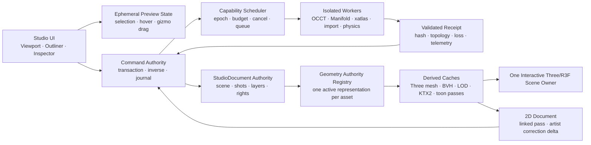

# ToonSpectrum Hybrid 3D DCC 엔진 아키텍처와 전달 증거 계약

> 기준일: 2026-08-03
> 저장소 기준: `ef789c388537` + 2026-08-03 작업 트리
> 원본 요구 문서: `ToonSpectrum_하이브리드_3D_DCC_엔진_라이브러리_포맷_아키텍처_2026-08-01.md` (작업 요청에 첨부된 외부 설계 자료)

이 문서는 원본 설계서의 방향을 현재 Vite/React/NestJS 저장소에 맞춰 실행 가능한 제품 아키텍처, 라이브러리 격리 규칙, 포맷 약속, 수치 계약, 검증 증거로 고정한다. 기능 목록을 다시 선언하는 문서가 아니라, **호출 가능한 커널과 실제 작가용 제품을 구분하고 둘 사이를 닫기 위한 전달 계약**이다.

---

## 0. 결론과 현재 사실

### 0.1 한 문장 결론

현재 ToonSpectrum에는 광범위한 3D/DCC 커널, 실제 OCCT·Manifold·Rapier·Three·Babylon·VRM·IFC·NURBS 자산과 테스트가 존재한다. Phase 0 작업 트리에는 권위 메시를 보여 주는 R3F viewport, object TRS, 점·선·면 stable-ID 선택, 선택 기반 기본 topology 편집, 표준 카메라 view/frame, 되돌릴 수 있는 복제·삭제, 사용자/작품 범위 OPFS workspace 복구, 검증된 GLB derivative handoff, 장면 크기에 맞는 BG3D shadow frustum까지 들어왔다. 또한 현재 페이지의 canonical VRM 레이어를 BG3D 카메라·조명·그림자 아래 읽기 전용으로 함께 보여 주고, 완전하게 표현된 캐릭터만 캡처 receipt와 같은 Studio undo transaction으로 합성하는 첫 공유 장면 수직 경로가 생겼다. Avatar Forge는 기존 VRM 리그를 보존한 얼굴·헤어·색 조형에 제한된 체형 비율 조절을 더했다. 그러나 이 authoring workspace는 아직 canonical Studio 프로젝트 root 및 양방향 2D↔3D live 경로와 하나의 저장·협업 단위로 통합되지 않았고, 공유 장면도 캐릭터 편집/writeback과 모든 의상·소품 상태를 지원하지 않는다. 따라서 **Blender·VRM Studio급 제품 완료 상태가 아니라 실제 편집 수직 경로를 넓히고 있는 Phase 0 통합 단계**다.

### 0.2 지금 증명된 것과 증명되지 않은 것

| 구분 | 2026-08-03 저장소 사실 | 제품 판단 |
|---|---|---|
| 원본 §6 ID | 175개, 중복 없음 | 원본 범위의 식별자 기준선 |
| 현재 카탈로그 | 178개 | 원본 175개 + 포맷 교차 항목 3개 |
| `kernelStatus` | 178개 모두 `kernel-shipped` | 호출 가능한 API/fixture 표면이 있다는 뜻 |
| `productionActivated` | **0/178** | 실제 제품 완료를 주장할 수 없음 |
| Hybrid DCC UI | 3-panel workbench + 실제 R3F authority viewport + object/vertex/edge/face 선택 + TransformControls | 화면 픽셀 반경 선택, 명시적 빈 선택 보호, 기본 선택·TRS·선택 기반 Extrude/Inset/Bevel/Loop Cut은 연결됨; marquee/BVH 대형 선택과 topology 연산별 stable-ID remap receipt는 미완료 |
| Hybrid DCC 상태 | `StudioPage`의 사용자·작품 scope state + panel의 ephemeral component selection | 동일 scope에서 dialog를 다시 열 때 작업 공간은 유지되지만 canonical Studio project controller와는 별도 |
| Studio 3D 뷰포트 | DCC embedded viewport와 shipping `StudioBackground3D`가 별도 존재하며, BG3D에는 현재 페이지 VRM source를 연결하는 bounded runtime composite가 추가됨 | 배경이 camera/light/environment authority를 유지하고 VRM 원본 권위를 변환 없이 보존하지만, 공용 편집 authority·양방향 writeback·모든 캐릭터 부속 상태는 미완료 |
| Hybrid DCC → BG3D | mesh→GLB hash 검증→content-addressed attachment→canonical BG3D scene handoff | one-way derived handoff; authoring round-trip·linked-pass writeback은 미완료 |
| 저장·복구 | native OPFS + Web Lock 기반 Hybrid workspace checkpoint, auth-ready/stable draft scope, 900 ms autosave, dialog 종료/전달 전 flush | 전체 session·undo/redo·bridge·UV·보조 상태의 codec/recovery test는 통과; mutation 직렬화와 scope별 latest-write-wins 대기열을 사용하지만 canonical Studio save, 실제 `/studio` cold restart/crash E2E는 미증명 |
| Object lifecycle | 반복 primitive ID/배치, command 기반 복제·삭제, bridge visibility | 복제·삭제는 undo/redo 가능; visibility는 bridge에 보존되고 toon pass를 dirty 처리하지만 아직 공용 Command Authority undo 대상은 아님 |
| 카메라 탐색 | 등각·정면·우측·상단 preset, scene/selection frame, perspective/ortho 전환 | 기본 DCC 탐색은 연결됨; shot camera document와 동일 권위/북마크 경로는 미완료 |
| BG3D 그림자 | 실제 primitive/GLB hierarchy bounds와 linked VRM의 보수적 human bounds로 key/fill shadow frustum 동적 fit | 대형 장면 clipping과 작은 장면 texel 안정성을 개선; animated deformation의 exact bounds 및 전체 device/browser 성능·시각 회귀 gate는 별도 필요 |
| 캐릭터 생성 | Avatar Forge v3의 21개 스타일 조합, 얼굴·헤어·색·디테일, 5개 체형 preset과 5개 안전 범위 비율, 원본 VRM 리그 보존 | 기존 VRM 기반 비파괴 creator이며, 빈 상태에서 skin mesh·morph·skeleton을 만드는 생성기나 VRM export 제품은 아님 |
| 손·소품 접촉 | 실제 손 크기와 선택 grip anchor/scale 기반 자동 그립, grip별 손가락/PIP 중심 굽힘, joint hard-limit·불완전 rig fail-closed | 접촉 collision solve, 손바닥 skin contact, 물리 기반 양손 재파지와 시각 golden corpus는 미완료 |
| 의상·소품 품질 | legacy 저품질 항목 신규 선택 차단, 곡선형 torso/skirt profile, physical cloth/metal material, rounded hard-surface props, cast/receive shadow | skin-bound 의상, 패턴/봉제, avatar/self-collision cloth, 고품질 자산 corpus·LOD·texture bake는 미완료 |
| 데생 인형 Live Motion | mannequin 전용 MediaPipe VIDEO singleton, same-origin SIMD/non-SIMD WASM, bounded model fetch, GPU→CPU fallback, cancel/retry/cleanup과 단계별 한국어 오류 | 실제 camera/device/browser matrix, 손가락·얼굴 tracking의 mannequin 적용, frame-time/thermal evidence는 미완료 |
| 협업 | Yjs metadata·collab shell 존재 | Hybrid DCC geometry 종단 수렴 증거 없음 |
| 브라우저 E2E | Three/Babylon production console verifier와 Hybrid 전용 harness | constructor 오인식·빈 캡처 진단은 보강됐지만 actual `/studio` 전체 viewport/browser matrix 증거가 아님 |

현재 상태의 기준 코드는 다음과 같다.

- 카탈로그와 7단계 평가: [`studio-dcc-section6-full-catalog.ts`](../src/domains/creator/studio-dcc-section6-full-catalog.ts)
- 독립 제품 패널: [`StudioHybridDccPanel.tsx`](../src/domains/creator/StudioHybridDccPanel.tsx)
- 다이얼로그 shell: [`StudioHybridDccDialog.tsx`](../src/domains/creator/StudioHybridDccDialog.tsx)
- workspace facade: [`studio-hybrid-dcc-workspace.ts`](../src/domains/creator/studio-hybrid-dcc-workspace.ts)
- workspace OPFS codec/recovery: [`studio-hybrid-dcc-workspace-persistence.ts`](../src/domains/creator/studio-hybrid-dcc-workspace-persistence.ts)
- component-selection authority: [`studio-hybrid-dcc-component-selection.ts`](../src/domains/creator/studio-hybrid-dcc-component-selection.ts)
- authority preview: [`StudioHybridDccViewport.tsx`](../src/domains/creator/StudioHybridDccViewport.tsx)
- GLB derivative exporter: [`studio-hybrid-dcc-glb-export.ts`](../src/domains/creator/studio-hybrid-dcc-glb-export.ts)
- shipping BG3D handoff: [`studio-hybrid-dcc-bg3d-handoff.ts`](../src/domains/creator/studio-hybrid-dcc-bg3d-handoff.ts)
- 현재 제품 3D 뷰포트: [`StudioBackground3D.tsx`](../src/domains/creator/StudioBackground3D.tsx)
- BG3D 그림자 fit: [`studio-bg3d-shadow-frustum.ts`](../src/domains/creator/studio-bg3d-shadow-frustum.ts)
- BG3D↔VRM runtime 공유 장면 계약: [`studio-shared-3d-scene-bridge.ts`](../src/domains/creator/studio-shared-3d-scene-bridge.ts)
- 공유 VRM 로드·상태 적용 경계: [`studio-bg3d-shared-vrm-runtime.ts`](../src/domains/creator/studio-bg3d-shared-vrm-runtime.ts)
- 공유 VRM runtime projection: [`StudioBg3dSharedVrmCharacter.tsx`](../src/domains/creator/StudioBg3dSharedVrmCharacter.tsx)
- VRM 기반 캐릭터 creator: [`studio-vrm-avatar-forge.ts`](../src/domains/creator/studio-vrm-avatar-forge.ts)
- 자동 손가락 grip: [`studio-vrm-prop-rig.ts`](../src/domains/creator/studio-vrm-prop-rig.ts)
- 실측 procedural wardrobe: [`studio-vrm-wardrobe.ts`](../src/domains/creator/studio-vrm-wardrobe.ts)
- 데생 인형 Live Motion runtime: [`studio-mannequin-webcam-tracking.ts`](../src/domains/creator/studio-mannequin-webcam-tracking.ts)
- Studio 진입점: [`StudioPage.tsx`](../src/domains/creator/StudioPage.tsx)
- production 3D console verifier: [`verify-studio-3d-console.mts`](../scripts/verify-studio-3d-console.mts)

### 0.3 완료 선언 금지 규칙

다음 표현은 대응하는 증거가 생기기 전까지 사용하지 않는다.

- “178개 기능 구현 완료”: 금지. 현재 정확한 표현은 “178개 카탈로그 항목에 호출 가능한 커널 표면이 등록됨”이다.
- “Blender 대체”: 금지. 실제 캔버스 편집, 저장/재로드, 대형 장면, 포맷 왕복, 브라우저 매트릭스가 통과해야 한다.
- “STEP/IFC/FBX 완전 지원”: 금지. 파일을 읽는 것, 편집 가능한 구조를 보존하는 것, 원본 앱과 왕복하는 것은 서로 다른 약속이다.
- “WebGPU 엔진”: 기본 3D 제품 렌더러가 WebGPU로 활성화됐다는 의미로 쓰지 않는다. 현재 Three WebGPU 경로는 lab/capability 경로이며, 기본 제품 장면 소유자는 기존 Three/R3F 경로다.
- “협업 지원”: Yjs 타입이나 합성 fixture의 존재만으로 geometry 협업을 뜻하지 않는다.

---

## 1. 원본 175개와 현재 178개 카탈로그의 정확한 차이

### 1.1 비교 방법

원본 문서의 `# 6.`부터 `# 7.` 직전까지 표의 첫 번째 열에서 ID를 기계적으로 추출하고, 현재 `STUDIO_DCC_SECTION6_CATALOG`의 `id` 집합과 비교했다. 원본은 175행/175개 고유 ID이며, 현재 카탈로그에서 빠진 원본 ID는 없다.

### 1.2 원본 175개 분포

| prefix | 영역 | 원본 개수 | 현재 개수 | 차이 |
|---|---|---:|---:|---:|
| `DOC` | Document·저장·복구·협업 | 15 | 15 | 0 |
| `MOD` | 모델링·Modifier | 25 | 25 | 0 |
| `BLD` | 건축·배경·SketchUp형 도구 | 20 | 20 | 0 |
| `CAD` | CAD·NURBS·BIM | 20 | 20 | 0 |
| `SCP` | Sculpt·Retopo·Bake | 15 | 15 | 0 |
| `CHR` | Character·VRM·Animation | 20 | 20 | 0 |
| `GAR` | Garment·Cloth | 15 | 15 | 0 |
| `MAT` | Material·Texture | 12 | 12 | 0 |
| `PRC` | Procedural | 8 | 8 | 0 |
| `SHT` | Shot | 6 | 6 | 0 |
| `NPR` | Toon/NPR | 8 | 8 | 0 |
| `DRW` | 2D Draw | 7 | 7 | 0 |
| `PUB` | Publish | 4 | 4 | 0 |
| `FMT` | §7 포맷 교차 항목 | 0 | 3 | **+3** |
| 합계 |  | **175** | **178** | **+3** |

### 1.3 추가된 정확한 세 ID

현재 178개에서 원본 §6에 없던 ID는 정확히 다음 세 개뿐이다.

| 추가 ID | 현재 이름 | 모듈 | 해석 |
|---|---|---|---|
| `FMT-FBX` | FBX import (ASCII+binary mesh lite) | `studio-fbx-ascii-import.ts` | 원본 §7 포맷 표의 FBX 경로를 §6 카탈로그와 교차 연결 |
| `FMT-IFC` | IFC import shell+semantic mesh | `studio-mesh-format-adapters.ts` | 원본 §7의 IFC 호환 경로를 교차 연결 |
| `FMT-STEP` | STEP/IGES import shell+mesh | `studio-mesh-format-adapters.ts` | 원본 §7의 CAD 포맷 경로를 교차 연결 |

따라서 “원본 175개가 178개로 늘었다”는 말은 세 개의 새로운 DCC 도메인 기능이 추가됐다는 뜻이 아니다. **원본 §7 포맷 호환 항목 세 개가 구현 추적을 위해 카탈로그에 들어온 것**이다.

### 1.4 같은 ID 안에서 바뀐 메타데이터

ID 집합 외에도 다음 세 우선순위 표현이 원본과 다르다.

| ID | 원본 | 현재 | 판단 |
|---|---|---|---|
| `CAD-016` | `Rhino 3DM`, P3 | `Rhino 3DM openNURBS full NURBS eval`, P2 | 실제 rhino3dm 경로를 반영해 이름을 구체화하고 우선순위를 앞당김 |
| `CAD-018` | `IFC property/space/wall/opening`, P3 | `IFC city/building body (web-ifc)`, P2 | 실제 web-ifc tessellation 경로를 반영해 이름을 구체화하고 우선순위를 앞당김 |
| `DRW-007` | P0/P1 | P0 | 단일 enum에 맞춰 더 엄격한 쪽으로 정규화 |

현재 우선순위 분포는 P0 11개, P1 61개, P2 55개, P3 37개, P4 14개, P5 0개다. 이 숫자도 **제품 전달 단계와 무관한 카탈로그 계획 분포**다.

---

## 2. 7단계 전달 증거 모델

### 2.1 단계 정의

모든 기능 ID는 다음 일곱 단계로 독립 추적한다. 단계 이름은 현재 코드의 `StudioSection6DeliveryStage`와 동일하다.

| 단계 | 의미 | 최소 증거 | 해당 단계가 증명하지 않는 것 |
|---|---|---|---|
| 1. `kernel-shipped` | 공개 함수·타입·고정 fixture가 존재하고 커널 테스트가 통과 | API 경로, unit/property test, 실패 코드 | 제품 UI, 저장, 브라우저 품질 |
| 2. `ui-wired` | 실제 사용자가 제품 UI에서 기능을 발견하고 실행 | 접근 가능한 메뉴/도구, 상태/오류 UI, component test | 프로젝트 문서 변경 |
| 3. `document-integrated` | 실행 결과가 canonical `StudioDocument`와 Command에 원자적으로 반영 | command receipt, revision/hash 변화, undo/redo | 종료 후 복구 |
| 4. `persistence-verified` | save/reload/crash recovery 후 동일 상태 | OPFS/checkpoint/reload golden, migration test | 협업 수렴 |
| 5. `collaboration-verified` | 동시 편집 또는 명시적 binary lock/branch 정책이 결정적으로 작동 | 2인 이상 convergence, lock collision UI, selective undo | 실제 브라우저/GPU 품질 |
| 6. `browser-verified` | production build의 실제 `/studio`에서 지원 기기/브라우저 계약 통과 | Playwright, screenshot, console=0, 성능 JSON | 실제 릴리스 플래그 활성화 |
| 7. `production-activated` | capability·rollout·telemetry·지원 문서까지 갖춰 사용자에게 활성화 | release config, rollback, observability, support matrix | 이후 품질 개선이 불필요하다는 뜻 |

### 2.2 승격 규칙

1. 단계는 코드 작성자의 서술이 아니라 저장소 증거로만 승격한다.
2. `kernel-shipped` 테스트가 통과해도 뒤의 여섯 단계는 자동 승격하지 않는다.
3. 각 단계는 실제 제품 경로에서 앞 단계를 재검증한다. 전용 HTML harness만으로 `browser-verified`를 부여하지 않는다.
4. 협업 대상이 아닌 기능도 `collaboration-verified`를 생략하지 않는다. 그 기능의 command가 공유 문서에서 결정적으로 재생되거나, binary lock/branch로 안전하게 거부되는지를 증명한다.
5. 실패·취소·stale epoch·worker crash·device loss 경로가 없는 기능은 `production-activated`가 될 수 없다.
6. 기능 이름 옆의 P0/P1/P2는 우선순위이고, 7단계는 전달 성숙도다. 둘을 섞지 않는다.

### 2.3 현재 보수적 평가

현재 [`STUDIO_DCC_SECTION6_DELIVERY_ASSESSMENTS`](../src/domains/creator/studio-dcc-section6-full-catalog.ts)는 178개 모두 `verifiedStages: ["kernel-shipped"]`로만 기록한다.

```text
total                178
kernel-shipped       178
ui-wired               0  (카탈로그 증거로 승격된 수)
document-integrated     0
persistence-verified    0
collaboration-verified  0
browser-verified        0
production-activated    0
```

일부 기능은 별도 제품 UI나 브라우저 테스트가 실제로 존재한다. 그러나 현재 카탈로그는 ID별 종단 증거가 연결되지 않았으므로 의도적으로 0으로 남겨 둔다. 이 보수성은 결함이 아니라 과장 방지 장치다.

### 2.4 증거 레코드의 다음 스키마

현재의 전역 map을 다음과 같은 ID별 증거 레코드로 진화시킨다.

```ts
interface StudioDccDeliveryEvidence {
  featureId: string;
  stage: StudioSection6DeliveryStage;
  evidenceRevision: number;
  sourcePaths: readonly string[];
  testPaths: readonly string[];
  fixtureIds: readonly string[];
  browserArtifacts?: readonly string[];
  benchmarkArtifact?: string;
  supportedCapabilities?: readonly string[];
  limitations: readonly string[];
  verifiedAt: string;
  verifiedCommit: string;
}
```

CI는 동일 `(featureId, stage, evidenceRevision)`의 파일이 사라지거나 테스트가 빠지면 승격을 취소해야 한다. 문서의 체크박스는 증거가 아니다.

---

## 3. 현재 저장소의 실제 3D/DCC 상태

### 3.1 실행 환경과 도구 체인

| 항목 | 현재 값 | 저장소 증거 |
|---|---|---|
| Node.js | 24.16.0 | [`package.json`](../package.json)의 `>=24.16.0` |
| pnpm | 11.4.0 | `packageManager: pnpm@11.4.0` |
| Vite | 8.0.16 | Vite 8 production build |
| React | 19 | React Compiler 활성화 |
| Vitest | 4.1.9 | root Vitest config |
| Playwright | 1.55.1 | production preview/harness 검증 |
| workspace | root, API, core, play-core | [`pnpm-workspace.yaml`](../pnpm-workspace.yaml) |

Vite는 WASM 자산, COOP/COEP 헤더, React Compiler, Babylon 수동 chunk, OCCT optimize 제외를 다룬다. 기준은 [`vite.config.ts`](../vite.config.ts), [`vitest.config.ts`](../vitest.config.ts), [`playwright.config.ts`](../playwright.config.ts)다.

### 3.2 실제 강점

| 영역 | 현재 코드 자산 | 강점 | 아직 부족한 제품 증거 |
|---|---|---|---|
| Document/Command | Hybrid document, command journal, scope-isolated OPFS workspace recovery, Rights BOM | hash·revision·undo/redo·snapshot 및 full-workspace cold codec 기반 | Studio 프로젝트와 하나의 저장 단위가 아니며 actual `/studio` restart evidence 없음 |
| Editable Mesh | half-edge mesh, stable-ID component selection, selection-aware edit operations, invariant tests, authority viewport projection | object/vertex/edge/face UI, ray-hit mapping, TransformControls와 기본 topology 도구 commit | topology operation별 remap receipt, marquee/BVH 대형 선택, non-manifold UX |
| Modifier | Mirror/Array/Boolean/Solidify/Bevel stack | source 불변, Manifold commit 경로 | 제품 inspector stack·preview/commit 분리 |
| Exact CAD | OCCT WASM facade + module Worker + topology/mass receipt | 실제 B-Rep 연산과 STEP round-trip fixture | persistent B-Rep authority·feature tree·임의 파일 종단 경로 |
| Mesh Boolean | Manifold provider | 강건한 solid commit과 명시적 예산 | 현재 일부 호출이 main thread에서 runtime을 소유 |
| NURBS | rhino3dm openNURBS path | 실제 curve/surface 평가, destructor 검증 | Worker 격리·파일 크기 예산·Studio 재로드 |
| IFC | web-ifc body tessellation | `StreamAllMeshes`, semantic count | main-thread 실행, city streaming/admission budget 부족 |
| UV | xatlas 전용 Worker provider | epoch, transfer, cancel, timeout, backpressure | workspace가 아직 `studio-uv-unwrap-lite` 사용 |
| Spatial query | three-mesh-bvh provider | ray/shape/lasso/refit 계약과 예산 | 현재 component selection은 Three raycast 기반이며 BVH/lasso/retopo/shrinkwrap 제품 경로에 미연결 |
| Asset optimize | glTF Transform provider | inspect/transform/hash/예산 | 제품 import/export pipeline에 미연결, worker 미격리 |
| Physics | deterministic Rapier module Worker | 실제 UI physics production-preview verifier | Hybrid garment/cloth authority와 별개 |
| Character | Three/R3F + three-vrm + pose/IK, Avatar Forge v3, prop/contact rig | 실제 VRM poser와 기존 VRM 기반 얼굴·헤어·체형 creator, 접촉 anchor 기반 자연스러운 손가락 grip | blank-to-rigged-mesh 생성·skin/morph 편집·VRM export, Hybrid DCC document/shot continuity 종단 연결 |
| Shared character stage | canonical VRM source bridge + BG3D runtime projection | 배경 camera/light/environment를 공유하고 source authority·capture readiness·원본 layer 보존 규칙을 명시 | 공유 transform/edit/writeback, wardrobe/props/paint/physics 전체 fidelity, quad/capture device matrix |
| 2D/3D bridge | shared set, shot override, visibility/geometry pass dirtying, artist delta | 핵심 웹툰 차별화 데이터 모델과 object visibility 보존 | 실제 3D pass/2D layer와 동일 command로 연결되지 않음 |
| BG3D lighting | key/fill directional lights + hierarchy-aware dynamic shadow frustum | 실제 primitive/verified model bounds, ground receiver depth, texel snap, malformed input clamp | animated deformation의 매-frame exact bounds와 cross-device visual/performance matrix 미증명 |
| Garment | XPBD cloth kernel fixture + bone-attached measured procedural wardrobe | 실측 fit, 저품질 신규 선택 차단, curved silhouette와 physical cloth/metal material | procedural shell은 skin-bound cloth가 아니며 pattern/seam/avatar/self-collision·texture/LOD 제품 부재 |
| Sculpt | hybrid sculpt + 별도 deterministic sculpt 모듈 | 다양한 kernel 실험 | 단일 authority/worker/viewport stroke 경로로 통합되지 않음 |

### 3.3 Phase 0에서 연결된 것과 아직 끊긴 것

[`StudioHybridDccDialog.tsx`](../src/domains/creator/StudioHybridDccDialog.tsx)는 [`StudioHybridDccPanel.tsx`](../src/domains/creator/StudioHybridDccPanel.tsx)을 마운트하고, 현재 panel은 다음처럼 전달받은 workspace 또는 자체 workspace를 React state로 소유한다.

```ts
const [ws, setWs] = useState(() =>
  initialWorkspace ?? createStudioHybridDccWorkspace("ui-workspace"),
);
```

현재 Phase 0에는 다음과 같은 실질 연결과 제품 보강이 있다.

1. [`StudioHybridDccViewport.tsx`](../src/domains/creator/StudioHybridDccViewport.tsx)가 immutable geometry authority record를 Three `BufferGeometry` cache로 투영하며, viewport와 outliner가 `workspaceSelectAsset`으로 같은 object ID를 선택한다.
2. [`studio-hybrid-dcc-component-selection.ts`](../src/domains/creator/studio-hybrid-dcc-component-selection.ts)가 object/vertex/edge/face 선택, replace/add/toggle/subtract, active element, source revision/hash provenance를 별도 권위로 관리한다. viewport fan-triangle ray hit는 stable face·vertex·canonical undirected edge ID로 변환되고, 숫자 1–4와 mouse modifier가 panel state에 연결된다. 점·선 refinement는 로컬 3D 거리가 아니라 CSS pixel 반경을 사용해 면 중앙 클릭을 임의 요소로 바꾸지 않는다. Extrude·Inset·Bevel·Loop Cut은 선택 ID를 소비하며, component mode의 명시적 빈 선택에서는 임의 첫 요소 fallback을 금지한다.
3. document schema v2의 canonical object TRS가 geometry와 분리되어 snapshot·undo/redo·OPFS checkpoint·`.toon3d`에 저장되며, 실제 Three TransformControls의 pointer-up과 숫자 inspector가 각각 하나의 `object.transform` 명령으로 commit된다.
4. `Inset`, direct edge `Bevel`, `Loop Cut`, merge-by-distance, flat/smooth shading을 포함한 핵심 mesh edit가 쉬운 모드별 UI에서 geometry authority commit과 undo에 연결된다. 선택 reconcile은 살아 있는 stable ID를 보존하고 사라진 ID를 prune하며 명시적 remap API도 갖지만, 각 topology operation이 실제 remap receipt를 내는 단계는 아직 아니다.
5. command 기반 duplicate/delete가 geometry·TRS·Rights BOM을 함께 복제하거나 제거하고 undo/redo로 복구한다. 반복 cube 생성은 충돌 없는 ID와 겹치지 않는 초기 X 배치를 사용한다. visibility는 bridge base object를 바꾸고 모든 toon pass를 dirty 처리하지만 아직 공용 document command/history로 승격되지 않았다.
6. viewport는 등각·정면·우측·상단 preset, perspective/orthographic 전환, scene/selection bounds frame을 제공한다. `Numpad1/3/7`, `Home`, `.`/`NumpadDecimal`, `G/R/S`, `Shift+D`, `Delete`가 같은 초점 범위에서 동작한다.
7. [`studio-hybrid-dcc-glb-export.ts`](../src/domains/creator/studio-hybrid-dcc-glb-export.ts)가 editable mesh authority에서 deterministic GLB derivative와 hash/loss report를 만든다. browser 입력은 15-section little-endian packed SoA `ArrayBuffer`로 변환되어 module Worker에 transfer되며 object graph structured clone을 사용하지 않는다.
8. [`studio-hybrid-dcc-bg3d-handoff.ts`](../src/domains/creator/studio-hybrid-dcc-bg3d-handoff.ts)가 derivative를 기존 model-library에 검증·저장하고 canonical object TRS를 유지한 BG3D scene을 만들어 [`StudioBackground3D.tsx`](../src/domains/creator/StudioBackground3D.tsx)로 연다. 지원하지 않는 shot override와 artist ink는 silently drop하지 않고 DCC authority에 남았다는 loss로 보고한다.
9. [`studio-hybrid-dcc-workspace-persistence.ts`](../src/domains/creator/studio-hybrid-dcc-workspace-persistence.ts)는 native OPFS와 origin Web Lock을 필수로 사용한다. user/work ID는 SHA-256 scope key로 경로와 분리하고, 48 MiB hard bound 안에서 document state, command journal, undo/redo, bridge, UV typed array, CAD 및 보조 상태를 canonical JSON envelope로 저장한다. byte length·CRC32·SHA-256·state hash·schema revision을 검증하고, checkpoint/head atomicity, tombstone clear, quota/corruption/version mismatch fail-closed를 테스트한다. 같은 persistence 인스턴스의 save/clear는 writer lease 전체를 FIFO 직렬화한다. `StudioPage`는 인증 준비 완료 전 복구를 시작하지 않고, 미게시 문서에는 기존 Studio autosave key에서 고정한 draft scope를 사용한다. 12초 bounded recovery gate는 기존 modal focus/inert/Escape 경계를 유지하며, 900 ms autosave·dialog close/BG3D handoff 전 flush는 scope별로 실행 중 1개와 최신 대기 snapshot 1개만 보존한다. UI는 `checking/ready/saving/saved/session-only/error`를 구분한다.
10. [`studio-shared-3d-scene-bridge.ts`](../src/domains/creator/studio-shared-3d-scene-bridge.ts)는 현재 페이지의 image element 중 canonical `vrmScene`을 최대 12명까지 runtime session으로 묶는다. BG3D는 camera/light/environment/background 권위를 유지하고 각 character는 VRM source authority를 보존한다. model, body/finger pose, root translation/rotation, expression, body scale, base color와 MToon 효과만 이 slice의 지원 범위다. Avatar Forge, wardrobe/costume, props, surface paint, IK constraint, physics 등 omission이 하나라도 있으면 viewport-only이며 결과 캡처와 source hide receipt에서 제외된다.
11. [`StudioBg3dSharedVrmCharacter.tsx`](../src/domains/creator/StudioBg3dSharedVrmCharacter.tsx)는 bundled 또는 content-addressed attachment VRM을 실제 Three object로 로드하고 BG3D 조명과 shadow를 함께 사용한다. 완전히 준비된 full-fidelity character만 capture receipt에 들어가며, [`StudioPage.tsx`](../src/domains/creator/StudioPage.tsx)는 정확히 그 unlocked source layer만 delete가 아닌 `hidden:true`로 같은 undo transaction에서 보존한다. loading/unavailable이면 삽입을 차단한다. document master mode와 quad secondary views는 중복 합성을 명시적으로 피한다.
12. Avatar Forge v3는 기존 face·hair·accent·color creator에 어깨·몸통·골반·팔·다리 비율과 5개 deterministic body preset을 추가했다. raw/skinned humanoid rig만 치수 권위로 사용하고 normalized pose rig와 geometry buffer를 변경하지 않으며 effect cleanup에서 원래 TRS를 복원한다. 이는 기존 VRM 기반 creator이지 빈 mesh 생성·topology sculpt·skin weight·morph authoring·VRM export가 아니다.
13. 손가락 자동 grip은 선택된 contact anchor 반경과 최종 prop scale, 실제 손 치수를 사용한다. pinch/cylinder/handle/flat/support별 접촉 손가락을 분리하고 PIP 중심 굽힘, 제한된 DIP 결합, 분산된 thumb opposition, 좌우 미러, 모든 VRM joint hard limit을 적용한다. 불완전 rig·fallback socket·invalid basis·한 손의 복수 충돌은 임의 포즈 대신 fail-closed한다. wardrobe는 곡선형 lathe torso/skirt와 physical material/shadow를 사용하고, hard-surface prop은 rounded geometry adapter와 shadow를 사용한다.
14. 3D 데생 인형 Live Motion은 운영 CSP에서 차단되던 jsDelivr MediaPipe loader를 제거하고 package-exported SIMD/non-SIMD loader·WASM을 Vite `?url`의 same-origin asset으로 사용한다. pose model은 허용된 GCS에서 20초 timeout/AbortSignal로 명시적으로 가져와 `modelAssetBuffer`로 전달하고, mannequin 전용 VIDEO singleton과 GPU→CPU fallback을 사용한다. stop·close·unmount·stale initialization은 generation과 best-effort close로 camera/RAF/task를 정리한다. secure-context, permission, camera busy/missing, model timeout/load, WASM, frame analysis 오류는 동일한 generic failure가 아니라 재시도 가능한 한국어 안내로 구분한다.

shipping BG3D 쪽에서는 [`studio-bg3d-shadow-frustum.ts`](../src/domains/creator/studio-bg3d-shadow-frustum.ts)가 primitive와 검증된 model hierarchy의 실제 world bounds 및 linked VRM의 보수적 human bounds를 모아 key/fill별 orthographic shadow camera를 맞춘다. hidden hierarchy는 제외하고 static batch 후보는 포함하며, ground receiver depth, 작은 장면의 기존 40 m 폭, 대형 장면 확장, texel snapping, 수직 광원용 up vector, hostile finite input clamp를 함께 처리한다. 이는 렌더 품질과 첫 runtime composite 보강이지 Hybrid/BG3D/VRM scene authority 전체가 하나로 통합됐다는 뜻은 아니다.

workspace는 더 이상 module-global 변수를 사용하지 않고 `StudioPage`가 사용자·work scope별 React state로 소유하며 scope 변경 시 dialog를 remount한다. native OPFS가 있으면 앱 재진입 시 이 **별도 Hybrid workspace**를 복원할 수 있고, 없으면 UI가 session-only 상태를 명시한다. 다만 이것은 canonical Studio project controller, 수동 save/checkpoint acknowledgement, 2D layer와 함께하는 단일 저장 트랜잭션을 아직 대체하지 않는다. 실제 `/studio`의 cold restart·crash injection·browser matrix 증거도 없다. handoff 역시 DCC→BG3D one-way derivative이며 BG3D 편집을 DCC authority로 되돌리는 command는 남아 있다. handoff evidence는 `canonicalSceneVerified`, 실제 모델이 있을 때만 `receipt-verified`, 아직 Studio canvas commit 전에는 `canvasDocumentIntegrated:false`로 단계별 사실만 보고한다. 그러므로 독립 workspace durability와 shipping shot editor 진입이 생긴 것, 프로젝트 전체가 종단 통합됐다는 주장을 구분한다.

### 3.4 중복 커널 정리 방향

| 현재 중복/혼재 | canonical로 남길 것 | 처리 |
|---|---|---|
| `studio-3d-editable-mesh.ts` vs `studio-editable-half-edge-mesh.ts` | `studio-editable-half-edge-mesh.ts` | 전자는 fixture/legacy로 명시하고 제품 import 금지 |
| `studio-3d-modifier-dag.ts` vs `studio-mesh-modifier-stack.ts` | `studio-mesh-modifier-stack.ts` + dependency graph | 기능 이관 후 legacy 제거 계획 |
| `studio-cad-kernel-lite.ts` vs OCCT | OCCT B-Rep가 exact CAD authority | lite는 preview/sketch fallback만 허용 |
| pure convex/AABB boolean vs Manifold | Manifold가 final solid commit | pure 경로는 preview/test fallback으로 receipt에 명시 |
| `studio-hybrid-sculpt-kernel.ts` vs `studio-sculpt-*` | 하나의 sculpt authority와 stroke protocol | 브러시·remesh·mask를 동일 worker로 통합 |
| lite UV vs xatlas Worker | xatlas가 자동 unwrap/pack commit | lite는 즉시 preview/비가용 fallback만, 사용자에게 등급 표시 |

---

## 4. Canonical 다중 권위 아키텍처

“다중 권위”는 같은 자산을 여러 엔진이 동시에 쓴다는 뜻이 아니다. 문서, 명령, 기하 도메인마다 명확한 권위를 두고, **한 자산의 한 revision에는 정확히 하나의 geometry authority만 존재**하게 한다.

### 4.1 불변식

1. React state, Three `BufferGeometry`, Babylon `VertexData`, Pixi display tree는 authoring source가 아니다.
2. 모든 영속 변경은 Command Authority를 통과한다. Worker가 문서를 직접 수정하지 않는다.
3. 한 asset revision의 geometry authority는 `editable-mesh`, `exact-brep`, `sculpt-field`, `cloth-state`, `external-linked` 중 하나다.
4. 다른 표현으로의 변환은 `derived artifact`이거나 명시적인 `convert/fork` command다.
5. 모든 derived artifact는 `sourceHash`, `sourceRevision`, `provider`, `providerVersion`, `settingsHash`를 가진다.
6. Worker 응답은 request epoch, document revision, input hash가 일치할 때만 commit한다.
7. 취소되거나 stale한 Worker 결과가 문서에 반영되는 횟수는 0이어야 한다.
8. stable object/face provenance가 끊기면 artist delta를 조용히 버리지 않고 재매칭 결과와 손실을 보고한다.

### 4.2 전체 흐름



### 4.3 Document Authority

`StudioDocument`는 다음 정보를 한 versioned root에서 소유한다.

- scene graph, object stable ID, parent/instance 관계
- asset handle과 geometry authority reference
- shot, camera, visibility/material/pose/light override
- 2D layer와 linked 3D pass reference
- command/checkpoint revision
- dependency graph와 dirty set
- Rights BOM, external source hash, import/export loss report
- capability-independent authoring parameters

기존 [`studio-hybrid-dcc-document.ts`](../src/domains/creator/studio-hybrid-dcc-document.ts)의 snapshot·geometry registry·Rights BOM을 기존 Studio project schema 안으로 흡수한다. 별도 `ui-workspace` 문서는 최종 구조에서 없어야 한다.

### 4.4 Geometry Authority

권장 handle은 다음 의미를 가진다.

```ts
type StudioGeometryAuthorityKind =
  | "editable-mesh"
  | "exact-brep"
  | "sculpt-field"
  | "cloth-state"
  | "external-linked";

interface StudioGeometryHandle {
  assetId: string;
  authorityKind: StudioGeometryAuthorityKind;
  authorityRevision: number;
  contentHash: `sha256:${string}`;
  units: "meters";
  axis: "y-up";
  provenance: StudioGeometryProvenance;
  derived: readonly StudioDerivedArtifactRef[];
}
```

| authority kind | owner | 가능한 직접 편집 | 렌더 경로 |
|---|---|---|---|
| `editable-mesh` | 자체 half-edge | vertex/edge/face, modifier, retopo | triangulated `BufferGeometry` cache |
| `exact-brep` | OCCT adapter | sketch/feature/fillet/shell/Boolean | tolerance가 기록된 tessellation cache |
| `sculpt-field` | 자체 sparse field/multires | brush, remesh, mask, face set | proxy/final mesh cache |
| `cloth-state` | pattern+constraint+solver state | pattern, seam, material, pins | simulated render mesh/cache |
| `external-linked` | immutable source reference | transform/override만 | importer-generated proxy |

`exact-brep → editable-mesh`는 암묵 변환이 아니라 `ConvertToEditableFork` command다. 원본 B-Rep를 유지하고 새 asset ID, provenance map, loss report를 만든다. 반대 방향은 일반적으로 무손실이 아니므로 자동 왕복을 약속하지 않는다.

현재 [`studio-geometry-authority.ts`](../src/domains/creator/studio-geometry-authority.ts)는 half-edge source와 derived render cache의 분리를 이미 강제한다. 다음 단계는 record의 `kernel`을 실질적인 다중 representation handle로 확장하는 것이다.

#### 4.4.1 Component Selection Authority

[`studio-hybrid-dcc-component-selection.ts`](../src/domains/creator/studio-hybrid-dcc-component-selection.ts)는 Three raycast 결과를 편집 권위로 저장하지 않는다. object mode와 single-object vertex/edge/face mode를 구분하고, 요소 선택에는 정확한 `assetId`, geometry-authority revision, source mesh hash를 붙인다. directed half-edge의 twin 쌍은 더 작은 stable ID 하나로 canonicalize한다. 배열은 정렬·중복 제거하고 selection/topology/snapshot 작업량을 hard bound로 제한한다.

현재 viewport는 renderer의 fan-triangulated `faceIndex`를 원래 polygon face, triangle-local vertex 후보, polygon boundary edge 후보로 되돌린 뒤 화면상 가장 가까운 stable element를 선택한다. 후보 좌표는 현재 object world transform과 실제 camera로 CSS pixel 공간에 투영하며 기본 10 px 반경 밖의 점·선은 선택하지 않는다. 비균일 object scale에서도 로컬 거리 대신 화면상 거리를 사용한다. 이것은 point click 기반 첫 제품 경로다. source hash 검증의 대형 메시 반복 비용, BVH 가속 대형 선택, box/lasso, occlusion 정책은 아직 이 경로에 연결되지 않았다.

topology commit 뒤 selection reconcile은 다음 규칙을 따른다.

1. asset ID, source revision/hash가 맞지 않으면 stale selection을 fail closed한다.
2. ID가 그대로 살아 있으면 유지하고, 사라진 ID는 진단과 함께 prune한다.
3. operation이 명시적인 `oldId → newId | null` receipt를 제공하면 그때만 교체 ID로 remap한다.
4. 현재 Extrude·Inset·Bevel·Loop Cut UI는 stable input ID를 실제 kernel에 전달하지만, 모든 topology operation이 remap receipt를 생성하지는 않는다. 따라서 새로 갈라지거나 치환된 요소까지 선택 continuity가 보장된다고 주장하지 않는다.

component selection은 viewport interaction을 위한 ephemeral authority이며 현재 OPFS workspace checkpoint 대상이 아니다. geometry/TRS/history의 durability와 selection highlight의 session continuity를 혼동하지 않는다.

### 4.5 Command Authority

모든 편집은 다음 생명주기를 따른다.

```text
BeginIntent
→ validate selection/revision/capability/budget
→ cheap preview 또는 Worker request
→ validate receipt
→ one atomic command transaction
→ dependency dirty propagation
→ journal append
→ derived cache invalidation
→ viewport/layer projection
```

gizmo drag처럼 고주파인 동작은 매 pointer event를 journal에 넣지 않는다.

- `pointerdown`: base revision과 selection을 고정한다.
- `pointermove`: ephemeral preview만 갱신한다.
- `pointerup`: 최종 transform 하나를 command로 commit한다.
- `Escape`, pointer cancel, worker error: preview를 폐기하고 command를 만들지 않는다.

기존 [`studio-command-journal.ts`](../src/domains/creator/studio-command-journal.ts)는 canonical JSON, checksum, transaction/group, undo/redo, 64 MiB hard limit을 제공한다. Hybrid DCC command는 이 공용 journal 규약을 사용하고 별도 역사 스택을 만들지 않는다.

### 4.6 Worker 구조

무거운 엔진은 다음 계층을 반드시 가진다.

```text
renderer-neutral request/response types
→ validating client
→ module Worker URL
→ worker host/runtime
→ provider adapter
→ WASM/native handle scope
→ plain typed-array/metadata receipt
```

모든 request의 최소 필드:

```ts
interface StudioGeometryWorkerRequest<T> {
  protocolVersion: number;
  requestId: string;
  requestEpoch: number;
  documentEpoch: number;
  assetId: string;
  sourceRevision: number;
  sourceHash: `sha256:${string}`;
  operation: T;
  budget: StudioGeometryBudget;
}
```

모든 success receipt의 최소 필드:

```ts
interface StudioGeometryWorkerReceipt<T> {
  requestId: string;
  requestEpoch: number;
  documentEpoch: number;
  sourceRevision: number;
  sourceHash: `sha256:${string}`;
  resultHash: `sha256:${string}`;
  provider: string;
  providerVersion: string;
  durationMs: number;
  peakBytes?: number;
  warnings: readonly string[];
  topology?: StudioTopologyReceipt;
  loss?: StudioCompatibilityLoss;
  result: T;
}
```

#### Worker 배치

| Worker | authority/역할 | 현재 | 목표 |
|---|---|---|---|
| OCCT | exact B-Rep operation/tessellation | 전용 module Worker, 일부 ABI 위험 연산은 one-shot realm | 유지, byte/topology admission 추가 |
| Manifold | final solid Boolean/repair | provider는 있으나 workspace commit이 main-thread runtime을 소유 | dedicated geometry Worker로 이동 |
| xatlas | unwrap/pack | 전용 Worker 구현 완료 | lite UV 대신 제품 commit 경로에 연결 |
| BVH | build/refit/query | provider와 테스트 존재 | build/refit는 Worker, query cache는 viewport owner에 연결 |
| glTF Transform | optimize/export derivative | provider와 테스트 존재 | dedicated import/export Worker로 이동 |
| rhino3dm | 3DM/NURBS | dynamic main-thread WASM | dedicated import/CAD Worker로 이동 |
| web-ifc | IFC geometry/semantics | dynamic main-thread WASM | streaming import Worker와 progressive receipt로 이동 |
| Rapier | rigid physics | 전용 module Worker | 현재 경계 유지, command bake만 문서에 반영 |

Tier 0/1에서는 무거운 geometry job을 동시에 1개만 실행한다. Tier 2는 메모리 측정이 있는 경우 최대 2개까지 허용한다. Worker를 늘리는 것은 throughput 최적화가 아니라 메모리 계약 변경으로 취급한다.

### 4.7 렌더 권위와 specialist 격리

대화형 3D viewport의 scene owner는 하나만 둔다.

- Three/R3F가 camera, selection raycast, gizmo, render loop, interactive scene을 소유한다.
- Three `BufferGeometry`는 geometry authority에서 생성되는 폐기 가능한 cache다.
- Three `WebGPURenderer`는 capability-gated 승격 후보이며 WebGL2 fallback과 동등 기능을 fixture로 증명해야 한다.
- Babylon은 stable object/material ID, depth/normal/beauty 등 독립 artifact capture를 위한 **offscreen specialist**다. 대화형 scene owner가 되지 않는다.
- PixiJS와 CanvasKit은 2D 합성·path/text·고품질 raster specialist이며 3D geometry나 authoring document를 소유하지 않는다.

shipping BG3D의 directional shadow camera도 render cache다. [`studio-bg3d-shadow-frustum.ts`](../src/domains/creator/studio-bg3d-shadow-frustum.ts)가 scene hierarchy와 verified model cache의 bounds에서 매 렌더 상태에 맞는 key/fill fit을 만들지만, 그 frustum 값은 scene/document authority로 역기록하지 않는다. bounds가 없거나 잘못되면 bounded fallback을 쓰며, shadow 품질 계산 실패가 authoring geometry를 변경해서는 안 된다.

이 경계는 [`check-studio-bundle.mjs`](../scripts/check-studio-bundle.mjs)와 [`studio-background-3d-bundle-boundary.test.ts`](../src/domains/creator/studio-background-3d-bundle-boundary.test.ts)에서 구조적으로 검사한다.

### 4.8 2D↔3D Live Bridge

[`studio-live-2d3d-bridge.ts`](../src/domains/creator/studio-live-2d3d-bridge.ts)의 shared set, shot override, dirty pass, artist correction delta는 ToonSpectrum의 차별화 중심이다.

정상 흐름은 다음과 같다.

```text
geometry command commit
→ asset geometryHash/revision 갱신
→ 이 asset을 보는 Shot만 dirty
→ line/shadow/tone/depth/normal/object-ID 중 영향 pass만 재생성
→ 기존 artist delta를 stable provenance로 재투영
→ 재매칭 실패 stroke만 사용자 검토 대상으로 표시
```

artist delta 보존은 pass hash를 다시 만든다는 사실만으로 증명되지 않는다. 실제 2D layer의 stroke anchor, camera projection, topology provenance, before/after visual diff가 함께 있어야 한다.

---

## 5. 라이브러리 역할, 격리, 라이선스 계약

아래 표의 버전과 SPDX 식별자는 2026-08-02 설치된 package metadata 기준이다. 외부 링크는 프로젝트 공식 문서, 표준 레지스트리 또는 upstream 저장소만 사용한다. 라이선스 표는 엔지니어링 경계이며 법률 자문을 대신하지 않는다.

| 구성요소 | 현재 버전 / 라이선스 | canonical 역할 | 현재 저장소 상태 | 격리와 금지 규칙 | 공식 1차 출처 |
|---|---|---|---|---|---|
| Three.js | 0.184.0 / MIT | 유일한 대화형 3D render scene owner, loaders/exporters, render cache 소비자 | BG3D·VRM 제품 표면에 실제 사용 | `BufferGeometry`를 authoring authority로 사용 금지; Studio 초기 graph에서 lazy 유지 | [Three WebGPURenderer](https://threejs.org/docs/pages/WebGPURenderer.html) |
| React Three Fiber | 9.6.1 / MIT | React 19에서 Three scene shell·pointer/gizmo 연결 | BG3D·VRM에 실제 사용, workspace patch 적용 | document mutation과 geometry kernel을 React component에 넣지 않음 | [R3F Introduction](https://r3f.docs.pmnd.rs/getting-started/introduction) |
| Drei | 10.7.7 / MIT | Orbit/Transform/Camera/View 등 UI adapter | BG3D·VRM에서 deep import | 필요한 module만 import, authority 없음 | [pmndrs/drei](https://github.com/pmndrs/drei) |
| Three WebGPU | Three에 포함 / MIT | WebGPU 우선 renderer 후보, WebGL2 fallback capability | [`studio-bg3d-three-webgpu-lab.ts`](../src/domains/creator/studio-bg3d-three-webgpu-lab.ts)의 lab 경로 | 기본 제품 renderer라고 표시 금지; backend parity 후 점진 활성화 | [WebGPURenderer 공식 문서](https://threejs.org/docs/pages/WebGPURenderer.html) |
| Babylon.js core/loaders | 9.19.0 / Apache-2.0 | stable ID·beauty/depth/normal 등 offscreen artifact specialist | 승인된 dynamic entry와 수동 runtime chunk 존재 | 두 번째 interactive scene owner 금지; 승인 entry 밖 import 금지 | [Babylon WebGPU Support](https://doc.babylonjs.com/setup/support/webGPU/) |
| Manifold | 3.5.1 / Apache-2.0 | watertight mesh Boolean, solid commit, repair | provider와 default Boolean backend에서 실제 WASM 호출 | main thread 경로를 geometry Worker로 이동; input/output receipt 필수 | [elalish/manifold](https://github.com/elalish/manifold) |
| OpenCascade.js | 1.1.1 / LGPL-2.1-only | exact B-Rep, fillet/shell/pattern/STEP, mass/topology receipt | 실제 module Worker와 약 63 MiB WASM, one-shot realm 격리 | 교체 가능한 adapter/WASM, source·notice·checksum·relink 정보 유지 | [donalffons/opencascade.js](https://github.com/donalffons/opencascade.js/) |
| Rapier deterministic compat | 0.19.3 / Apache-2.0 | rigid body·collision·query·bake | 전용 module Worker에서만 정적 import | 고정 timestep/order/version; render loop와 문서 직접 mutation 금지 | [Rapier Determinism](https://rapier.rs/docs/user_guides/javascript/determinism/) |
| three-mesh-bvh | 0.9.13 / MIT | accelerated ray/shape/lasso, retopo/shrinkwrap 후보 | provider와 unit/boundary test, 제품 미연결 | topology revision별 rebuild/refit; stale tree 사용 금지 | [gkjohnson/three-mesh-bvh](https://github.com/gkjohnson/three-mesh-bvh) |
| meshoptimizer | 직접 dependency 아님 / MIT | render/export cache reorder·simplify·codec | Three 예제에 포함된 decoder만 사용, lockfile에는 transitive로 존재 | pnpm strict 환경에서 transitive 직접 import 금지; encoder 사용 시 direct dependency와 notice 추가 | [zeux/meshoptimizer](https://github.com/zeux/meshoptimizer) |
| glTF Transform | 4.4.2 / MIT | glTF inspect, deterministic transform, optimize/export derivative | bounded provider와 test 존재, 제품 경로 미연결 | edit authority 변경 금지; Worker에서 copy/hash/loss receipt 후 derivative만 생성 | [glTF Transform](https://gltf-transform.dev/) |
| KTX2/Basis assets | Three 0.184.0에 포함 / upstream license 보존 | source texture의 device별 runtime derivative | 실제 KTX2 admission/transcoder/corpus/renderer path 존재 | source master 보존; dimensions·decoded bytes·extension 검증 | [KTX 2.0 Specification](https://registry.khronos.org/KTX/specs/2.0/ktxspec.v2.html) |
| three-vrm | 3.5.3 / MIT | VRM 0.x/1.0 normalization, humanoid, expression, MToon, spring bone | VRM runtime/poser에서 dynamic load | 원본 license/avatar permission 보존; internal semantic IR로 정규화 | [@pixiv/three-vrm](https://pixiv.github.io/three-vrm/docs/) |
| rhino3dm | 8.32.1 / MIT + openNURBS notices | 3DM read/write와 NURBS curve/surface 평가 | 실제 WASM·Embind disposal test, 현재 main-thread browser path | dedicated Worker로 이동; openNURBS attribution/조건과 수정 notice 보존 | [McNeel rhino3dm API](https://developer.rhino3d.com/api/rhino3dm/) |
| web-ifc | 0.0.77 / MPL-2.0 | IFC geometry·property·space/building semantics | 실제 `StreamAllMeshes` tessellation, 현재 main-thread browser path | Worker·streaming·size/topology limits; 수정 MPL 파일의 source 의무 추적 | [ThatOpen engine_web-ifc](https://github.com/ThatOpen/engine_web-ifc) |
| xatlasjs | 0.2.0 / MIT | automatic UV chart/parameterization/packing | renderer-neutral provider + 전용 Worker + client 존재, workspace 미연결 | Worker only, max pending 1, main-thread fallback 금지 | [repalash/xatlas.js](https://github.com/repalash/xatlas.js/) |
| Yjs | 13.6.31 / MIT | scene/layer/shot metadata CRDT | 공용 CRDT와 DCC metadata adapter 존재 | 대형 geometry typed array를 CRDT에 저장 금지; content hash + lock/branch 사용 | [Yjs Docs](https://docs.yjs.dev/) |
| PixiJS | 8.19.0 / MIT | 2D layer/sprite/mask/filter/selection overlay specialist | lazy scene provider와 기존 2D 자산 | 3D geometry와 StudioDocument authority 금지 | [PixiJS Renderers](https://pixijs.com/8.x/guides/components/renderers) |
| CanvasKit | 0.41.1 / BSD-3-Clause | 고품질 path/text/vector/raster specialist | quality engine, Worker verifier, 약 6.8 MiB WASM | lazy Worker, 명시적 WASM object disposal; 전체 2D 문서 교체 금지 | [Skia CanvasKit](https://docs.skia.org/docs/user/modules/canvaskit/) |

### 5.1 라이선스별 배포 경계

| 계열 | 적용 패키지 예 | 배포 계약 |
|---|---|---|
| MIT/BSD/ISC | Three, R3F, xatlasjs, rhino3dm package, Yjs, Pixi, CanvasKit | copyright·license text를 generated notices와 제품 credits에 유지 |
| Apache-2.0 | Babylon, Manifold, Rapier, MediaPipe | LICENSE/NOTICE와 수정 고지를 유지하고 patent 조항을 누락하지 않음 |
| LGPL-2.1-only | OpenCascade.js | 독립 교체 가능한 WASM/adapter, 정확한 source 링크·checksum·수정 기록·재링크 절차 제공 |
| MPL-2.0 | web-ifc | MPL 적용 파일의 수정 여부를 기록하고 필요한 source availability를 배포 gate로 확인 |
| openNURBS 조건 | rhino3dm payload | package SPDX만으로 끝내지 않고 McNeel/openNURBS attribution과 조건을 notices에 보존 |

OCCT의 정확한 artifact provenance, 교체 절차, source commit, checksum, 법률 검토 상태는 [`docs/third-party/opencascade-lgpl.md`](./third-party/opencascade-lgpl.md)에 있다. notices 생성과 hard check는 [`scripts/generate-third-party-notices.mjs`](../scripts/generate-third-party-notices.mjs), dependency 선언은 [`package.json`](../package.json)과 [`pnpm-lock.yaml`](../pnpm-lock.yaml)이 source of truth다.

현재 `pnpm run audit:licenses`는 578개 dependency entry와 327개 수집 license text를 검사한다. “통과”는 notices·정책 자동 검사 통과라는 뜻이며, OCCT 문서에 명시된 최종 법률 검토 대기를 대체하지 않는다.

### 5.2 엔진 payload 정책

설치 artifact의 대략적인 원본 크기는 OCCT WASM 63 MiB, CanvasKit WASM 6.8 MiB, rhino3dm WASM 2.5 MiB, web-ifc WASM 1.2 MiB, Manifold WASM 532 KiB다. 이 크기는 gzip 전 설치 파일 관측이며 네트워크 전송량과 같지 않다.

따라서 다음을 hard rule로 둔다.

1. Studio route 초기 static graph에는 위 specialist WASM이 들어오면 안 된다.
2. 각 엔진은 사용자 intent 이후 분석 가능한 dynamic entry 또는 module Worker에서만 로드한다.
3. dialog close/document switch 시 Worker와 native handle을 해제한다.
4. 같은 엔진의 서로 다른 사본이 둘 이상의 runtime owner에 포함되면 bundle gate를 실패시킨다.
5. production manifest에 `.test.ts`, `.spec.ts`, 원본 `.ts/.tsx`가 emitted asset로 포함되면 hard failure다.

---

## 6. 포맷 호환 아키텍처: N/A/B/C/D/P/X

### 6.1 등급 정의

| 등급 | 이름 | 정확한 제품 약속 | UI 문구 |
|---|---|---|---|
| `N` | Native | `.toon3d`에서 authoring 구조, stable ID, history, rights까지 무손실 | 네이티브 |
| `A` | Browser Direct | 브라우저 JS/WASM이 구조를 직접 읽고/쓰며 golden round-trip을 통과 | 직접 지원 |
| `B` | Browser Partial | geometry/material/animation 일부만 직접 지원, 손실표 필수 | 부분 지원 |
| `C` | Source-App Bridge | Blender/SketchUp/CAD 등 원본 앱 plugin·공식 SDK·local sidecar 필요 | 브리지 필요 |
| `D` | Server Converter | 격리된 upload/converter service에서만 처리 | 변환 전용 |
| `P` | Preview/Baked | appearance, raster 또는 triangle cache만 보존 | 미리보기/베이크 |
| `X` | Unsupported | 기술·법률·품질상 현재 지원하지 않음 | 미지원 |

등급은 단일 글자로 전체 파일을 평가하지 않는다. 모든 import/export report는 다음 네 축을 독립적으로 기록한다.

```text
G = Geometry fidelity
M = Material/texture fidelity
R = Rig/animation fidelity
S = Semantic/history/metadata fidelity
```

예를 들어 `A/B/X/P`는 geometry는 직접 구조 지원, material은 부분 지원, rig는 미지원, history는 baked/reference만 보존한다는 뜻이다. 현재 타입은 [`studio-import-compatibility-report.ts`](../src/domains/creator/studio-import-compatibility-report.ts)에 이미 `N/A/B/C/D/P/X`를 포함한다.

### 6.2 포맷 등급과 7단계는 별개다

포맷 등급은 parser가 어느 정도의 fidelity를 제공하는지 설명한다. 7단계는 그 parser가 제품에 얼마나 전달됐는지 설명한다.

- `A + kernel-shipped`: 직접 파싱 가능한 커널은 있으나 제품에서 지원한다고 말할 수 없다.
- `B + production-activated`: 손실을 명확히 표시하는 부분 지원 제품은 출시할 수 있다.
- `C + production-activated`: source-app bridge 설치와 round-trip이 실제로 검증된 상태다.

### 6.3 현재와 목표 호환 매트릭스

다음 “현재 축”은 저장소에 존재하는 가장 강한 kernel/provider 능력을 보수적으로 평가한 것이다. Hybrid DCC 제품 전달 단계는 별도 표기대로 아직 `kernel-shipped` 기준이다.

| 포맷 | 목표 등급 | 현재 축 `G/M/R/S` | 현재 실제 경로와 한계 |
|---|---|---|---|
| `.toon3d` | `N/N/N/N` | `B/P/X/B` | [`studio-toon3d-package.ts`](../src/domains/creator/studio-toon3d-package.ts)는 JSON/ZIP-ready shell이며 실제 ZIP64, command segments, full layer/source cache를 아직 담지 않음 |
| glTF/GLB | `A/A/A/B` | `B/B/B/P` | custom SceneIR/probe와 Three loader/exporter, glTF Transform provider가 분리되어 있고 authoring round-trip 종단 증거가 없음 |
| VRM 0.x/1.0 | `A/A/A/B` | `A/A/A/B` provider capability | three-vrm 제품 runtime은 강하지만 Hybrid DCC document/shot/save와 아직 단일 경로가 아님 |
| OBJ/MTL | `A/B/X/P` | `A/B/X/P` | OBJ geometry subset과 BG3D Worker/Three 경로가 존재, units/hierarchy/rig/history 제한 |
| FBX | `B/B/B/P` 또는 `C` export | `B/P/X/P` | ASCII + binary mesh-lite와 Three fallback; skin/animation/material round-trip을 완전 지원하지 않음 |
| COLLADA/DAE | `B/B/B/P` | `B/P/X/P` | minimal float array/triangle 경로와 별도 Three loader; controller/animation은 current lite path에서 손실 |
| STL | `A/X/X/P` | `A/X/X/P` | ASCII/binary triangle geometry, unit가 암묵적이고 topology/material/history 없음 |
| PLY | `A/B/X/P` | `A/P/X/P` | current adapter는 ASCII geometry 중심, vertex attributes 범위 제한 |
| OFF | `A/X/X/P` | `A/X/X/P` | polygon mesh subset |
| 3MF | `A/B/X/B` | `B/P/X/P` | custom/package subset이며 lib3mf 수준의 full validation/round-trip은 아직 없음 |
| DXF | `A/B/X/B` | `B/X/X/P` | current lite path는 주로 LINE 기반 wall guide; arc/block/text/hatch coverage 부족 |
| BVH motion | `A/X/A/P` | `B/X/B/P` | skeleton/motion subset과 retarget shell, source rig semantics 보고 필요 |
| Rhino 3DM | `A/B/X/B` | `B/P/X/B` | 실제 rhino3dm NURBS/File3dm 능력은 있으나 임의 파일의 Worker→document→reload 종단 증거 없음 |
| IFC/IFCZIP | `A/B/X/A` | `B/P/X/B` | web-ifc body tessellation과 semantic counts, large model streaming·georeference·opening mapping 미완료 |
| STEP/IGES/BREP | `A/B/X/B` | `B/P/X/B` | OCCT exact operations/STEP fixture와 별도의 shell importer가 존재; assembly/name/color/PMI/full generic import 미증명 |
| PNG | `X/A/X/P` | `X/A/X/P` | raster asset로 직접 지원, 3D authoring 구조 없음 |
| PSD/PSB | `X/A/X/B` | Hybrid intake `X/P/X/P` | 전체 Studio 2D PSD 경로와 Hybrid shell을 혼동하지 않음; linked 3D passes의 왕복을 별도 증명해야 함 |
| USDZ | `B/B/B/P` 또는 `C` | `X/X/X/X` | 현재 Hybrid DCC provider 없음; loader PoC 후에도 full USD composition을 약속하지 않음 |
| USD/USDA/USDC | `C` 우선 | `X/X/X/X` | OpenUSD sidecar/bridge가 원칙, browser core 직접 탑재는 별도 PoC |
| Alembic | `C/P/P/P` | `X/X/X/X` | Blender/Houdini/Maya/C4D bridge를 통한 baked cache 대상 |
| Blender `.blend` | `C` | `X/X/X/X` direct | native parser를 만들지 않고 Blender plugin/export bridge와 source revision 연결 |
| SketchUp `.skp` | `C` | `X/X/X/X` direct | 공식 SDK/extension bridge를 통해 component/tag/scene/material을 interchange IR로 변환 |
| DWG | `C` 또는 `D` | `X/X/X/X` | ODA/RealDWG 등 계약된 translator 또는 격리 converter 없이는 지원 표시 금지 |
| SolidWorks/Parasolid/ACIS/CATIA/Creo/NX | `C` | `X/X/X/X` | source-app plugin/상용 translator만; proprietary history 무손실을 약속하지 않음 |

범용 runtime asset 표준은 Khronos의 [glTF Registry](https://registry.khronos.org/glTF/)를 기준으로 한다. `.toon3d`는 glTF를 대체하지 않는다. glTF는 전달용 runtime snapshot이고 `.toon3d`는 편집/history/rights/provenance를 보존하는 authoring package다.

### 6.4 `.toon3d` 목표 구조

```text
project.toon3d (ZIP64)
  manifest.json
  document/document.fb
  journal/commands-*.bin
  scene/runtime.glb
  geometry/editable/*.meshbin
  geometry/cad/*.brep
  geometry/sculpt/*.fieldbin
  geometry/cloth/*.clothbin
  geometry/cache/*.glb
  materials/*.mtlx
  textures/source/*
  textures/runtime/*.ktx2
  drawings/pages/*.layerbin
  shots/*.json
  previews/*.webp
  rights/rights-bom.json
  reports/import-*.json
  reports/export-*.json
```

모든 cache는 삭제 후 동일 input/settings hash로 재생성 가능해야 한다. migration은 기존 package를 덮어쓰지 않고 새 checkpoint를 만든다. 외부 원본은 content hash와 URI를 보존하고 embed/link 정책을 명시한다.

### 6.5 모든 import/export receipt의 필수 필드

- parser/provider와 정확한 version
- source hash, output hash, byte count
- unit, up-axis, handedness, coordinate transform
- scene/node/mesh/vertex/triangle/material/texture/bone/animation/morph count
- `G/M/R/S` 네 축 등급
- dropped/baked/approximated/unsupported entity 목록
- external URI와 missing resource 목록
- stable ID/provenance mapping
- security limit과 rejection reason
- original source 보존 위치와 Rights BOM 결과

“성공” boolean만 반환하는 importer는 production에 올리지 않는다.

---

## 7. 전달 로드맵과 증거 게이트

### 7.1 Phase 0 — 현재 진행 중: vertical bridge와 실제 viewport

Phase 0은 새 커널을 더 늘리는 단계가 아니다. 이미 존재하는 커널을 실제 Studio 작가 흐름에 연결해 첫 번째 종단 증거를 만드는 단계다.

#### 범위

1. `StudioHybridDccWorkspace`를 패널 local state에서 Studio project controller로 hoist한다.
2. Hybrid DCC geometry registry를 실제 Three/R3F viewport에 투영한다.
3. outliner selection과 viewport selection이 동일 `assetId`를 공유한다.
4. gizmo preview/commit을 Command Authority에 연결한다.
5. modifier inspector에서 최소 Extrude·Boolean·UV·Material을 편집한다.
6. camera/shot/toon pass와 2D linked layer/artist delta를 실제 문서에 연결한다.
7. undo/redo, manual save, autosave, reload, crash recovery를 동일 프로젝트에서 증명한다.
8. 기존 `StudioBackground3D`와 별도 Canvas를 중복 소유하지 않도록 shared viewport mode를 만든다.

2026-08-03 작업 트리 기준 진행 상태는 다음과 같다.

| Phase 0 경계 | 현재 구현 | 아직 필요한 종료 증거 |
|---|---|---|
| workspace owner | `StudioPage`가 user/work scope별 workspace를 소유하고 dialog에 주입 | canonical Studio project root와 동일 transaction/save lifecycle |
| viewport/selection | authority-derived R3F viewport, outliner object ID, vertex/edge/face stable-ID click selection과 selected-element quick edit | operation별 topology remap receipt, BVH/lasso, 실제 canvas E2E |
| transform/navigation | TransformControls + numeric TRS command, 등각/정면/우측/상단, scene/selection frame | shot camera document와 동일 권위, 대형 scene 성능 artifact |
| object lifecycle | 충돌 없는 반복 cube, undoable duplicate/delete, bridge visibility + pass dirtying | visibility의 공용 Command Authority/inverse, multi-object command transaction |
| durability | native OPFS/Web Lock checkpoint, scoped restore, autosave/flush status, full workspace codec tests | manual save acknowledgement, actual `/studio` cold restart/crash/recovery matrix, canonical project bundle |
| derivative handoff | transferable packed-SoA GLB Worker + content-addressed BG3D handoff | BG3D→DCC writeback, linked 2D pass/canvas document atomic commit |
| shared BG3D/VRM stage | 현재 페이지 VRM source를 같은 camera/light/shadow scene에 read-only projection, ready/full-fidelity capture receipt와 원본 layer hide undo transaction | shared character transform/edit/writeback, wardrobe/props/paint/physics fidelity, canonical common scene authority |
| character creator | Avatar Forge 얼굴·헤어·색·detail + v3 body proportions/presets, 저장·공유 payload round-trip | blank-to-skinned-mesh 생성, morph/sculpt/weights, texture authoring·VRM export·compatibility corpus |
| contact/asset quality | contact-anchor 기반 natural finger grip, curved procedural garment, physical material, rounded props, legacy quality gate | collision/cloth solve, skin-bound garments, authored high-quality catalog·LOD·texture bake·visual golden |
| mannequin live motion | same-origin MediaPipe WASM fileset, bounded model buffer, dedicated lifecycle, retry/cancel과 오류 taxonomy | 실제 webcam permission/device/GPU·CPU browser matrix, long-session leak·thermal benchmark, finger/face tracking evidence |
| interaction/accessibility | 공통 44×24 switch, role=switch/aria-checked, DCC 390/320px에서 44px touch target과 내부 toolbar scroll | actual `/studio` 전체 mobile modal matrix, keyboard/screen reader task completion evidence |
| shipping BG3D render | hierarchy/linked-character bounds 기반 key/fill shadow frustum, 동적 camera far/orbit | supported device/browser visual·performance·device-loss evidence |

따라서 element edit mode와 독립 workspace durability라는 이전의 큰 공백은 코드 경로까지 닫혔다. 그러나 이 표의 오른쪽 열, 특히 canonical project 통합·양방향 writeback·linked 2D layer·actual `/studio` browser evidence가 남아 있으므로 Phase 0은 아직 종료되지 않았다.

#### Phase 0 수직 시나리오

```text
새 Studio 프로젝트
→ Hybrid 3D workspace 열기
→ cube 생성
→ outliner와 viewport에서 같은 object 선택
→ gizmo 이동 + face 선택 + extrude
→ Manifold Boolean commit
→ xatlas UV + material/decal
→ camera/shot 생성
→ object-ID/line/tone linked layer 생성
→ artist correction stroke 추가
→ 3D geometry 수정
→ 영향을 받은 pass만 갱신하고 stroke 보존/충돌 표시
→ undo/redo
→ 저장·탭 종료·재시작·reload
→ document hash, geometry hash, shot/layer link 동일
```

#### Phase 0 종료 증거

- 실제 `/studio` production build를 사용하는 Playwright spec
- canvas screenshot과 outliner/inspector state artifact
- command/revision/hash timeline JSON
- save/reload 전후 canonical snapshot equality
- Worker cancel/stale/crash injection
- 1440×1000 desktop, 390×844와 320×844 mobile 결과
- 예상 밖 console error, page error, Vite overlay가 각각 0
- Phase 0 대상 ID의 단계별 evidence record

### 7.2 P0 — 전문 제작 기반

P0는 “기본 메뉴가 보임”이 아니라 데이터 손실 없이 최소 2D/3D 작업을 끝내는 수준이다.

| P0 gate | 필수 범위 | 정량/증거 종료 조건 |
|---|---|---|
| 문서 안정성 | schema migration, command transaction, OPFS journal/checkpoint, content-address store | 10,000 command undo/redo 후 hash 동일; acknowledged command 100% recovery |
| 기본 viewport | scene/outliner/selection/gizmo/camera, Three WebGL2 + WebGPU capability | Tier별 frame budget, backend loss/fallback, actual `/studio` E2E |
| 기본 포맷 | GLB/glTF/VRM/OBJ/PNG/PSD read path | golden corpus와 `G/M/R/S` loss report, malformed corpus rejection |
| 기본 NPR | depth/normal/object-ID/silhouette, stable IDs | ID exactness, Three/Babylon artifact parity, deterministic hash |
| 2D/3D project | 3D scene와 linked 2D layers를 한 프로젝트로 저장 | save/reload 후 projection와 layer link 동일 |
| 제품 전달 | 기능별 7단계 증거 | P0 release set의 모든 항목이 적어도 browser-verified, rollout 항목만 production-activated |

P0가 닫히기 전에는 P3 CAD·sculpt button 수를 늘리는 일이 출시 준비도를 높이지 않는다.

### 7.3 P1 — Webtoon Object Creator v1

P1은 Blender 전체를 복제하는 대신 웹툰 배경·소품 제작의 끝단을 외부 앱 없이 완주하게 한다.

| P1 gate | 필수 범위 | 종료 증거 |
|---|---|---|
| Mesh edit | element select, extrude/inset/bevel/loop cut/knife/bridge/weld, normals | topology property/fuzz, non-manifold diagnostics, viewport interaction video/screenshot |
| Modifier | Mirror/Array/Boolean/Solidify/Bevel | non-destructive stack, preview vs Manifold commit receipt, undo/reload hash |
| Build/Room | snap/inference, Push/Pull, floorplan, wall/opening/stair, component/instance | 방→가구→8 shots 실제 시나리오, stable component IDs |
| UV/Material | xatlas + manual seam, PBR/MToon, decal | UV overlap/padding fixture, glTF round-trip, KTX2 derivative |
| Shot/NPR | 64 shots capacity, shot overrides, wall hide, linked line/tone/shadow | 8-shot golden, 하나의 plan change 후 dirty shots만 regenerate |
| Artist delta | 3D 변경 후 수작업 선 보존 | unchanged anchors 100%, 재매칭 실패를 조용히 drop 0건 |
| Publish | PSD/PSB loss report, Rights BOM, package | Photoshop/Clip Studio 재개방 visual diff와 blocked rights gate |

P1 종료 시 작가는 단순 소품과 배경 세트를 외부 Blender/SketchUp 없이 완성할 수 있어야 한다. 단순히 해당 이름의 61개 P1 API가 존재하는 것으로는 종료하지 않는다.

### 7.4 P2 — 캐릭터·협업·포맷 확장

| P2 gate | 필수 범위 | 종료 증거 |
|---|---|---|
| Character | VRM IK/FK, expression/lookAt/spring bone, BVH/FBX retarget | 여러 shots의 pose/표정 continuity, retarget error report, reload |
| Collaboration | Yjs metadata, review pin/approval, selective undo, binary geometry lock/branch | 2인 이상 10,000-op convergence, conflict/lock collision UI, offline reconnect |
| UV/Paint/Bake | xatlas, manual seam, texture paint, normal/AO/ID bake | seam/cage/padding/color-space corpus, worker cancel/memory budget |
| Open formats | DXF/3MF/3DM/IFC subset | source-app corpus, structure/appearance loss report, Worker isolation |
| Procedural | scatter, curve sweep, instances, deterministic recipe | seed/hash determinism, editable semantic output, bake/freeze provenance |
| Animatic | continuity compare, timing/audio cue | previous/next shot diff와 export/reload |

#### 7.4.1 “VRM Studio형 캐릭터 창조”의 정확한 경계

현재 Avatar Forge v3는 **기존 VRM을 기반으로 하는 비파괴 character creator vertical slice**다. 스타일 preset, 절차형 hair, 얼굴 비율/accent/color, 제한된 body proportions, pose/expression/wardrobe/props와 Studio scene 저장을 한 UI에서 이어 주는 것은 실제 제품 가치다. 반면 “빈 상태에서 캐릭터를 창조하고 VRM으로 내보낸다”는 약속에는 다음 authority가 추가로 필요하다.

1. base body/head mesh generator와 연령·체형 topology family,
2. facial morph target authoring과 표정 preset의 VRM expression binding,
3. skeleton 생성·joint placement·automatic skin weights와 manual weight paint,
4. hair curve/card/strand generator와 spring-bone collider authoring,
5. skin/eye/hair/cloth UV·texture·normal/AO/ID bake 및 색공간 계약,
6. skin-bound garment, footwear, accessory socket와 avatar/self-collision cloth,
7. VRM 0.x/1.0 meta, humanoid validation, thumbnail, license/permission UI,
8. GLB/VRM export, 재수입 golden corpus, source hash와 geometry/material/rig loss report.

이 여덟 항목과 실제 브라우저 저장·재로드·export/reimport 증거가 없으면 “VRM Studio 대체 완료”라고 표현하지 않는다. 현재 UI의 `체형` 탭은 raw/skinned VRM bone TRS를 안전 범위에서 비파괴 조절하며 normalized pose rig와 원본 geometry/skin buffer를 변경하지 않는 단계다.

### 7.5 P3–P5: Blender급 깊이를 향한 후속 단계

| 단계 | 제품 목표 | 출시 기준의 핵심 |
|---|---|---|
| P3 | exact CAD, production sculpt, garment basic, typed Geometry Nodes, Blender/SketchUp bridges | sketch→B-Rep→tessellation→line, multires/provenance, pattern/seam/drape, bridge revision relink |
| P4 | large city, high-end simulation, OpenUSD/Alembic sidecar, Maya/3ds Max/C4D/Houdini/CLO bridges | streaming·queue·self-collision·cache·enterprise 운영 증거 |
| P5 | high-quality auto retopo, topology-aware ink rematch, advanced NURBS/hair/virtualized geometry | 독립 연구 track, benchmark와 fallback이 product core를 막지 않음 |

“Blender급”은 기능 이름의 합계가 아니라 다음 workflow별 parity scorecard로 판단한다.

- topology edit depth와 failure recovery
- modifier non-destructive fidelity
- large-scene viewport latency와 memory
- rig/animation/constraint editing
- sculpt/retopo/bake quality
- material/texture/color fidelity
- file interchange와 source-app round-trip
- automation/node graph/plugin extensibility
- save/recovery/collaboration robustness
- 웹툰 특화 multi-shot/NPR/artist-delta 생산성

ToonSpectrum의 경쟁 우위는 모든 범용 DCC 영역에서 Blender를 복제하는 데 있지 않다. **동일한 3D 세트를 여러 웹툰 컷에 재사용하고, 변경 후에도 작가의 2D 수정선을 보존하는 종단 workflow**를 더 빠르고 안전하게 만드는 데 있다.

---

## 8. 수치형 성능·메모리·번들 계약

### 8.1 숫자의 지위

이 절의 숫자는 세 종류로 구분한다.

| 표기 | 의미 | 실패 시 처리 |
|---|---|---|
| `현행 hard` | 현재 코드가 입력을 거부하거나 CI를 실패시키는 한도 | 즉시 실패, 상향에는 코드·테스트·메모리 근거 필요 |
| `신규 release` | 해당 phase를 닫기 전에 executable benchmark로 만들어야 하는 출시 계약 | 해당 phase 승격 불가 |
| `관측 reference` | 회귀를 발견하기 위한 기준선이며 현재는 자동 veto가 아님 | artifact에 기록하고 원인을 설명 |

평균만으로 통과시키지 않는다. latency는 warm-up을 제외한 최소 600 samples의 median, p95, p99와 worst를 기록한다. 장치·OS·브라우저·GPU·backend·DPR·scene hash·commit을 artifact에 포함한다. CI 가상 GPU 숫자와 실제 hardware lab 숫자는 섞지 않는다.

### 8.2 기준 장치와 장면

| tier | 기준 | viewport | 의도 |
|---|---|---|---|
| Tier 0 | 4 logical cores, 4 GiB class mobile, WebGL2 | 390×844 및 320×844, DPR 최대 2 | 열람·기본 변형·shot framing·경량 편집 |
| Tier 1 | Apple M1 8 GiB 또는 Intel i5-1135G7 16 GiB급 integrated GPU | 1440×1000, DPR 최대 2 | P0/P1 기본 authoring release gate |
| Tier 2 | 8 logical cores, 16 GiB 이상, discrete GPU | 2560×1440, DPR 최대 2 | 대형 장면·고품질 preview·P2+ |

공통 `dcc-medium` fixture는 visible 100만 triangles, 2,000 objects, 64 materials, 4K texture 16개, 8 shots로 고정한다. `dcc-large` fixture는 500만 triangles, 10,000 objects, 128 textures이며 Tier 2와 out-of-core 경로만 평가한다. 실제 fixture hash가 없는 benchmark 결과는 evidence가 아니다.

### 8.3 상호작용과 렌더링 release 계약

| 항목 | Tier 0 | Tier 1 | 측정/실패 조건 |
|---|---:|---:|---|
| orbit/pan/gizmo frame time | median ≤ 33.3 ms, p95 ≤ 50 ms | median ≤ 16.7 ms, p95 ≤ 25 ms | `dcc-medium`, 10초 연속 입력; 100 ms 초과 frame 비율 ≤ 1% |
| pointer event → preview transform | p95 ≤ 33 ms | p95 ≤ 16 ms | event timestamp부터 다음 presented frame까지 |
| BVH point/ray selection | p95 ≤ 16 ms | p95 ≤ 8 ms | 100만 triangle fixture, 정확한 face ID 일치 |
| command commit UI acknowledgement | p95 ≤ 100 ms | p95 ≤ 50 ms | transform/material/visibility command; durability는 별도 |
| idle render | 5초 동안 ≤ 2 frame | 5초 동안 ≤ 2 frame | animation·physics·asset decode가 없는 안정 상태 |
| backend/device loss 복구 | ≤ 3 s | ≤ 2 s | 마지막 acknowledged document hash 유지, 손실 command 0 |
| dialog 10회 open/close | Worker/native handle 잔존 0 | Worker/native handle 잔존 0 | 강제 GC lab에서 retained owned bytes 증가 ≤ 5% 또는 32 MiB 중 큰 값 |

WebGPU는 같은 장면과 기능에서 WebGL2 fallback보다 빠르다는 이유만으로 승격하지 않는다. stable object ID, camera projection, tone/color output, capture pass, device-loss recovery가 동등한 뒤 성능을 비교한다.

### 8.4 geometry·저장·협업 release 계약

| 경로 | `신규 release` 계약 |
|---|---|
| lightweight transform preview | 100,000-triangle single asset에서 p95 ≤ 16 ms Tier 1 |
| geometry preview receipt | 100,000-triangle Boolean/bevel/unwrap preview의 첫 usable result p95 ≤ 100 ms; 넘으면 progressive proxy 제공 |
| final geometry commit | 동일 fixture의 Worker final receipt p95 ≤ 2 s; 2초 초과 job은 progress·cancel UI 필수 |
| cancel/stale | cancel acknowledgement ≤ 100 ms, cancel 이후 commit 0, stale epoch/revision commit 0 |
| bounded import | 50 MiB GLB의 첫 visible proxy p95 ≤ 2 s, 전체 document receipt p95 ≤ 5 s Tier 1 |
| journal append | p95 ≤ 20 ms, max ≤ 50 ms; UI acknowledgement와 durability acknowledgement를 구분 |
| checkpoint | 100 MiB canonical project의 checkpoint p95 ≤ 2 s Tier 1; main thread 50 ms 초과 long task 0 |
| recovery | durability acknowledgement를 받은 command의 복구율 100%; 마지막 unacknowledged tail은 명시적 recovery report |
| collaboration | 50 ms simulated RTT에서 local commit→remote projection p95 ≤ 250 ms; 2 clients × 10,000 operations 최종 hash 수렴 100% |
| multi-shot dirtying | clean shot의 불필요한 pass regeneration 0; affected pass 누락 0 |
| artist delta | unchanged anchor 보존 100%; 매칭 실패를 무통보 삭제 0 |

Boolean·CAD·unwrap의 2초 계약은 모든 임의 입력의 완료 보장이 아니라, 명시된 fixture와 admission budget 안에서의 release SLO다. 더 큰 입력은 queue/progress/cancel, proxy, 서버 또는 desktop bridge 중 하나로 routing한다.

### 8.5 현재 구현된 provider hard budget

다음 값은 목표가 아니라 현재 코드에 있는 방어선이다.

| provider | `현행 hard` 한도 | 저장소 근거 |
|---|---|---|
| Manifold | input 250,000 vertices/500,000 triangles; output 500,000 vertices/1,000,000 triangles/128 MiB; concurrent 1 | [`studio-manifold-mesh-provider.ts`](../src/domains/creator/studio-manifold-mesh-provider.ts) |
| xatlas | 64 meshes; mesh당 65,535 vertices; input 1,000,000 vertices/2,000,000 triangles/256 MiB; output 4,000,000 vertices/2,000,000 triangles/512 MiB; execution 120 s; pending 1 | [`studio-xatlas-uv-provider.ts`](../src/domains/creator/studio-xatlas-uv-provider.ts) |
| three-mesh-bvh | 2,000,000 vertices/2,000,000 triangles; depth 48; query당 triangle tests 250,000/candidates 100,000; lasso 512 points; concurrent 4 | [`studio-three-mesh-bvh-provider.ts`](../src/domains/creator/studio-three-mesh-bvh-provider.ts) |
| glTF Transform | input/output 각각 256 MiB; operations 4; scenes 10,000; nodes 500,000; meshes 100,000; primitives 500,000; textures 20,000; concurrent 1 | [`studio-gltf-transform-provider.ts`](../src/domains/creator/studio-gltf-transform-provider.ts) |
| Command Journal | default records 2,048, actors 256, command payload 1 MiB, serialized journal 16 MiB; absolute serialized ceiling 64 MiB; ID/kind 160 code units | [`studio-command-journal.ts`](../src/domains/creator/studio-command-journal.ts) |
| OCCT | default timeout 120 s, 허용 1–300 s; shared Worker에서 active request 1개 | [`studio-occt-worker-client.ts`](../src/domains/creator/studio-occt-worker-client.ts) |

Provider 최대치가 제품의 기본 admission limit라는 뜻은 아니다. 예를 들어 xatlas output 512 MiB는 provider의 최후 방어선이고, Tier 0/1 제품은 memory estimate에 따라 훨씬 일찍 거부하거나 분할해야 한다. 특히 OCCT, rhino3dm, web-ifc에는 입력 byte·entity·topology의 공통 admission receipt가 아직 부족하다. 이것은 Phase 0/P0의 보안·안정성 차단점이다.

### 8.6 번들·초기 로드 계약

[`check-studio-bundle.mjs`](../scripts/check-studio-bundle.mjs)의 현재 byte 숫자는 `관측 reference`이고, engine isolation과 production artifact integrity는 hard failure다.

| graph | 현재 reference raw/gzip | 의미 |
|---|---:|---|
| 전체 Studio static closure | 3,060,000 / 1,000,000 bytes | 관측 경보, 자동 release veto 아님 |
| Studio entry | 1,284,000 / 389,000 bytes | 관측 경보 |
| app shell 이후 Studio incremental | 2,556,000 / 840,000 bytes, 158 chunks | 관측 경보 |
| BG3D activation closure | 2,516,000 / 744,000 bytes, 43 chunks | 사용자 3D 진입 뒤 graph |
| Rapier physics Worker | 2,350,000 / 875,000 bytes | 격리된 optional Worker |

Phase 0부터 다음을 `신규 release`/hard gate로 추가한다.

- Studio 최초 static closure의 OCCT·Manifold·xatlas·rhino3dm·web-ifc·Babylon specialist·CanvasKit WASM bytes: **0**.
- Hybrid DCC shell activation의 신규 application code: 기존 Studio와 Three/R3F 공용 chunk 제외 gzip **≤ 300 KiB**.
- 각 specialist engine의 analyzable dynamic entry 또는 module Worker: 정확히 1 owner.
- production manifest의 `.test.*`, `.spec.*`, 원본 `.ts/.tsx` emitted asset: **0**.
- Worker close 뒤 5초 이내 해당 engine worker count: **0**. 공유 pool이면 idle worker 1개 이하이며 document/native handle은 0.

---

## 9. 수치형 보안·입력 격리 계약

### 9.1 신뢰 경계

외부 3D/CAD/BIM 파일, texture, archive, source-app bridge 응답은 모두 공격자 입력으로 취급한다. 확장자나 MIME은 힌트일 뿐이며 magic/header, declared length, 실제 byte length, 내부 count를 독립 검증한다. parser/WASM은 StudioDocument를 직접 쓰지 않고 격리 Worker에서 immutable receipt만 반환한다.

### 9.2 공통 import admission limit

아래 값은 Phase 0/P0의 `신규 release` 기본값이다. 특정 포맷이 더 작은 현재 hard limit를 가지면 작은 값을 적용한다.

| 항목 | 기본 한도 | 초과 처리 |
|---|---:|---|
| 단일 browser-direct source | 256 MiB | parsing 전 거부; server/desktop/source-app bridge 안내 |
| archive entries | 10,000 | 전체 archive 거부 |
| archive path | 512 code units | entry 거부; normalize 후 중복도 거부 |
| expanded archive total | 1 GiB | streaming 중 즉시 중단 |
| 압축비 | 100:1 | zip bomb 의심으로 거부 |
| nested archive depth | 1 | 중첩 payload 거부 |
| symlink/hardlink/device entry | 0 | archive 전체 거부 |
| 자동 remote URI fetch | 0 | 기본 차단; 사용자 확인+allowlist+size budget 뒤 별도 fetch |
| scene nodes | 500,000 | receipt 없이 allocation 금지 |
| scene hierarchy depth | 128 | cycle/depth error로 거부 |
| 한 texture edge | 16,384 px | decode 전 거부 |
| 전체 texture pixels | 268,435,456 px | aggregate budget 초과 거부 |
| 한 decoded texture bytes | 512 MiB | decode 중단 |
| coordinate magnitude | 1,000,000,000 | normalization/loss report 또는 거부 |
| command/import JSON nesting | 64 | parse/normalize 거부 |

### 9.3 Worker/WASM 실행 계약

- 모든 heavy parser와 geometry kernel은 module Worker 또는 교체 가능한 sidecar process에서 실행한다. main thread에서 rhino3dm/web-ifc를 실행하는 현재 경로는 production 승격 전 제거한다.
- Worker에는 DOM, auth token, cookie, arbitrary network, project-wide file handle을 주지 않는다. 요청마다 필요한 owned `ArrayBuffer`와 capability만 전달한다.
- probe는 2초, interactive preview는 10초, bounded batch는 120초를 기본 timeout으로 둔다. OCCT의 현재 300초 상한은 명시적으로 선택한 Tier 2/background job에만 허용한다.
- cancel 요청 후 100 ms 안에 cooperative acknowledgement가 없으면 Worker를 terminate한다. terminate된 Worker의 native/WASM handle과 response는 재사용하지 않는다.
- `eval`, `new Function`, importer script 실행, embedded executable/plugin 자동 실행은 0건이어야 한다. Blender Python 등 source-app bridge 코드는 별도 서명·권한·versioned protocol 대상이다.
- integer overflow, NaN/Infinity, overlapping ranges, duplicate IDs, cyclic hierarchy, accessor out-of-bounds를 typed array allocation 전 가능한 범위에서 검사한다.
- `SharedArrayBuffer`가 필요한 path는 COOP/COEP가 실제 Studio response에 있는 경우에만 활성화하며, 부재 시 bounded copy path로 fail closed한다.

### 9.4 내보내기와 공급망

- export archive 경로는 상대 경로만 허용하고 `..`, absolute path, NUL, platform device name을 거부한다.
- 원본 source, generated derivative, engine/provider version, SPDX/license, Rights BOM, 손실 보고서를 package manifest에 기록한다.
- importer가 외부 URI를 embed하면 source hash와 최종 byte count가 receipt와 일치해야 한다. 일치하지 않는 resource는 publish를 막는다.
- LGPL/MPL/openNURBS 관련 source/notice/checksum gate는 [`opencascade-lgpl.md`](./third-party/opencascade-lgpl.md)와 [`generate-third-party-notices.mjs`](../scripts/generate-third-party-notices.mjs)를 따른다.
- lockfile 변경 PR은 `pnpm run audit:licenses`와 generated notice diff를 필수 evidence로 첨부한다.

---

## 10. QA 매트릭스와 단계별 증거 계약

### 10.1 geometry와 command

| suite | PR gate | nightly/release gate |
|---|---:|---:|
| topology property/fuzz | operation family당 seed 1,000 | seed 10,000 + 60분 soak |
| command/undo/redo | deterministic 10,000-command sequence 3회 | crash point 100곳 × 3 storage states |
| worker cancel/stale | provider당 cancel timing 50개, stale epoch 50개 | document switch/close/device loss 조합 1,000개 |
| memory lifecycle | open/close 10회 | 100회, Worker/native handle leak 0 |
| collaboration | 2 clients × 10,000 operations | 4 clients × 100,000 operations + offline/reconnect 100회 |
| determinism | 동일 input/settings 10회 hash 동일 | supported browser/CPU matrix 전부 동일하거나 명시된 tolerance receipt |

Half-edge operation은 단순 triangle count만 검사하지 않는다. twin 대칭, `next` cycle, face winding, boundary loop, vertex fan, finite coordinate, attribute cardinality, stable provenance를 매 seed마다 확인한다. Boolean·CAD 변환은 manifoldness, signed volume, bounding box, connected component, tolerance, dropped face provenance를 receipt에 기록한다.

### 10.2 포맷 corpus

production 등급을 받는 포맷마다 최소 다음 fixture를 versioned source hash와 함께 둔다.

- 정상 corpus 12개 이상: 최소/복합 hierarchy, instancing, units/axes, non-ASCII names, material/texture, animation/skin/morph, large-but-valid 경계값.
- malformed/adversarial corpus 20개 이상: truncated header, length overflow, cyclic graph, huge counts, NaN/Infinity, path traversal, zip bomb, duplicate ID, corrupt compression, missing external resource.
- export가 있는 포맷은 import→edit→export→re-import golden 8개 이상.
- source-app bridge 등급 `C`는 지원하는 원본 앱의 현재 major와 직전 major에서 golden 5개 이상, bridge protocol downgrade/upgrade 각각 1개 이상.
- 모든 결과에 `G/M/R/S`, dropped/baked/approximated entity, source/output hash가 있어야 하며 손실 목록 없는 “부분 성공”은 실패다.

### 10.3 시각·browser·접근성

기존 [`verify-studio-3d-console.mts`](../scripts/verify-studio-3d-console.mts)의 Three/Babylon silhouette 계약을 유지한다.

2026-08-03에는 verifier 자체의 false failure 원인도 제거했다. production Three module을 export 이름 없이 찾는 과정에서 `type === "Mesh"`만 사용하면 `InstancedMesh` 계열을 기본 `Mesh`로 오인할 수 있었다. 이제 constructor source identity(`isScene`, `isPerspectiveCamera`, `isMeshBasicMaterial`, `isMesh`)를 함께 검증하며, LT Worker로 보내기 전에 alpha가 전부 0인 Three capture를 별도 오류로 차단하고 malformed worker response에는 kind/width/height/layer count를 기록한다. static production preview에서는 선택적인 `/api/auth/session` 요청도 허용한다. 이 보강으로 현재 production console verifier는 다시 통과하지만, verifier의 정확성이 올라간 것이 Hybrid DCC의 actual `/studio` browser stage 승격을 뜻하지는 않는다.

- direct silhouette IoU ≥ 0.88.
- area ratio 0.85–1.15.
- edge와 centroid tolerance는 `max(3 px, viewport edge의 1.25%)`.
- direct IoU는 최선의 horizontal/vertical/180° mirrored IoU보다 ≥ 0.01 높아야 한다.
- 예상 밖 console error, page error, request failure, Vite overlay: 각각 0.

Phase 0 actual `/studio` E2E는 Chromium/Firefox/WebKit에서 1440×1000을 실행하고, Chromium hardware 또는 승인된 WebGPU runner에서 WebGPU/WebGL2 동등성을 추가 실행한다. mobile은 390×844와 320×844에서 horizontal overflow 허용 오차 ±1 px, 모든 주요 touch target 44×44 CSS px 이상을 요구한다. 이 mobile 기준은 기존 [`verify-studio-bg3d-physics.mts`](../scripts/verify-studio-bg3d-physics.mts)의 계약과 맞춘다.

Screenshot만으로 상호작용을 증명하지 않는다. 각 visual artifact에는 canonical document hash, selected asset ID, camera matrix, renderer backend, stable-ID buffer hash, command timeline을 함께 보관한다.

### 10.4 7단계별 CI evidence

| 단계 | merge/release에 필요한 자동 증거 |
|---|---|
| `kernel-shipped` | unit/property/adversarial tests, public API import, bounded error fixture |
| `ui-wired` | accessible tool discovery, keyboard/touch invocation, disabled/loading/error state component test |
| `document-integrated` | actual command receipt, before/after revision+hash, undo/redo snapshot equality |
| `persistence-verified` | save/reload, migration, crash injection, acknowledgement recovery artifact |
| `collaboration-verified` | deterministic replay 또는 lock/branch rejection, two-client convergence artifact |
| `browser-verified` | production `/studio`, supported viewport/browser matrix, screenshot+timeline+console=0, numeric performance JSON |
| `production-activated` | rollout percentage, capability policy, telemetry dashboard, alert/rollback drill, support/limitation 문서 |

한 단계의 artifact가 다른 단계의 빈칸을 채우지 않는다. 예를 들어 Playwright가 버튼을 눌렀어도 document hash가 변하지 않으면 `ui-wired`까지만 가능하다. save/reload가 통과했어도 remote peer 수렴을 실행하지 않았으면 `collaboration-verified`가 아니다.

### 10.5 2026-08-03 audit snapshot

이 문서를 작성하며 확인한 표적 검증 snapshot은 다음과 같다.

| 검증 묶음 | 결과 | 해석 |
|---|---:|---|
| Hybrid DCC/BG3D 관련 회귀 Vitest | **19 files, 174 tests 통과** | panel/dialog/viewport, persistence, selection, GLB Worker, BG3D handoff·shadow, product gate 회귀 방지 |
| 이번 character/shared-stage/asset/toggle 집중 묶음 | **10 files, 186 tests 통과** | Avatar Forge, shared scene, wardrobe, props, finger grip, 공통 switch의 직접 회귀; 아래 묶음과 일부 테스트가 중복되므로 단순 합산 금지 |
| BG3D↔VRM 공유 장면 | **7 files, 69 tests 통과 + 실제 `/studio` 수직 시나리오 통과** | 1 VRM link→shared camera/light/shadow→capture→source hide→단일 undo, quad 중복 방지, desktop/390/320과 console 0 |
| Avatar Forge v3 | **6 files, 135 tests 통과 + 실제 `/studio` 체형/undo/keyboard 통과** | v1/v2 migration, body plan/raw rig TRS restore, panel accessibility, desktop/390/320 no-overflow |
| 손가락 grip/의상/소품 | **grip 3 files, 62 tests; wardrobe+props 2 files, 58 tests 통과** | anchor/scale·joint limit·fail-closed, curved profile·material·rounded geometry·shadow 회귀 |
| 데생 인형 Live Motion 복구 | **2 files, 18 tests 통과** | same-origin WASM boundary, singleton/dispose/stale retry, engine vs camera error, cancel/stream cleanup; 실제 camera device matrix는 미실행 |
| DCC mobile touch 보강 | **2 files, 27 tests 통과 + 390/320 실측** | selection/view/outliner target 최소 44px, document horizontal overflow 0, toolbar 내부 scroll |
| OPFS workspace persistence 단독 | **11 tests 통과** | visibility·duplicate·delete·undo/redo를 포함한 cold codec, concurrent save/save·save/clear 직렬화, atomic head 이전 crash, corruption/quota/version/scope mismatch, tombstone 검증 |
| component selection authority 단독 | **13 tests 통과** | deterministic selection operations, canonical edges, stale provenance fail-closed, explicit remap/prune, bounded snapshot과 renderer face mapping |
| dynamic BG3D shadow frustum 단독 | **7 tests 통과** | 작은/대형 scene, texel snap, hierarchy/pivot/deformation margin, malformed/hostile bounds 검증 |
| `verify:studio-3d-console` production harness | **통과** | constructor identity·empty capture·response diagnostics 보강 후 Three/Babylon stable-ID와 silhouette 계약 회복; actual `/studio` 전체 E2E는 아님 |
| broader architecture/license/bundle/browser matrix | **이번 표적 실행에 포함하지 않음** | 이 snapshot은 29개 신규 회귀 test와 verifier 결과이며 release sign-off가 아님 |

현재 CI는 root Vitest, production build, bundle check와 [`verify:studio-3d-console`](../package.json)을 실행한다. 그러나 위 Phase 0 수직 시나리오를 실제 `/studio`에서 수행하고 7단계 evidence record를 갱신하는 job은 없다. 따라서 `productionActivated=0`을 유지하며, Phase 0 E2E를 required CI job으로 추가하기 전에는 제품 완료 수치를 올리지 않는다.

### 10.6 실패 artifact와 flake 정책

- 모든 numeric gate는 machine-readable JSON과 사람이 볼 screenshot/trace를 함께 남긴다.
- test retry는 기본 0이다. GPU/browser 환경 불안정으로 retry를 허용하면 첫 실패와 retry 결과를 모두 보존하고, 20회 중 1회라도 실패하면 quarantine이 아니라 release 차단으로 분류한다.
- random/fuzz seed, input hash, provider version, worker epoch, browser/GPU 정보가 없으면 재현 불가능한 실패로 보고 gate 자체를 실패시킨다.
- pixel tolerance는 backend별 명시된 pass에만 적용한다. stable-ID와 command/document hash는 tolerance 없이 exact match다.
- benchmark가 budget을 넘으면 숫자를 즉시 상향하지 않는다. scene complexity, regression source, degradation/fallback, 새 기준 장치 데이터를 decision record에 남긴 뒤 변경한다.

---

## 11. 구현 순서와 완료 정의

### 11.1 다음 구현 순서

1. **Phase 0 vertical slice 종결**: 현재 user/work-scoped workspace와 OPFS checkpoint를 canonical Studio project controller/Command에 흡수한다. 첫 VRM capture/source-hide transaction을 shared character transform·edit·BG3D writeback 및 wardrobe/props/paint fidelity까지 넓힌다.
2. **선택·Worker 통합**: topology operation별 stable-ID remap receipt를 만들고, Manifold·rhino3dm·web-ifc·glTF Transform을 공통 scheduler/receipt/cancel/admission protocol로 이동하며 xatlas/BVH를 제품 commit/대형 선택에 연결한다.
3. **P0 durability와 linked pass 증명**: actual `/studio`에서 save/reload/crash recovery, stable-ID capture, 2D linked pass, artist delta를 하나의 Playwright 시나리오로 닫는다.
4. **P1 authoring depth**: editable mesh, modifier inspector, room/build, UV/material, shot/NPR을 실제 작업 결과 중심으로 확장한다.
5. **P2 character/collaboration/interchange**: 현재 기존-VRM 기반 Avatar Forge를 base mesh/morph/skeleton/weights/texture/garment/VRM export가 있는 독립 creator로 넓히고, VRM continuity, binary geometry lock/branch, open-format corpus, procedural recipe를 단계별 evidence로 승격한다.
6. **P3+ specialist/R&D**: exact CAD feature tree, production sculpt/garment, source-app bridges, large-scene streaming을 core release와 독립된 capability로 운영한다.

### 11.2 기능 ID 하나의 Definition of Done

기능 ID가 “완료”되려면 다음이 모두 참이어야 한다.

1. catalog ID, 실제 제품 command kind, UI action, evidence record가 동일 ID로 추적된다.
2. canonical document와 geometry authority가 변경되고 inverse/redo가 결정적이다.
3. save/reload와 crash recovery 후 content hash가 같다.
4. 협업 가능 command는 수렴하고, binary/exclusive command는 충돌 전에 명확히 lock/branch된다.
5. 실제 production `/studio`에서 browser·viewport·성능·접근성 계약을 통과한다.
6. malformed/oversized/cancel/stale/worker crash/device loss가 데이터 손실 없이 종료된다.
7. import/export 손실, provider version, rights/license, known limitation이 사용자와 artifact에 보인다.
8. release flag, telemetry, rollback, support matrix가 있어 `production-activated`를 부여할 수 있다.

이 여덟 조건을 충족하지 않은 ID는 커널이 존재하더라도 “구현 완료”가 아니라 현재 도달한 7단계 이름으로만 보고한다.

### 11.3 제품 수준 완료 정의

P0/P1/P2 milestone은 해당 우선순위의 178개 행을 단순히 세어 닫지 않는다. 각 milestone 표의 대표 작업 흐름이 실제 프로젝트에서 끝까지 완료되고, 대상 feature ID가 요구 단계에 도달하며, 이 문서의 수치 계약과 loss/security evidence를 모두 통과해야 한다.

최종적으로 “전문 3D 편집기 수준”이라는 표현은 다음 세 수치와 함께만 사용한다.

- 어떤 workflow parity scorecard를 어느 competitor/version과 비교했는지,
- 그 workflow에 포함된 feature ID 중 `production-activated` 비율이 얼마인지,
- 저장·협업·브라우저·성능·포맷 왕복 실패율이 계약 안에 있는지.

현재 그 숫자는 `productionActivated=0/178`이다. 그러므로 지금의 정직한 상태는 **Phase 0 vertical bridge 구축 중인 Hybrid DCC kernel platform**이며, 가장 높은 우선순위는 더 많은 버튼이 아니라 첫 실제 작가 프로젝트의 종단 증거다.
