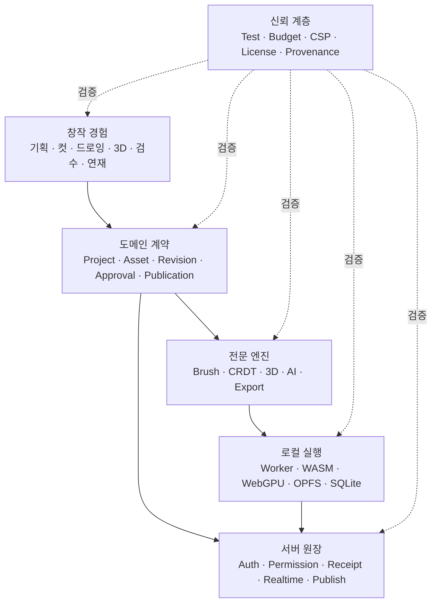
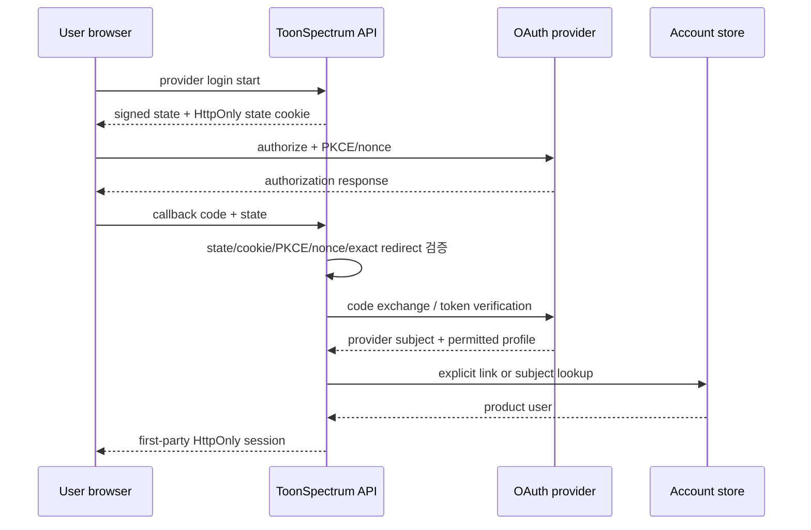
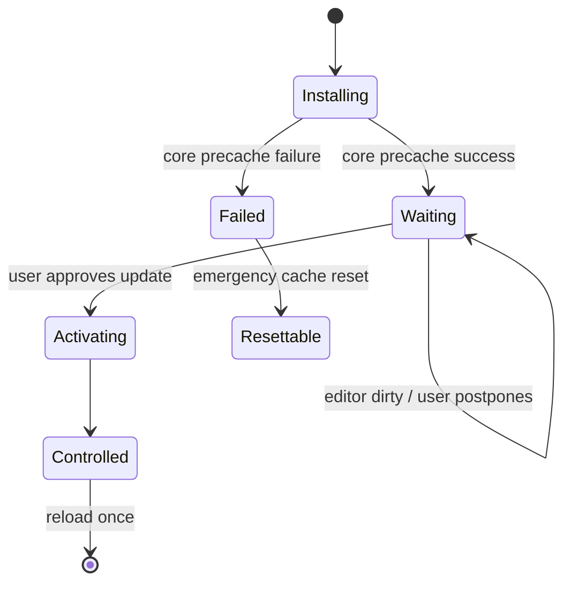
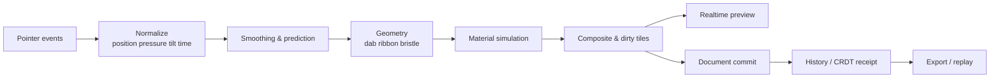
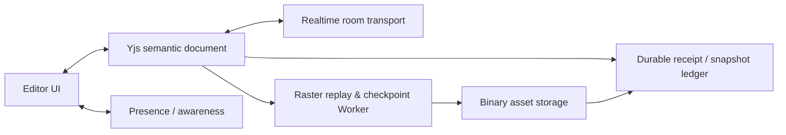

# ToonStudio Engineering Playbook

- 기준일: **2026-09-23**
- 목적: 서비스 소개, 기술 백서, 홍보영상 제작, 기술 세미나, 신규 웹서비스 설계 참고
- 공개 페이지: `/about/technology/playbook`
- 사실 원본: `apps/web/src/domains/legal/technology/*`
- 상태 원칙: 코드가 있다는 이유만으로 운영 기능이라고 부르지 않는다.

## 0. 상태와 증거 읽는 법

| 상태 | 의미 | 공개 문구에서 허용하는 표현 |
| --- | --- | --- |
| `live` | 제품 또는 검증된 delivery path에서 실행 | 현재 제공, 현재 실행 |
| `configured` | 코드·운영 계약이 있고 공급자 등록·환경 설정 필요 | 연동 준비, 설정 후 사용 |
| `experimental` | 제한된 경로에서 품질·호환성 검증 중 | 실험, 단계적 활성화 |
| `documented` | 정책·의사결정·target이 문서화됨 | 설계, 검토, 기준 |
| `planned` | 구현 전에 contract와 acceptance를 정의 | 계획, 후보, 목표 |
| `reference-only` | 외부 도구·제품을 선택적으로 참고 | 참고, 평가, 대안 |

증거 수준은 `code`, `test`, `workflow`, `document`로 구분한다. repository path는 구현 존재를 보여 주지만 운영 성공이나 시장 성과를 자동으로 증명하지 않는다. 정량 홍보 문구에는 측정 환경, 표본, 날짜와 commit이 추가로 필요하다.

---

## 1. 서비스 소개 원본

### 1.1 한 문장

> ToonStudio는 기획, 회차·컷, 드로잉, 3D, 자산, 협업, 검수와 연재 운영을 하나의 프로젝트 맥락으로 이어 주는 브라우저 기반 웹툰 제작 스튜디오다.

### 1.2 문제 정의

웹툰 제작의 핵심 비용은 특정 편집 기능의 부재만이 아니다. 대본, 콘티, 레이어 파일, 3D 배경, 참고 이미지, 검수 댓글과 게시 상태가 서로 다른 도구에 흩어지면 다음 작업자는 다음 항목을 반복해서 복원한다.

1. 지금 어떤 revision이 정본인가.
2. 왜 이 컷과 자산이 선택됐는가.
3. 누가 승인했고 무엇이 아직 실험 상태인가.
4. 외부 자산과 AI 결과를 사용할 권리가 있는가.
5. 실패 뒤 어디까지 복구할 수 있는가.

ToonStudio는 페이지보다 `Workspace → Project → Episode → Cut → Asset → Revision → Approval → Publication`을 중심에 둔다. 드로잉·3D·가상 공간·AI는 이 프로젝트 원장을 직접 소유하지 않고 전문 capability로 연결된다.

### 1.3 사용자에게 보이는 가치

- 설치 없이 프로젝트를 열고 기획부터 제작·검수까지 이어서 작업한다.
- 불안정한 네트워크에서도 로컬 작업과 복구 상태를 유지한다.
- 브러시·3D·AI 같은 고비용 기능은 기기와 공급자 상태에 맞춰 안전하게 낮춘다.
- 공유 link와 공개 preview가 작품 revision·canonical URL과 일치한다.
- 협업 중 presence와 durable document, media privacy를 구분한다.
- 자산·Open API·AI 결과의 출처와 권리를 결과와 함께 보존한다.

### 1.4 대상별 소개 카피

**창작자**

> 파일과 도구를 오갈 때마다 작업 이유를 다시 찾지 마세요. 작품, 회차, 컷, 브러시, 3D 참고, 검수와 연재 상태를 하나의 프로젝트에서 이어 갑니다.

**기술 발표**

> ToonStudio는 브라우저 제약 안에서 드로잉, 로컬 우선 저장, CRDT 협업, 가상 공간, 멀티 엔진 3D와 AI를 연결하면서도 데이터 권위와 실패 범위를 분리한 사례입니다.

**파트너·투자자**

> 방어력은 기능 수보다 연결된 제작 맥락에 있습니다. 프로젝트 원장, 로컬 우선 데이터, 전문 엔진 경계와 검증 증거를 유지하면 기능이 늘어도 workflow가 분해되지 않습니다.

**채용·오픈소스 소개**

> GPU·WASM·Worker·PWA·CRDT·3D·AI를 쓰는 것보다 중요한 것은 언제 쓰지 않을지, 무엇이 최종 결과를 소유할지, 실패 뒤 어떤 fallback이 남는지를 코드와 테스트로 고정하는 일입니다.

---

## 2. 시장과 벤치마크를 읽는 방법

### 2.1 관계 분류

- **used**: 제품 코드나 검증 workflow에서 실제 확인된다.
- **evaluated**: 제한된 실험이나 도입 평가를 수행했다.
- **inspired**: 제품·UX 원칙을 참고했으며 구현 동등성을 뜻하지 않는다.
- **alternative**: 현재 기본 선택은 아니지만 교체·확장 후보로 비교한다.

### 2.2 비교 제품군

| 제품군 | 참고 제품 | 배우는 것 | ToonStudio 적용 | 주장하지 않는 것 |
| --- | --- | --- | --- | --- |
| 전문 드로잉·만화 | Clip Studio Paint, Krita, Photoshop, Procreate, MediBang | 브러시 피드백, layer/page/project, 파일 round trip | preview/commit 역할, brush lab, revision, long-stroke 품질 | 동일 brush/file benchmark 없는 parity |
| 협업 캔버스 | Figma, tldraw, Magma, Excalidraw | room authority, presence, share, migration | Yjs semantic operation, awareness·asset 분리 | CRDT만으로 Figma 수준 운영 달성 |
| 웹 3D·DCC·자산 | Spline, Blender, SketchUp, ACON3D, VRoid | browser viewport, DCC QA, interchange, marketplace rights | Three.js·VRM·WASM geometry·Blender QA | browser가 DCC 전체 대체 |
| 가상 업무공간 | Gather 2.0, WorkAdventure, Kumospace | 사람·방·도구 discovery, consent, world authoring | world manifest, action registry, social adapter | 시각적 거리만으로 media privacy 보장 |
| 웹 창작·배포 | Canva, Adobe Express, Figma Slides, Remotion | guided entry, template, share/export/presentation | 웹 story·deck·film의 단일 사실 원본 | 화려한 영상이 실제 metric을 대체 |

### 2.3 시장 조사 체크리스트

1. 기능 이름보다 해결하려는 사용자 작업을 기록한다.
2. 최신 제품과 legacy 제품 문서를 섞지 않는다.
3. 공식 문서, 실제 사용 실험과 제3자 평가를 분리한다.
4. 확인하지 못한 접근성·암호화·성능은 `미확인`으로 둔다.
5. `source → lesson → product boundary → acceptance` 순서로 옮긴다.
6. 경쟁 기능을 복제하지 않고 가져올 원칙을 한 문장으로 만든다.

---

## 3. 전체 시스템 지도



핵심 원칙은 다음 다섯 가지다.

1. **Authority before library**: 라이브러리보다 누가 최종 결과를 소유하는지 먼저 정한다.
2. **Fast path / durable path**: 즉시 보이는 결과와 저장·공유 가능한 결과를 분리한다.
3. **Local-first, not local-only**: 계산·편집은 로컬 우선, 권한·게시·공유 원장은 명시적 서버 동기화.
4. **Evidence before claim**: 상태와 증거가 없는 문장은 홍보 카피로 승격하지 않는다.
5. **Rights travel with features**: 출처·권리·동의·재배포 범위를 데이터와 함께 이동시킨다.

---

## 4. 소셜 로그인 연동 개발

### 4.1 왜 어려운가

소셜 로그인 UI는 버튼 몇 개지만 운영 범위는 다음을 포함한다.

- 공급자 콘솔과 정확한 redirect URI
- state, PKCE, nonce와 cookie 정책
- 최소 scope와 verified email 판단
- provider subject와 제품 user ID의 관계
- 제품 HttpOnly session
- callback 중복·재시도·사용자 취소
- 계정 연결과 자동 병합 제한
- unlink webhook, 마지막 로그인 수단 제거와 탈퇴
- secret 회전·철회와 공급자 장애

OAuth 2.0 Security Best Current Practice는 authorization server가 redirect URI를 정확히 비교하고, CSRF 방어와 PKCE 같은 현대적 보호를 적용할 것을 요구한다. ToonStudio는 이 원칙을 공급자별 callback과 first-party session 경계로 적용한다.

### 4.2 권위 모델



### 4.3 공급자별 판단

- Google: 범용 계정과 GIS ID token 검증 경로.
- Kakao: 국내 전환에 중요. 최소 profile scope, unlink webhook과 app/domain 등록 필요.
- Naver: 국내 사용자 친화적. 별도 subject를 정본으로 쓰고 email 자동 병합을 제한.
- GitHub: 창작 도구·개발자·오픈소스 사용자. PKCE S256과 verified email 확인.
- Apple: 웹 return URL, nonce, `form_post`, private key와 유료 개발자 운영 범위가 필요.
- LINE, Microsoft, Discord: 지역·조직·커뮤니티 수요가 확인될 때 후보.

### 4.4 수락 기준

- client secret과 장기 provider token이 browser bundle에 없다.
- provider token과 product session은 다른 수명·회수 경계를 가진다.
- callback이 반복돼도 기존 성공 session이 `bad_state` 화면으로 덮이지 않는다.
- verified contact가 없어도 provider subject로 안전하게 별도 계정을 만들 수 있다.
- 계정 연결은 기존 session과 새 provider의 재인증을 요구한다.
- unlink와 마지막 로그인 수단 제거가 session revoke와 일관된다.
- 공급자 미설정·심사중·장애를 UI에서 구분한다.

관련 정본: `docs/social-login-provider-setup.md`, `apps/api/src/modules/auth`, `scripts/verify-social-login-production.test.mjs`.

---

## 5. 공유하기 기능 개발

### 5.1 하나의 canonical payload

공유 화면마다 문자열을 직접 조립하지 않고 다음 payload를 정본으로 둔다.

```ts
interface SharePayload {
  canonicalUrl: string;
  contentId?: string;
  title: string;
  text?: string;
  imageUrl?: string;
  locale: string;
}
```

이 payload에서 다음 adapter를 파생한다.

- 기기 공유: Web Share API
- 카카오톡: Kakao JavaScript SDK, 필요 시점 지연 로드, SRI·CSP
- 네이버·LINE·X·Facebook·Telegram: 공식 share URL
- 이메일: `mailto:`
- 링크 복사: Clipboard API + 제한 환경 fallback
- QR: 패널을 열 때만 모듈 지연 로드
- crawler preview: canonical, Open Graph title·description·image

Web Share API는 secure context와 사용자 activation이 필요하고 모든 브라우저에서 동일하게 제공되지 않는다. 취소는 장애가 아니라 정상 outcome으로 처리한다.

### 5.2 분석과 개인정보

공유 URL에는 기존 query·hash를 보존하며 UTM을 추가한다. 내부 event에는 전체 URL·제목을 보내지 않고 `channel`, `result`, `route`만 기록한다. `share()` 성공은 사용자가 share target을 선택했다는 뜻이지 실제 수신·열람·전환을 증명하지 않는다.

### 5.3 배포 전 검사

- 실제 crawler user agent로 canonical과 OG 확인
- mobile native share 취소가 error toast가 아닌지 확인
- 제한된 webview에서 copy fallback 확인
- Kakao JavaScript key와 로그인 REST/Admin secret 혼동 방지
- CSP, SRI, popup/app switch 확인
- UTM이 기존 query·hash를 파괴하지 않는지 검사

관련 정본: `docs/social-sharing.md`, `apps/web/src/shared/lib/share.ts`.

---

## 6. 앱 같은 성능: Worker, PWA, OPFS와 업데이트

### 6.1 Worker는 작업 권위 계약

Web Worker는 UI thread 밖에서 계산을 수행할 수 있지만 DOM 접근, serialization, duplicate memory와 lifecycle 비용이 있다. 작은 작업까지 무조건 이동하지 않는다.

공통 job envelope:

```ts
interface WorkerJob<T> {
  requestId: string;
  generation: number;
  kind: string;
  payload: T;
  deadlineMs?: number;
}
```

필수 규칙:

1. request ID와 generation으로 late response를 무시한다.
2. 큰 buffer는 가능한 경우 Transferable로 소유권을 이동한다.
3. AbortSignal·timeout·termination 후 cleanup을 명시한다.
4. backend는 job 시작 전에 고르고 중간에 바꾸지 않는다.
5. ambiguous failure 뒤 직접 실행·다른 provider replay는 side effect에 따라 금지한다.
6. Worker crash 후 reuse 가능한 heap인지 검증하고 WASM cleanup 실패 시 Worker를 폐기한다.

### 6.2 사용 영역

- brush input·natural media·GPU document render
- raster checkpoint와 CRDT replay
- SQLite WASM·OPFS database owner
- OpenCascade·Manifold 같은 3D geometry
- PSD·SVG·image codec·export
- CRC/hash·대형 file package 검증

OffscreenCanvas는 canvas와 DOM을 분리해 Worker에서 rendering을 수행할 수 있다. 다만 지원 여부, GPU context loss와 committed result 권위를 별도로 다룬다.

### 6.3 Service Worker 업데이트

Service Worker의 책임은 app shell·정적 asset·route cache 복구다. 원고 binary나 SQLite write authority가 아니다.



정책:

- 편집 중 자동 `skipWaiting`·reload 금지
- large optional WASM은 core precache에서 제외
- COOP/COEP header가 cache response에서도 보존되는지 검사
- `controllerchange` 반복 reload loop 방지
- emergency reset·cache kill switch 유지
- update 성공과 user data backup을 같은 기능으로 설명하지 않음

### 6.4 로컬 우선 저장

- OPFS: 대형 binary와 filesystem-like access
- SQLite WASM: 구조화된 local project index·journal
- IndexedDB: browser metadata와 작은 object
- 외부 cloud: 사용자 동의 기반 backup·export
- server: permission, durable receipt, collaboration/publish ledger

`local-first`는 서버가 없다는 뜻이 아니다. 오프라인에서 사용자가 할 수 있는 작업과 다시 연결될 때 충돌·권한·게시를 누가 결정하는지 명시하는 설계다.

---

## 7. 브러시 엔진

### 7.1 브러시는 하나의 함수가 아니다



### 7.2 핵심 데이터

- `strokeId`
- normalized sample stream
- brush preset revision
- deterministic seed
- tip/material/composite parameters
- layer transform와 color-space metadata
- selected renderer role와 capability receipt
- committed tile/document hash

### 7.3 renderer role

- `preview`: pointer movement 중 즉시 피드백
- `live`: 재료 simulation과 고품질 진행 상태
- `commit`: 최종 문서와 history를 소유
- `export`: 저장·인쇄·공유 파일 생성
- `reference`: 비교용 CPU·alternate implementation

두 engine이 같은 역할의 최종 권위를 동시에 가지지 않는다. preview가 빠르더라도 pointer-up 뒤 commit 결과가 크게 달라지면 제품 품질이 아니다.

### 7.4 기술 조합

- Pointer Events, pressure·tilt normalization
- perfect-freehand, lazy-brush 등 입력·경로 보조
- CanvasKit/Skia, WebGPU, Rust/WASM
- OffscreenCanvas·Worker
- dirty region·tile rendering
- mixbox·blend·natural media pipeline
- renderer registry와 capability probe

### 7.5 품질 예산

| 항목 | 검사 질문 |
| --- | --- |
| latency | pointer sample에서 visible preview까지 지연은? |
| committed parity | preview와 저장 결과의 형태·재료 차이는? |
| long stroke | 긴 획의 memory·queue·tile 증가는 bounded인가? |
| device loss | GPU device/context loss 뒤 같은 document를 복구하는가? |
| fallback | Canvas/WASM 경로에서도 receipt·Undo·export 의미가 유지되는가? |
| color | premultiply, color space와 alpha blend가 경로별로 일치하는가? |
| determinism | seed·preset revision으로 replay 가능한가? |

전문 도구와 비교할 때 짧은 선 demo보다 실제 brush preset, 큰 canvas, 긴 획, layer blend와 export round trip을 측정한다.

---

## 8. CRDT와 실시간 협업

### 8.1 CRDT가 소유할 것과 소유하지 않을 것

| CRDT/Yjs에 적합 | 별도 계층에 둘 것 |
| --- | --- |
| layer/object property | PSD·GLB·원본 image bytes |
| vector/stylus semantic operation | camera/mic/screen media stream |
| ordered operation·tombstone | server authorization·billing |
| bounded metadata·content hash | durable backup·object storage |
| ephemeral awareness는 별도 channel | large raster checkpoint bytes |

Yjs는 shared type의 update를 병합하는 CRDT framework이며 network provider와 persistence를 강제하지 않는다. Automerge도 local-first·offline merge의 대표 대안이지만 현재 ToonStudio의 구현 정본은 Yjs다. 대안을 문서에 적는 것은 실제 도입을 뜻하지 않는다.

### 8.2 권위 분리



### 8.3 반드시 설계할 것

- schema version과 migration
- update·awareness·room·asset size limit
- authentication과 per-document authorization
- offline fork와 reconnect protocol
- duplicate·reordered update convergence
- deletion operation과 acknowledgement
- snapshot·compaction·retention
- old client compatibility와 forced upgrade
- room abuse·rate limit·backpressure
- binary asset upload receipt와 orphan cleanup

### 8.4 tldraw에서 얻는 교훈

공식 sync 문서는 하나의 room authority, SQLite persistence, asset store 분리, application-level auth·rate limit와 client/server migration을 강조한다. 이 설계는 제품 동등성 근거가 아니라 협업 editor에서 반복되는 운영 경계의 참고다.

---

## 9. 가상 스튜디오와 Living World

### 9.1 목표

가상 공간은 장식적 lobby가 아니라 같은 Project 상태를 다음 방식으로 탐색하는 projection이다.

- 사람과 현재 활동 찾기
- 방·책상·보드·도구 이동
- 작업 상태·검수 요청·회의 제안
- world authoring과 publish/rollback
- 목록·검색·keyboard와 공간 화면의 상호 이동

### 9.2 모듈 경계

- `world-manifest`: versioned room, collision, spawn, object, art provenance
- `world-compiler`: schema·collision·action validation
- `actor-locomotion`: 이동·path·실패 이유
- `actor-animation`: 상태→animation mapping
- `npc-director`: local ambient와 shared authority 구분
- `interaction-registry`: allowlisted product action
- `interaction-session`: focus·consent·cancel
- `conversation-policy`: membership·lock·recipient
- `social-protocol`: live/huddle adapter
- Phaser renderer: projection, not business authority

### 9.3 제품 벤치마크에서 배운 것

**Gather 2.0**

- 사람·영역 검색, 목적지 이동, 회의 요청과 동의가 이어진다.
- Studio edit와 runtime/publish 경계가 있다.
- 최신 2.0과 Classic의 privacy 동작을 섞지 않는다.

**WorkAdventure**

- inline object·area editor와 Tiled 기반 terrain authoring을 구분한다.
- visual wall, meeting area, lock과 silence가 다른 규칙이다.
- client-side script와 shared state가 별도다.

**Kumospace**

- people search, follow consent, room list·map·door interaction의 발견성이 좋다.
- visual distance와 실제 camera/screen-share visibility가 같지 않을 수 있다.
- Battery Saver·Performance·High Quality처럼 기기별 사용자 선택을 둔다.

### 9.4 접근성과 privacy 수락 기준

- 모든 핵심 업무를 공간 없이 list·keyboard로 완료 가능
- reduced motion, low-power, high-contrast와 readable tooltip
- 사람·방·도구 통합 검색
- 이동 실패 이유와 대체 action
- mic·camera·screen share는 사용 시점에 권한 요청
- 현재 실제 수신자와 room lock 표시
- 공간 거리나 벽만으로 privacy를 설명하지 않음
- arbitrary script가 아니라 schema-validated action registry

---

## 10. 웹 3D와 DCC 왕복

### 10.1 역할별 기술

| 역할 | 기본/후보 기술 | 권위 |
| --- | --- | --- |
| interactive viewport | Three.js, React Three Fiber, Drei | 표시 scene graph |
| 캐릭터 교환 | VRM, `@pixiv/three-vrm` | humanoid·expression·spring metadata |
| 전문 비교 engine | Babylon.js | 제한된 기능·WebGPU 평가 |
| 정밀 solid/CAD | OpenCascade.js, Rhino3dm | bounded Worker computation |
| boolean·mesh | Manifold, BVH/CSG | bounded mesh result |
| UV·compression | xatlas, meshoptimizer | derived artifact |
| desktop QA | Blender, bpy, EEVEE | 독립 validation artifact |
| AI tool host | Blender MCP boundary | verified host가 있을 때만 실행 |

### 10.2 교환 package

- coordinate system과 unit
- GLB/VRM version
- mesh/material/texture manifest
- skeleton·humanoid mapping
- external URI 금지 또는 allowlist
- source asset revision·license·provenance
- input/output hash와 validation receipt

### 10.3 실패 시나리오

- VRM 0/1 차이와 bone mapping 누락
- 좌우·축·unit 변환 오류
- browser export와 Blender import material 차이
- texture URI와 package tampering
- GPU context loss, device loss와 readback race
- large WASM activation·memory spike
- boolean topology 폭증과 non-manifold result

브라우저는 상호작용과 빠른 조립에 강하고 Blender는 독립 QA·정밀 DCC에 강하다. 한 runtime의 만능화보다 교환 계약과 영수증을 관리한다.

---

## 11. AI 보조 기술과 자주 활용하는 작업 방식

### 11.1 제품 runtime

- provider-neutral task adapter
- free-first allowlist와 명시적 유료 승격
- BYOK 분리
- quota·cost ledger
- ambiguous timeout no-auto-replay
- input data policy와 user consent
- reference image role·model/provider revision
- generated output rights·provenance receipt

### 11.2 브라우저 로컬 AI

- ONNX Runtime Web
- WebGPU/WASM backend
- MediaPipe vision task
- Dedicated Worker
- capability probe와 memory budget
- model download·revision·cache·fallback disclosure

로컬 추론은 개인정보와 latency를 줄일 수 있지만 model size, memory, battery와 device 편차를 만든다. “서버에 보내지 않는다”는 설명도 실제 model path와 fallback을 확인한 뒤 사용한다.

### 11.3 개발 보조

- repository-aware coding agent
- 독립 branch·worktree
- GitHub review와 CI
- test·build·benchmark runner
- browser/E2E verification
- MCP/tool calling과 artifact generation

AI 개발 작업의 완료 기준은 메시지가 아니라 다음 artifact다.

1. 실제 `git diff`
2. 변경 의도를 설명하는 commit
3. 관련 unit/integration/browser test
4. build·typecheck·lint 결과
5. 성능·visual artifact가 필요한 경우 reproducible output
6. 남은 risk와 rollback
7. human review와 merge authority

### 11.4 조사·문서화

- 공식 문서와 표준/RFC 우선
- Context7 계열 library lookup은 최신 API 확인 보조
- 제품 benchmark는 열람일·제품 version·legacy 구분 기록
- search summary만으로 API·기능 존재를 단정하지 않음
- source, 판단, 적용 범위와 미확인 항목을 따로 기록

### 11.5 미디어 제작

- image generation adapter
- sound generation adapter
- Remotion deterministic composition
- prompt/brief·reference role·rights note
- render hash, poster, caption·transcript
- concept/illustration과 실제 UI capture 명시적 구분

---

## 12. 크롤링·Open API·provenance

### 12.1 공개 URL은 자유 이용 허가가 아니다

수집 전 source registry에 다음을 둔다.

- 공식 API 존재 여부
- robots와 이용 약관
- 허용 endpoint·field·purpose
- rate limit과 retry/backoff
- 저장 가능 범위와 retention
- attribution·license·재배포 조건
- 삭제·정정 요청 경로
- contact와 마지막 검토 날짜

### 12.2 adapter 결과 모델

```ts
interface ProvenanceEnvelope<T> {
  provider: string;
  sourceUrl: string;
  fetchedAt: string;
  sourceRevision?: string;
  license?: string;
  attribution?: string;
  rightsStatus: "allowed" | "restricted" | "unknown";
  contentHash: string;
  data: T;
}
```

### 12.3 schema와 rights drift

- fixture contract test
- unknown field tolerance와 required field failure
- image host allowlist
- public-use flag·license 값 변경 감지
- ETag/Last-Modified와 fetchedAt 기록
- provider별 circuit breaker
- stale cache와 사용자 표시
- source 제거·권리 변경 시 downstream cleanup

AI RAG도 같은 원칙을 적용한다. URL만 남기지 말고 retrievedAt, source revision, chunk hash와 license를 함께 보존한다.

---

## 13. 기술적 성과를 설명하는 방식

### 13.1 자랑할 수 있는 것

- 30개 기술 chapter를 문제·결정·사용자 가치·tradeoff·evidence·재사용 순서로 공개
- Worker·WASM·WebGPU·OPFS·SQLite를 목적별 권위와 실패 계약으로 연결
- brush preview/live/commit/export role과 document authority registry
- Yjs semantic collaboration과 대형 binary storage 분리
- Service Worker의 user-approved update와 emergency reset
- virtual studio world manifest·action registry·social adapter 분리
- Three.js·VRM·precision WASM·Blender QA의 specialist round trip
- provider-neutral AI task·budget·rights receipt
- social login lifecycle과 multi-channel share fallback
- source·rights·schema drift를 포함하는 crawling/Open API adapter
- story·guide·reference·field note·deck·film이 같은 typed content를 사용

### 13.2 과장하지 말아야 할 것

- repository path를 운영 성공이나 사용자 성과로 표현
- 한 장비 benchmark를 전체 사용자 성능으로 일반화
- CRDT 사용을 완전한 실시간 협업으로 표현
- browser 3D를 Blender·SketchUp 전체 대체로 표현
- concept art를 실제 product screenshot·사용자 행동처럼 표시
- share intent를 실제 conversion으로 표현
- Service Worker cache를 user document backup으로 표현
- provider adapter가 있다는 이유로 모든 provider 운영 등록이 끝났다고 표현
- AI generation 결과의 정확성·권리·안전을 자동 보장

### 13.3 정량 수치 템플릿

> Commit `<sha>`에서 `<browser/version>`, `<device/OS>`, `<dataset>`로 `<trials>`회 측정했다. `<metric>` p50/p95는 `<value>`였으며, 이 수치는 `<scope>`에만 적용된다. fallback과 미확인 항목은 `<notes>`다.

---

## 14. 모험적인 기능과 학습 가치

| 기능 | 모험적인 이유 | 안전 경계 | 다른 서비스에서의 학습 |
| --- | --- | --- | --- |
| 자연 재료 GPU brush | 실시간·결정성·색·기기 편차가 동시에 존재 | renderer role, commit parity, fallback | preview와 durable output 분리 |
| CRDT raster pilot | update 크기·replay·삭제·room resource 복잡 | semantic log, Worker checkpoint, asset 분리 | CRDT 범위를 좁게 시작 |
| virtual living world | UX·realtime·media privacy·접근성 결합 | spatial projection, action allowlist, list path | 공간 UI와 업무 원장 분리 |
| browser CAD/geometry | 대형 WASM, topology 폭증, memory | lazy load, input budget, Worker disposal | 전문 계산을 bounded job으로 |
| Blender/MCP 자동화 | 외부 host와 file·command 권한 | allowlist, package hash, fail-closed | AI tool call과 제품 authority 분리 |
| local browser AI | model size·GPU·privacy·battery 편차 | capability, memory budget, fallback | local-first not local-only |
| user-approved PWA update | 최신 코드와 편집 연속성 충돌 | dirty-session wait, reset | 긴 session 앱의 update UX |
| provider-neutral free AI | quota·중복 과금·privacy 재전송 | ledger, no ambiguous replay | 비용을 기능 contract로 |

---

## 15. 홍보영상 구성

### 15.1 15초 teaser

- 0–3초: 대본·그림·3D·검수 창이 흩어진 문제
- 3–10초: 프로젝트 중심 Studio, 즉시 반응 brush, living world, 3D
- 10–15초: “맥락이 끊기지 않는 창작 스튜디오”와 CTA

표현 규칙: 기술명은 최대 3–4개, illustration은 illustration로 표시, 측정하지 않은 최상급 금지.

### 15.2 45초 파트너·투자자

1. 제작 handoff 문제
2. project domain과 local-first
3. Worker/PWA/CRDT/3D의 기술 방어력
4. free-first cost·provider boundary·rights
5. status와 evidence로 검증

### 15.3 90초 서비스·기술 소개

1. fragmented context
2. project-centered domain
3. identity·sharing trust
4. brush preview/commit
5. Worker·PWA·local recovery
6. CRDT semantic collaboration
7. virtual studio
8. web 3D·Blender
9. AI·Open data·provenance
10. troubleshooting·quality evidence
11. reusable engineering CTA

### 15.4 6분 세미나 오프닝

- 1분: 제품·시장 문제
- 2분: authority map, Worker/PWA/local-first
- 1분: brush·CRDT·virtual studio tradeoff
- 1분: 3D·AI·data rights
- 1분: 장애 기록, 검증과 재사용

### 15.5 영상 검수 체크리스트

- 모든 scene에 public chapter 또는 evidence가 있는가.
- 실제 UI capture와 concept art가 구분되는가.
- live/configured/experimental 상태가 copy와 일치하는가.
- 숫자는 측정 근거와 환경을 표시하는가.
- motion-reduced 대안, caption, transcript와 poster가 있는가.
- render hash와 source revision이 manifest에 기록되는가.
- 자동 배포 없이 review artifact로 먼저 확인하는가.

---

## 16. 120분 스터디·세미나

| 시간 | 모듈 | 데모/실습 | 토론 질문 |
| ---: | --- | --- | --- |
| 5분 | 왜 브라우저 제작실인가 | 기획→컷→드로잉→검수 route | 다음 담당자가 가장 자주 복원하는 맥락은? |
| 10분 | 시장 benchmark | 제품 한 개를 source→lesson→boundary로 변환 | 복제하지 않고 가져올 원칙은? |
| 15분 | authority architecture | input/output/authority/failure/fallback 표 | 최종 결과를 둘이 소유하는 곳은? |
| 20분 | brush engine | pointer→Worker→renderer→history sequence | 빠르게 보이지만 저장 결과가 다른 경로는? |
| 15분 | Worker·PWA·local-first | waiting SW→승인 update→reset | 어떤 작업은 자동 replay하면 위험한가? |
| 15분 | CRDT collaboration | reordered update convergence test | CRDT 밖에 둘 가장 큰 binary는? |
| 15분 | virtual studio·3D | object action→route, GLB→Blender QA | 공간 UI의 동등 대체 경로는? |
| 10분 | AI·Open API·rights | 외부 결과를 provenance receipt로 변환 | 접근 가능하지만 수집하지 말 데이터는? |
| 10분 | 장애·품질·홍보 | incident를 symptom/cause/fix/test로 재구성 | evidence link가 먼저 필요한 카피는? |
| 5분 | 적용 계획 | 30일 adoption card | 월요일 정의할 authority·budget·fallback은? |

### 16.1 실습 산출물

참가자는 하나의 기능에 대해 다음 한 장을 작성한다.

```text
사용자 작업:
입력:
빠른 표시 권위:
최종 결과 권위:
외부 공급자/엔진:
실패 유형:
자동 재시도 가능 여부:
fallback:
성능/비용/권리 budget:
완료 증거:
```

### 16.2 발표자 준비

- 모든 live demo에 녹화 fallback
- 실패 demo 한 개 포함
- 공개 가능한 fixture와 dummy account 사용
- 실제 secret·private endpoint·계정 식별자 제거
- audience별 10/34/44 slide deck 사용
- 마지막 10분은 참가자 시스템 적용 토론에 배정

---

## 17. 다른 웹사이트에 적용하는 청사진

### 17.1 로그인·공유가 필요한 콘텐츠 서비스

- 첫 경계: provider subject, product session, canonical share payload
- 첫 완료: provider 한 개 + native share·copy + OG
- 첫 장애 훈련: duplicate callback, provider outage, share cancellation
- 완료 증거: server callback test, mobile capture, crawler preview, unlink runbook

### 17.2 대형 파일과 긴 계산이 있는 웹앱

- 첫 경계: UI thread, Worker job, local storage, durable export
- 첫 완료: heavy job 한 개의 typed Worker·cancel·OPFS checkpoint
- 첫 장애 훈련: Worker crash, tab close, quota 부족, late response
- 완료 증거: latency·memory·recovery benchmark, browser restart test

### 17.3 공동 편집기

- 첫 경계: semantic operation, awareness, room authority, asset store
- 첫 완료: 두 peer convergence + reconnect snapshot
- 첫 장애 훈련: update reorder·duplicate, old schema, oversized payload
- 완료 증거: property test, room limit, migration test, asset receipt

### 17.4 가상 업무·교육 공간

- 첫 경계: spatial projection, project authority, consent, media recipient
- 첫 완료: searchable room + allowlisted action + list alternative
- 첫 장애 훈련: blocked movement, locked room, mic denial, reconnect, low power
- 완료 증거: keyboard·reduced motion·list path와 recipient disclosure test

### 17.5 멀티 엔진 3D

- 첫 경계: authoritative scene, viewport, geometry Worker, DCC package
- 첫 완료: 작은 GLB/VRM import-edit-export + headless validation
- 첫 장애 훈련: coordinate·unit·material·texture·skeleton mismatch
- 완료 증거: round-trip hash, visual QA, preflight, provenance

### 17.6 AI·외부 데이터

- 첫 경계: task, data, budget policy, source registry, result receipt
- 첫 완료: provider/source 한 개의 schema validation·provenance·explicit failure
- 첫 장애 훈련: ambiguous timeout, quota, schema drift, rights change
- 완료 증거: fixture test, cost ledger, removal path, public disclosure

---

## 18. 공식 참고자료

열람 기준일은 2026-09-23이며, 제품·브라우저·표준 동작은 배포 전 다시 확인한다.

### Web platform

- [Using Web Workers — MDN](https://developer.mozilla.org/en-US/docs/Web/API/Web_Workers_API/Using_web_workers)
- [OffscreenCanvas — MDN](https://developer.mozilla.org/en-US/docs/Web/API/OffscreenCanvas)
- [Web Share API — MDN](https://developer.mozilla.org/en-US/docs/Web/API/Web_Share_API)
- [Origin private file system — MDN](https://developer.mozilla.org/en-US/docs/Web/API/File_System_API/Origin_private_file_system)
- [Service Worker API — MDN](https://developer.mozilla.org/en-US/docs/Web/API/Service_Worker_API)

### Identity and security

- [OAuth 2.0 Security Best Current Practice — RFC 9700](https://www.rfc-editor.org/rfc/rfc9700.html)
- [Proof Key for Code Exchange — RFC 7636](https://datatracker.ietf.org/doc/html/rfc7636)

### Local-first and collaboration

- [Yjs documentation](https://docs.yjs.dev/)
- [Automerge documentation](https://automerge.org/docs/hello/)
- [tldraw sync documentation](https://tldraw.dev/docs/sync)

### Drawing and 3D

- [Krita brush engines](https://docs.krita.org/en/reference_manual/brushes/brush_engines.html)
- [Clip Studio Paint](https://www.clipstudio.net/en/)
- [Spline](https://spline.design/)
- [Three.js documentation](https://threejs.org/docs/)
- [Blender manual](https://docs.blender.org/manual/en/latest/)

### Spatial workspaces

- [Gather Getting Started](https://support.help.gather.town/articles/1982412443-getting-started-guide)
- [Gather Studio Overview](https://support.help.gather.town/articles/1963307749-studio-overview)
- [WorkAdventure map building](https://docs.workadventu.re/map-building/)
- [WorkAdventure Map Scripting API](https://docs.workadventu.re/developer/map-scripting/)
- [Kumospace navigation](https://www.kumospace.com/help/navigation)
- [Kumospace spatial and room audio](https://www.kumospace.com/help/spatial-and-room-audio)

### ToonStudio 내부 정본

- `docs/social-login-provider-setup.md`
- `docs/social-sharing.md`
- `docs/studio-crdt-webgpu-architecture-2026-07-16.md`
- `docs/studio/virtual-studio-living-world-design-20260920.md`
- `docs/studio/virtual-studio-benchmark-20260920.md`
- `docs/engines/renderer-roles.md`
- `docs/engines/native-brush-benchmark-optimization-2026-09-19.md`
- `docs/marketing/creator-first-home.md`
- `docs/marketing/creator-film-playback-hardening.md`

---

## 19. 유지보수 규칙

1. 새 기술 주장은 먼저 chapter 또는 dossier에 status와 evidence를 추가한다.
2. 홍보영상·deck·홈페이지 copy는 별도 사실을 만들지 않고 shared content에서 편집한다.
3. 경쟁 제품 동작은 열람 날짜, 최신/legacy 구분과 공식 source를 기록한다.
4. benchmark 숫자는 장비·browser·dataset·trial·commit을 동반한다.
5. provider·모델·가격·quota·정책은 정기적으로 재검증한다.
6. secret·private endpoint·실계정 식별자는 공개 문서와 artifact에서 제거한다.
7. merge와 deploy를 분리하고 배포는 별도 승인 뒤 수행한다.
8. 완료 선언에는 source, test, 실제 route 또는 review artifact가 모두 필요하다.
